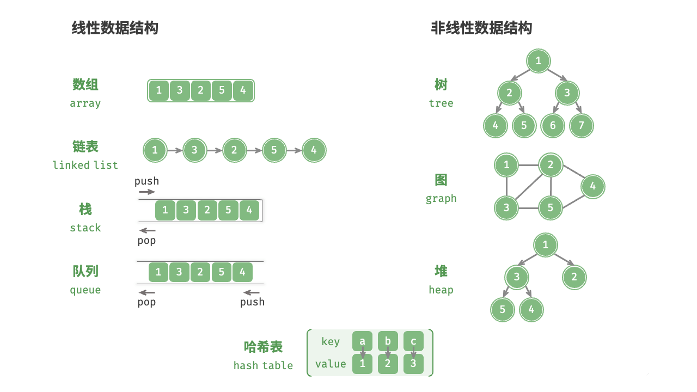

# <strong>1.1 什么是数据结构？</strong>

!!! note

    <p>&nbsp;&nbsp;&nbsp;&nbsp;&nbsp;&nbsp;&nbsp;&nbsp;在计算机世界中，数据结构代表了计算机在内存中存储和组织数据的独特方法。通过不同的排列和组合方式，可以使用户高效且适当的方式访问和使用他们所需的数据。</br>&nbsp;&nbsp;&nbsp;&nbsp;&nbsp;&nbsp;&nbsp;&nbsp;数据结构的存在使用户能够方便地按需访问和操作他们的数据，有助于以高效而紧凑的方式组织和检索各种类型的数据。</p>

<p>&nbsp;&nbsp;&nbsp;&nbsp;&nbsp;&nbsp;&nbsp;&nbsp;对于接触过计算机基础知识的读者而言，对于下面这个公式应该不会陌生：</p></br>
<p align="center" style="color: #c3185d"><strong>程序</strong> = <strong>数据结构</strong> + <strong>算法</strong></p></br>
<p>&nbsp;&nbsp;&nbsp;&nbsp;&nbsp;&nbsp;&nbsp;&nbsp;程序（Program）是由数据结构（Data Structure）和算法（Algorithm）组成，这意味着的程序的好和快是直接由程序所采用的数据结构和算法决定的。</p>

!!! danger "请注意"

    <p>绪论部分只做介绍,涉及到的具体数据结构和算法会在后续章节中详细讲解。</p>


## <strong>数据结构分类</strong>
<hr>

<!-- hr style="border: 1px solid #77608E;" / -->
<p>&nbsp;&nbsp;&nbsp;&nbsp;&nbsp;&nbsp;&nbsp;&nbsp;常见的数据结构包括数组、链表、栈、队列、哈希表、树、堆、图，它们可以从“逻辑结构”和“物理结构”两个维度进行分类。</p></br>

<figure markdown="span">
  
  <figcaption>数据结构分类</figcaption>
</figure>


### 线性结构

!!! info 

    数据元素按顺序或者线性排列<br>
    除了第一个元素和最后一个元素之外，剩余每个元素都有前一个和下一个相邻元素。

#### 有两种技术可以在内存中表示这种线性结构。

* 数组：存储在<code style="color: #4f9c83;">连续内存位置</code>的相同数据类型的项目的集合。
* 链表：通过使用<code style="color: #4f9c83;"> 指针或链接</code> 的概念来表示的所有元素之间的线性关系。

#### 常见的线性结构例子有：
* 数组：存储在<code style="color: #4f9c83;">连续内存位置</code>的元素的集合。
* 链表：节点的集合，每个节点包含一个元素和对下一个节点的<code style="color: #4f9c83;">引用</code>。
* 堆栈：具有<code style="color: #4f9c83;">后进先出 (LIFO)</code>顺序的元素集合。
* 队列：具有<code style="color: #4f9c83;">先进先出 (FIFO)</code>顺序的元素集合。

<br>

### 非线性结构

!!! info

    该结构主要用于表示包含各种元素之间的层次关系的数据。<br>

<span>常见的非线性结构例子有：</span>
* 图：顶点（节点）和表示顶点之间关系的边的集合。图用于建模和分析网络，例如社交网络或交通网络。
* 树：树的结构呈现出一个类似根和分支的形状，其中有一个根节点，从根节点出发，分成多个子节点，每个子节点可以又分为更多的子节点，依此类推

## <strong>数据结构分类</strong>
<hr>

### 数组（Arrays）

<span>数组是相似数据元素的集合。这些数据元素具有相同的数据类型。</span></br>
<span>数组的元素存储在连续的内存位置中，并由索引（也称为下标）来指向数据。</span></br>

=== "C"

    ```c title="array.c"
    /* 初始化数组 */
    int arr[5] = { 0 }; // { 0, 0, 0, 0, 0 }
    int nums[5] = { 1, 3, 2, 5, 4 };
    ```


=== "C++"

    ```cpp title="array.cpp" hl_lines="1 4 5 6" linenums="1"
    /* 初始化数组 */
    // 存储在栈上
    int arr[5];
    int nums[5] = { 1, 3, 2, 5, 4 };
    // 存储在堆上（需要手动释放空间）
    int* arr1 = new int[5];
    int* nums1 = new int[5] { 1, 3, 2, 5, 4 };
    ```

=== "Python"

    ```cpp title="array.cpp"
    # 初始化数组
    arr: list[int] = [0] * 5  # [ 0, 0, 0, 0, 0 ]
    nums: list[int] = [1, 3, 2, 5, 4]
    ```

=== "Java"

    ```java title="array.java"
    /* 初始化数组 */
    int[] arr = new int[5]; // { 0, 0, 0, 0, 0 }
    int[] nums = { 1, 3, 2, 5, 4 };
    ```

??? example "可视化运行"

    <iframe width="800" height="500" frameborder="0" src="https://pythontutor.com/iframe-embed.html#code=int%20main%28%29%0A%7B%0A%20%20/*%20%E5%88%9D%E5%A7%8B%E5%8C%96%E6%95%B0%E7%BB%84%20*/%0A%20%20//%20%E5%AD%98%E5%82%A8%E5%9C%A8%E6%A0%88%E4%B8%8A%0A%20%20int%20arr%5B5%5D%3B%0A%20%20int%20nums%5B5%5D%20%3D%20%7B%201,%203,%202,%205,%204%20%7D%3B%0A%20%20//%20%E5%AD%98%E5%82%A8%E5%9C%A8%E5%A0%86%E4%B8%8A%EF%BC%88%E9%9C%80%E8%A6%81%E6%89%8B%E5%8A%A8%E9%87%8A%E6%94%BE%E7%A9%BA%E9%97%B4%EF%BC%89%0A%20%20int*%20arr1%20%3D%20new%20int%5B5%5D%3B%0A%20%20int*%20nums1%20%3D%20new%20int%5B5%5D%20%7B%201,%203,%202,%205,%204%20%7D%3B%20%20%0A%7D&codeDivHeight=400&codeDivWidth=350&cumulative=false&curInstr=0&heapPrimitives=nevernest&origin=opt-frontend.js&py=cpp_g%2B%2B9.3.0&rawInputLstJSON=%5B%5D&textReferences=false"> </iframe>
    <a href="https://pythontutor.com/iframe-embed.html#code=int%20main%28%29%0A%7B%0A%20%20/*%20%E5%88%9D%E5%A7%8B%E5%8C%96%E6%95%B0%E7%BB%84%20*/%0A%20%20//%20%E5%AD%98%E5%82%A8%E5%9C%A8%E6%A0%88%E4%B8%8A%0A%20%20int%20arr%5B5%5D%3B%0A%20%20int%20nums%5B5%5D%20%3D%20%7B%201,%203,%202,%205,%204%20%7D%3B%0A%20%20//%20%E5%AD%98%E5%82%A8%E5%9C%A8%E5%A0%86%E4%B8%8A%EF%BC%88%E9%9C%80%E8%A6%81%E6%89%8B%E5%8A%A8%E9%87%8A%E6%94%BE%E7%A9%BA%E9%97%B4%EF%BC%89%0A%20%20int*%20arr1%20%3D%20new%20int%5B5%5D%3B%0A%20%20int*%20nums1%20%3D%20new%20int%5B5%5D%20%7B%201,%203,%202,%205,%204%20%7D%3B%20%20%0A%7D&codeDivHeight=400&codeDivWidth=350&cumulative=false&curInstr=0&heapPrimitives=nevernest&origin=opt-frontend.js&py=cpp_g%2B%2B9.3.0&rawInputLstJSON=%5B%5D&textReferences=false" target="_blank" rel="noopener noreferrer"><span style="color:#349890">【全屏观看】</span></a>

    
