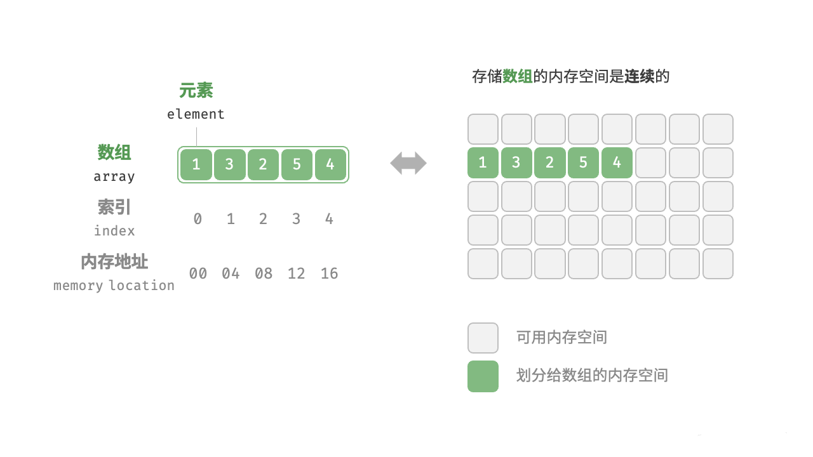

# <strong>2.1 顺序表</strong>

!!! note

    <p>&nbsp;&nbsp;&nbsp;&nbsp;&nbsp;&nbsp;&nbsp;&nbsp;在计算机世界中，数据结构代表了计算机在内存中存储和组织数据的独特方法。通过不同的排列和组合方式，可以使用户高效且适当的方式访问和使用他们所需的数据。</br>&nbsp;&nbsp;&nbsp;&nbsp;&nbsp;&nbsp;&nbsp;&nbsp;数据结构的存在使用户能够方便地按需访问和操作他们的数据，有助于以高效而紧凑的方式组织和检索各种类型的数据。</p>

<p>&nbsp;&nbsp;&nbsp;&nbsp;&nbsp;&nbsp;&nbsp;&nbsp;<strong style="text-decoration:underline"> 数组(array) </strong>是一种<span style="color:red">线性数据结构</span>，使用数组存放的数据不仅在逻辑上会排成一条线，在物理上也是连续存储。存储的这些数据元素具有相同的数据类型。图 2-1 展示了数组的主要概念和存储方式。</p></br>

<figure markdown="span">
  
  <figcaption>图2-1 数组定义与存储方式</figcaption>
</figure>

## <strong>2.1.1 数组的声明</strong> 
<hr>

<p>    我们知道在使用变量之前要先进行声明，同样的我们在使用数组的时候也要提前进行声明。数组的声明是这样的：</p>

```C linenums="1" title="array.cpp" hl_lines="1"
    ElemType name[size];
```

* <strong>ElemType：</strong>是我们要存放的数组元素的<code style="color:red">类型</code>，类型可以是<code style="color:green">int</code>, <code style="color:green">float</code>, <code style="color:green">double</code>, <code style="color:green">char</code>,或者其他可以使用的数据类型；
* <strong>name：</strong>是用来表示数组的，称为<code style="color:red">数组名</code>；
* <strong>size：</strong>当前数组可以存放的<code style="color:red">最大数量</code>。

<strong>例如</strong>，int 类型是我们最常用的数据类型。<br>
我们可以使用以下来定义一个大小为10，数组名为array的数组。

```C linenums="1" title="array.cpp" hl_lines="3"
    ElemType name[size];
    //例如
    int array[6] = {2, 6, 0, 8, 5, 4};
```

!!! info "请注意"

    <p>后续中提到的所有</p>
    <strong>索引或下标</strong> 都是从 0 开始计数。<br>
    <strong>位序或第几个</strong> 都是从 1 开始计数。


<div>
<svg xmlns="http://www.w3.org/2000/svg" xmlns:xlink="http://www.w3.org/1999/xlink" width="726" height="302" viewBox="0 0 726 302">
<defs>
  <clipPath id="clip-array">
    <rect width="726" height="302"></rect>
  </clipPath>
</defs>
<g id="array" clip-path="url(#clip-array)">
  <rect width="726" height="302" fill="#fff"></rect>
  <rect id="矩形_7" data-name="矩形 7" width="305" height="60" rx="5" transform="translate(401 50)" fill="#f2f2f2"></rect>
  <g id="路径_1" data-name="路径 1" transform="translate(32 22)" fill="#fff">
    <path d="M 39.5 39.5 L 0.5 39.5 L 0.5 0.5 L 39.5 0.5 L 39.5 39.5 Z" stroke="none"></path>
    <path d="M 1 1 L 1 39 L 39 39 L 39 1 L 1 1 M 0 0 L 40 0 L 40 40 L 0 40 L 0 0 Z" stroke="none" fill="#c9c9c9"></path>
  </g>
  <g id="路径_1-2" data-name="路径 1" transform="translate(71 22)" fill="#fff">
    <path d="M 39.5 39.5 L 0.5 39.5 L 0.5 0.5 L 39.5 0.5 L 39.5 39.5 Z" stroke="none"></path>
    <path d="M 1 1 L 1 39 L 39 39 L 39 1 L 1 1 M 0 0 L 40 0 L 40 40 L 0 40 L 0 0 Z" stroke="none" fill="#c9c9c9"></path>
  </g>
  <g id="路径_1-3" data-name="路径 1" transform="translate(110 22)" fill="#fff">
    <path d="M 39.5 39.5 L 0.5 39.5 L 0.5 0.5 L 39.5 0.5 L 39.5 39.5 Z" stroke="none"></path>
    <path d="M 1 1 L 1 39 L 39 39 L 39 1 L 1 1 M 0 0 L 40 0 L 40 40 L 0 40 L 0 0 Z" stroke="none" fill="#c9c9c9"></path>
  </g>
  <g id="路径_1-4" data-name="路径 1" transform="translate(149 22)" fill="#fff">
    <path d="M 39.5 39.5 L 0.5 39.5 L 0.5 0.5 L 39.5 0.5 L 39.5 39.5 Z" stroke="none"></path>
    <path d="M 1 1 L 1 39 L 39 39 L 39 1 L 1 1 M 0 0 L 40 0 L 40 40 L 0 40 L 0 0 Z" stroke="none" fill="#c9c9c9"></path>
  </g>
  <g id="路径_1-5" data-name="路径 1" transform="translate(188 22)" fill="#fff">
    <path d="M 39.5 39.5 L 0.5 39.5 L 0.5 0.5 L 39.5 0.5 L 39.5 39.5 Z" stroke="none"></path>
    <path d="M 1 1 L 1 39 L 39 39 L 39 1 L 1 1 M 0 0 L 40 0 L 40 40 L 0 40 L 0 0 Z" stroke="none" fill="#c9c9c9"></path>
  </g>
  <g id="路径_1-6" data-name="路径 1" transform="translate(227 22)" fill="#fff">
    <path d="M 39.5 39.5 L 0.5 39.5 L 0.5 0.5 L 39.5 0.5 L 39.5 39.5 Z" stroke="none"></path>
    <path d="M 1 1 L 1 39 L 39 39 L 39 1 L 1 1 M 0 0 L 40 0 L 40 40 L 0 40 L 0 0 Z" stroke="none" fill="#c9c9c9"></path>
  </g>
  <g id="路径_1-7" data-name="路径 1" transform="translate(32 61)" fill="#fff">
    <path d="M 39.5 39.5 L 0.5 39.5 L 0.5 0.5 L 39.5 0.5 L 39.5 39.5 Z" stroke="none"></path>
    <path d="M 1 1 L 1 39 L 39 39 L 39 1 L 1 1 M 0 0 L 40 0 L 40 40 L 0 40 L 0 0 Z" stroke="none" fill="#c9c9c9"></path>
  </g>
  <g id="路径_1-8" data-name="路径 1" transform="translate(71 100)" fill="#fff">
    <path d="M 39.5 39.5 L 0.5 39.5 L 0.5 0.5 L 39.5 0.5 L 39.5 39.5 Z" stroke="none"></path>
    <path d="M 1 1 L 1 39 L 39 39 L 39 1 L 1 1 M 0 0 L 40 0 L 40 40 L 0 40 L 0 0 Z" stroke="none" fill="#c9c9c9"></path>
  </g>
  <g id="路径_1-9" data-name="路径 1" transform="translate(110 100)" fill="#fff">
    <path d="M 39.5 39.5 L 0.5 39.5 L 0.5 0.5 L 39.5 0.5 L 39.5 39.5 Z" stroke="none"></path>
    <path d="M 1 1 L 1 39 L 39 39 L 39 1 L 1 1 M 0 0 L 40 0 L 40 40 L 0 40 L 0 0 Z" stroke="none" fill="#c9c9c9"></path>
  </g>
  <g id="路径_1-10" data-name="路径 1" transform="translate(149 100)" fill="#fff">
    <path d="M 39.5 39.5 L 0.5 39.5 L 0.5 0.5 L 39.5 0.5 L 39.5 39.5 Z" stroke="none"></path>
    <path d="M 1 1 L 1 39 L 39 39 L 39 1 L 1 1 M 0 0 L 40 0 L 40 40 L 0 40 L 0 0 Z" stroke="none" fill="#c9c9c9"></path>
  </g>
  <g id="路径_1-11" data-name="路径 1" transform="translate(188 100)" fill="#fff">
    <path d="M 39.5 39.5 L 0.5 39.5 L 0.5 0.5 L 39.5 0.5 L 39.5 39.5 Z" stroke="none"></path>
    <path d="M 1 1 L 1 39 L 39 39 L 39 1 L 1 1 M 0 0 L 40 0 L 40 40 L 0 40 L 0 0 Z" stroke="none" fill="#c9c9c9"></path>
  </g>
  <g id="路径_1-12" data-name="路径 1" transform="translate(227 100)" fill="#fff">
    <path d="M 39.5 39.5 L 0.5 39.5 L 0.5 0.5 L 39.5 0.5 L 39.5 39.5 Z" stroke="none"></path>
    <path d="M 1 1 L 1 39 L 39 39 L 39 1 L 1 1 M 0 0 L 40 0 L 40 40 L 0 40 L 0 0 Z" stroke="none" fill="#c9c9c9"></path>
  </g>
  <g id="路径_1-13" data-name="路径 1" transform="translate(32 139)" fill="#fff">
    <path d="M 39.5 39.5 L 0.5 39.5 L 0.5 0.5 L 39.5 0.5 L 39.5 39.5 Z" stroke="none"></path>
    <path d="M 1 1 L 1 39 L 39 39 L 39 1 L 1 1 M 0 0 L 40 0 L 40 40 L 0 40 L 0 0 Z" stroke="none" fill="#c9c9c9"></path>
  </g>
  <g id="路径_1-14" data-name="路径 1" transform="translate(71 139)" fill="#fff">
    <path d="M 39.5 39.5 L 0.5 39.5 L 0.5 0.5 L 39.5 0.5 L 39.5 39.5 Z" stroke="none"></path>
    <path d="M 1 1 L 1 39 L 39 39 L 39 1 L 1 1 M 0 0 L 40 0 L 40 40 L 0 40 L 0 0 Z" stroke="none" fill="#c9c9c9"></path>
  </g>
  <g id="路径_1-15" data-name="路径 1" transform="translate(110 139)" fill="#fff">
    <path d="M 39.5 39.5 L 0.5 39.5 L 0.5 0.5 L 39.5 0.5 L 39.5 39.5 Z" stroke="none"></path>
    <path d="M 1 1 L 1 39 L 39 39 L 39 1 L 1 1 M 0 0 L 40 0 L 40 40 L 0 40 L 0 0 Z" stroke="none" fill="#c9c9c9"></path>
  </g>
  <g id="路径_1-16" data-name="路径 1" transform="translate(149 139)" fill="#fff">
    <path d="M 39.5 39.5 L 0.5 39.5 L 0.5 0.5 L 39.5 0.5 L 39.5 39.5 Z" stroke="none"></path>
    <path d="M 1 1 L 1 39 L 39 39 L 39 1 L 1 1 M 0 0 L 40 0 L 40 40 L 0 40 L 0 0 Z" stroke="none" fill="#c9c9c9"></path>
  </g>
  <g id="路径_1-17" data-name="路径 1" transform="translate(188 139)" fill="#fff">
    <path d="M 39.5 39.5 L 0.5 39.5 L 0.5 0.5 L 39.5 0.5 L 39.5 39.5 Z" stroke="none"></path>
    <path d="M 1 1 L 1 39 L 39 39 L 39 1 L 1 1 M 0 0 L 40 0 L 40 40 L 0 40 L 0 0 Z" stroke="none" fill="#c9c9c9"></path>
  </g>
  <g id="路径_1-18" data-name="路径 1" transform="translate(227 139)" fill="#fff">
    <path d="M 39.5 39.5 L 0.5 39.5 L 0.5 0.5 L 39.5 0.5 L 39.5 39.5 Z" stroke="none"></path>
    <path d="M 1 1 L 1 39 L 39 39 L 39 1 L 1 1 M 0 0 L 40 0 L 40 40 L 0 40 L 0 0 Z" stroke="none" fill="#c9c9c9"></path>
  </g>
  <g id="路径_1-19" data-name="路径 1" transform="translate(32 178)" fill="#fff">
    <path d="M 39.5 39.5 L 0.5 39.5 L 0.5 0.5 L 39.5 0.5 L 39.5 39.5 Z" stroke="none"></path>
    <path d="M 1 1 L 1 39 L 39 39 L 39 1 L 1 1 M 0 0 L 40 0 L 40 40 L 0 40 L 0 0 Z" stroke="none" fill="#c9c9c9"></path>
  </g>
  <g id="路径_1-20" data-name="路径 1" transform="translate(71 178)" fill="#fff">
    <path d="M 39.5 39.5 L 0.5 39.5 L 0.5 0.5 L 39.5 0.5 L 39.5 39.5 Z" stroke="none"></path>
    <path d="M 1 1 L 1 39 L 39 39 L 39 1 L 1 1 M 0 0 L 40 0 L 40 40 L 0 40 L 0 0 Z" stroke="none" fill="#c9c9c9"></path>
  </g>
  <g id="路径_1-21" data-name="路径 1" transform="translate(110 178)" fill="#fff">
    <path d="M 39.5 39.5 L 0.5 39.5 L 0.5 0.5 L 39.5 0.5 L 39.5 39.5 Z" stroke="none"></path>
    <path d="M 1 1 L 1 39 L 39 39 L 39 1 L 1 1 M 0 0 L 40 0 L 40 40 L 0 40 L 0 0 Z" stroke="none" fill="#c9c9c9"></path>
  </g>
  <g id="路径_1-22" data-name="路径 1" transform="translate(149 178)" fill="#fff">
    <path d="M 39.5 39.5 L 0.5 39.5 L 0.5 0.5 L 39.5 0.5 L 39.5 39.5 Z" stroke="none"></path>
    <path d="M 1 1 L 1 39 L 39 39 L 39 1 L 1 1 M 0 0 L 40 0 L 40 40 L 0 40 L 0 0 Z" stroke="none" fill="#c9c9c9"></path>
  </g>
  <g id="路径_1-23" data-name="路径 1" transform="translate(188 178)" fill="#fff">
    <path d="M 39.5 39.5 L 0.5 39.5 L 0.5 0.5 L 39.5 0.5 L 39.5 39.5 Z" stroke="none"></path>
    <path d="M 1 1 L 1 39 L 39 39 L 39 1 L 1 1 M 0 0 L 40 0 L 40 40 L 0 40 L 0 0 Z" stroke="none" fill="#c9c9c9"></path>
  </g>
  <g id="路径_1-24" data-name="路径 1" transform="translate(227 178)" fill="#fff">
    <path d="M 39.5 39.5 L 0.5 39.5 L 0.5 0.5 L 39.5 0.5 L 39.5 39.5 Z" stroke="none"></path>
    <path d="M 1 1 L 1 39 L 39 39 L 39 1 L 1 1 M 0 0 L 40 0 L 40 40 L 0 40 L 0 0 Z" stroke="none" fill="#c9c9c9"></path>
  </g>
  <g id="路径_1-25" data-name="路径 1" transform="translate(32 217)" fill="#fff">
    <path d="M 39.5 39.5 L 0.5 39.5 L 0.5 0.5 L 39.5 0.5 L 39.5 39.5 Z" stroke="none"></path>
    <path d="M 1 1 L 1 39 L 39 39 L 39 1 L 1 1 M 0 0 L 40 0 L 40 40 L 0 40 L 0 0 Z" stroke="none" fill="#c9c9c9"></path>
  </g>
  <g id="路径_1-26" data-name="路径 1" transform="translate(71 217)" fill="#fff">
    <path d="M 39.5 39.5 L 0.5 39.5 L 0.5 0.5 L 39.5 0.5 L 39.5 39.5 Z" stroke="none"></path>
    <path d="M 1 1 L 1 39 L 39 39 L 39 1 L 1 1 M 0 0 L 40 0 L 40 40 L 0 40 L 0 0 Z" stroke="none" fill="#c9c9c9"></path>
  </g>
  <g id="路径_1-27" data-name="路径 1" transform="translate(110 217)" fill="#fff">
    <path d="M 39.5 39.5 L 0.5 39.5 L 0.5 0.5 L 39.5 0.5 L 39.5 39.5 Z" stroke="none"></path>
    <path d="M 1 1 L 1 39 L 39 39 L 39 1 L 1 1 M 0 0 L 40 0 L 40 40 L 0 40 L 0 0 Z" stroke="none" fill="#c9c9c9"></path>
  </g>
  <g id="路径_1-28" data-name="路径 1" transform="translate(149 217)" fill="#fff">
    <path d="M 39.5 39.5 L 0.5 39.5 L 0.5 0.5 L 39.5 0.5 L 39.5 39.5 Z" stroke="none"></path>
    <path d="M 1 1 L 1 39 L 39 39 L 39 1 L 1 1 M 0 0 L 40 0 L 40 40 L 0 40 L 0 0 Z" stroke="none" fill="#c9c9c9"></path>
  </g>
  <g id="路径_1-29" data-name="路径 1" transform="translate(188 217)" fill="#fff">
    <path d="M 39.5 39.5 L 0.5 39.5 L 0.5 0.5 L 39.5 0.5 L 39.5 39.5 Z" stroke="none"></path>
    <path d="M 1 1 L 1 39 L 39 39 L 39 1 L 1 1 M 0 0 L 40 0 L 40 40 L 0 40 L 0 0 Z" stroke="none" fill="#c9c9c9"></path>
  </g>
  <g id="路径_1-30" data-name="路径 1" transform="translate(227 217)" fill="#fff">
    <path d="M 39.5 39.5 L 0.5 39.5 L 0.5 0.5 L 39.5 0.5 L 39.5 39.5 Z" stroke="none"></path>
    <path d="M 1 1 L 1 39 L 39 39 L 39 1 L 1 1 M 0 0 L 40 0 L 40 40 L 0 40 L 0 0 Z" stroke="none" fill="#c9c9c9"></path>
  </g>
  <g id="组_1" data-name="组 1">
    <rect id="bg-1" width="54" height="199" rx="5" transform="translate(401 41)" fill="#ffdfdf" opacity="0" style=""></rect>
    <g id="矩形_1" data-name="矩形 1" transform="translate(408 60)" fill="#fff" stroke="#707070" stroke-width="1">
      <rect width="40" height="40" stroke="none"></rect>
      <rect x="0.5" y="0.5" width="39" height="39" fill="none"></rect>
    </g>
    <text id="_2" data-name="2" transform="translate(419 92)" fill="#434344" font-size="30" font-family="MicrosoftYaHei, Microsoft YaHei"><tspan x="0" y="0">2</tspan></text>
    <text id="_0_" data-name="[0]" transform="translate(419 138)" fill="#434344" font-size="14" font-family="MicrosoftYaHei, Microsoft YaHei"><tspan x="0" y="0">[0]</tspan></text>
    <text id="_1" data-name="1" transform="translate(424 185)" fill="#434344" font-size="14" font-family="MicrosoftYaHei, Microsoft YaHei"><tspan x="0" y="0">1</tspan></text>
    <text id="_0000" data-name="0000" transform="translate(414 225)" fill="#434344" font-size="12" font-family="MicrosoftYaHei, Microsoft YaHei"><tspan x="0" y="0">0000</tspan></text>
  </g>
  <g id="组_2" data-name="组 2">
    <rect id="bg-2" width="54" height="199" rx="5" transform="translate(451 41)" fill="#ffdfdf" opacity="0" style=""></rect>
    <g id="矩形_2" data-name="矩形 2" transform="translate(458 60)" fill="#fff" stroke="#707070" stroke-width="1">
      <rect width="40" height="40" stroke="none"></rect>
      <rect x="0.5" y="0.5" width="39" height="39" fill="none"></rect>
    </g>
    <text id="_1_" data-name="[1]" transform="translate(469 138)" fill="#434344" font-size="14" font-family="MicrosoftYaHei, Microsoft YaHei"><tspan x="0" y="0">[1]</tspan></text>
    <text id="_2-2" data-name="2" transform="translate(474 185)" fill="#434344" font-size="14" font-family="MicrosoftYaHei, Microsoft YaHei"><tspan x="0" y="0">2</tspan></text>
    <text id="_0004" data-name="0004" transform="translate(464 225)" fill="#434344" font-size="12" font-family="MicrosoftYaHei, Microsoft YaHei"><tspan x="0" y="0">0004</tspan></text>
    <text id="_6" data-name="6" transform="translate(469 92)" fill="#434344" font-size="30" font-family="MicrosoftYaHei, Microsoft YaHei"><tspan x="0" y="0">6</tspan></text>
  </g>
  <g id="组_3" data-name="组 3">
    <rect id="bg-3" width="54" height="199" rx="5" transform="translate(501 41)" fill="#ffdfdf" opacity="0" style=""></rect>
    <g id="矩形_3" data-name="矩形 3" transform="translate(508 60)" fill="#fff" stroke="#707070" stroke-width="1">
      <rect width="40" height="40" stroke="none"></rect>
      <rect x="0.5" y="0.5" width="39" height="39" fill="none"></rect>
    </g>
    <text id="_2_" data-name="[2]" transform="translate(519 138)" fill="#434344" font-size="14" font-family="MicrosoftYaHei, Microsoft YaHei"><tspan x="0" y="0">[2]</tspan></text>
    <text id="_3" data-name="3" transform="translate(524 185)" fill="#434344" font-size="14" font-family="MicrosoftYaHei, Microsoft YaHei"><tspan x="0" y="0">3</tspan></text>
    <text id="_0008" data-name="0008" transform="translate(514 225)" fill="#434344" font-size="12" font-family="MicrosoftYaHei, Microsoft YaHei"><tspan x="0" y="0">0008</tspan></text>
    <text id="_0" data-name="0" transform="translate(519 92)" fill="#434344" font-size="30" font-family="MicrosoftYaHei, Microsoft YaHei"><tspan x="0" y="0">0</tspan></text>
  </g>
  <g id="组_4" data-name="组 4">
    <rect id="bg-4" width="54" height="199" rx="5" transform="translate(551 41)" fill="#ffdfdf" opacity="0" style=""></rect>
    <g id="矩形_4" data-name="矩形 4" transform="translate(558 60)" fill="#fff" stroke="#707070" stroke-width="1">
      <rect width="40" height="40" stroke="none"></rect>
      <rect x="0.5" y="0.5" width="39" height="39" fill="none"></rect>
    </g>
    <text id="_3_" data-name="[3]" transform="translate(570 138)" fill="#434344" font-size="14" font-family="MicrosoftYaHei, Microsoft YaHei"><tspan x="0" y="0">[3]</tspan></text>
    <text id="_4" data-name="4" transform="translate(575 185)" fill="#434344" font-size="14" font-family="MicrosoftYaHei, Microsoft YaHei"><tspan x="0" y="0">4</tspan></text>
    <text id="_000C" data-name="000C" transform="translate(564 225)" fill="#434344" font-size="12" font-family="MicrosoftYaHei, Microsoft YaHei"><tspan x="0" y="0">000C</tspan></text>
    <text id="_8" data-name="8" transform="translate(569 92)" fill="#434344" font-size="30" font-family="MicrosoftYaHei, Microsoft YaHei"><tspan x="0" y="0">8</tspan></text>
  </g>
  <g id="组_5" data-name="组 5">
    <rect id="bg-5" width="54" height="199" rx="5" transform="translate(602 41)" fill="#ffdfdf" opacity="0" style=""></rect>
    <g id="矩形_5" data-name="矩形 5" transform="translate(608 60)" fill="#fff" stroke="#707070" stroke-width="1">
      <rect width="40" height="40" stroke="none"></rect>
      <rect x="0.5" y="0.5" width="39" height="39" fill="none"></rect>
    </g>
    <text id="_4_" data-name="[4]" transform="translate(620 138)" fill="#434344" font-size="14" font-family="MicrosoftYaHei, Microsoft YaHei"><tspan x="0" y="0">[4]</tspan></text>
    <text id="_5" data-name="5" transform="translate(625 185)" fill="#434344" font-size="14" font-family="MicrosoftYaHei, Microsoft YaHei"><tspan x="0" y="0">5</tspan></text>
    <text id="_0010" data-name="0010" transform="translate(615 225)" fill="#434344" font-size="12" font-family="MicrosoftYaHei, Microsoft YaHei"><tspan x="0" y="0">0010</tspan></text>
    <text id="_5-2" data-name="5" transform="translate(619 92)" fill="#434344" font-size="30" font-family="MicrosoftYaHei, Microsoft YaHei"><tspan x="0" y="0">5</tspan></text>
  </g>
  <g id="组_6" data-name="组 6">
    <rect id="bg-6" width="54" height="199" rx="5" transform="translate(652 41)" fill="#ffdfdf" opacity="0" style=""></rect>
    <g id="矩形_6" data-name="矩形 6" transform="translate(658 60)" fill="#fff" stroke="#707070" stroke-width="1">
      <rect width="40" height="40" stroke="none"></rect>
      <rect x="0.5" y="0.5" width="39" height="39" fill="none"></rect>
    </g>
    <text id="_5_" data-name="[5]" transform="translate(670 138)" fill="#434344" font-size="14" font-family="MicrosoftYaHei, Microsoft YaHei"><tspan x="0" y="0">[5]</tspan></text>
    <text id="_6-2" data-name="6" transform="translate(675 185)" fill="#434344" font-size="14" font-family="MicrosoftYaHei, Microsoft YaHei"><tspan x="0" y="0">6</tspan></text>
    <text id="_0014" data-name="0014" transform="translate(665 225)" fill="#434344" font-size="12" font-family="MicrosoftYaHei, Microsoft YaHei"><tspan x="0" y="0">0014</tspan></text>
    <text id="_4-2" data-name="4" transform="translate(669 92)" fill="#434344" font-size="30" font-family="MicrosoftYaHei, Microsoft YaHei"><tspan x="0" y="0">4</tspan></text>
  </g>
  <g id="组_7" data-name="组 7">
    <g id="矩形-1" transform="translate(71 61)" fill="#549bd7" style="">
      <path d="M 39.5 39.5 L 0.5 39.5 L 0.5 0.5 L 39.5 0.5 L 39.5 39.5 Z" stroke="none"></path>
      <path d="M 1 1 L 1 39 L 39 39 L 39 1 L 1 1 M 0 0 L 40 0 L 40 40 L 0 40 L 0 0 Z" stroke="none" fill="#c9c9c9"></path>
    </g>
    <text id="_2-3" data-name="2" transform="translate(82 93)" fill="#fff" font-size="30" font-family="MicrosoftYaHei, Microsoft YaHei"><tspan x="0" y="0">2</tspan></text>
  </g>
  <g id="组_8" data-name="组 8">
    <g id="矩形-2" transform="translate(110 61)" fill="#549bd7" style="">
      <path d="M 39.5 39.5 L 0.5 39.5 L 0.5 0.5 L 39.5 0.5 L 39.5 39.5 Z" stroke="none"></path>
      <path d="M 1 1 L 1 39 L 39 39 L 39 1 L 1 1 M 0 0 L 40 0 L 40 40 L 0 40 L 0 0 Z" stroke="none" fill="#c9c9c9"></path>
    </g>
    <text id="_6-3" data-name="6" transform="translate(121 93)" fill="#fff" font-size="30" font-family="MicrosoftYaHei, Microsoft YaHei"><tspan x="0" y="0">6</tspan></text>
  </g>
  <g id="组_9" data-name="组 9">
    <g id="矩形-3" transform="translate(149 61)" fill="#549bd7" style="">
      <path d="M 39.5 39.5 L 0.5 39.5 L 0.5 0.5 L 39.5 0.5 L 39.5 39.5 Z" stroke="none"></path>
      <path d="M 1 1 L 1 39 L 39 39 L 39 1 L 1 1 M 0 0 L 40 0 L 40 40 L 0 40 L 0 0 Z" stroke="none" fill="#c9c9c9"></path>
    </g>
    <text id="_0-2" data-name="0" transform="translate(160 93)" fill="#fff" font-size="30" font-family="MicrosoftYaHei, Microsoft YaHei"><tspan x="0" y="0">0</tspan></text>
  </g>
  <g id="组_10" data-name="组 10">
    <g id="矩形-4" transform="translate(188 61)" fill="#549bd7" style="">
      <path d="M 39.5 39.5 L 0.5 39.5 L 0.5 0.5 L 39.5 0.5 L 39.5 39.5 Z" stroke="none"></path>
      <path d="M 1 1 L 1 39 L 39 39 L 39 1 L 1 1 M 0 0 L 40 0 L 40 40 L 0 40 L 0 0 Z" stroke="none" fill="#c9c9c9"></path>
    </g>
    <text id="_8-2" data-name="8" transform="translate(199 93)" fill="#fff" font-size="30" font-family="MicrosoftYaHei, Microsoft YaHei"><tspan x="0" y="0">8</tspan></text>
  </g>
  <g id="组_11" data-name="组 11">
    <g id="矩形-5" transform="translate(227 61)" fill="#549bd7" style="">
      <path d="M 39.5 39.5 L 0.5 39.5 L 0.5 0.5 L 39.5 0.5 L 39.5 39.5 Z" stroke="none"></path>
      <path d="M 1 1 L 1 39 L 39 39 L 39 1 L 1 1 M 0 0 L 40 0 L 40 40 L 0 40 L 0 0 Z" stroke="none" fill="#c9c9c9"></path>
    </g>
    <text id="_5-3" data-name="5" transform="translate(238 93)" fill="#fff" font-size="30" font-family="MicrosoftYaHei, Microsoft YaHei"><tspan x="0" y="0">5</tspan></text>
  </g>
  <g id="组_12" data-name="组 12">
    <g id="矩形-6" transform="translate(32 100)" fill="#549bd7" style="">
      <path d="M 39.5 39.5 L 0.5 39.5 L 0.5 0.5 L 39.5 0.5 L 39.5 39.5 Z" stroke="none"></path>
      <path d="M 1 1 L 1 39 L 39 39 L 39 1 L 1 1 M 0 0 L 40 0 L 40 40 L 0 40 L 0 0 Z" stroke="none" fill="#c9c9c9"></path>
    </g>
    <text id="_4-3" data-name="4" transform="translate(43 132)" fill="#fff" font-size="30" font-family="MicrosoftYaHei, Microsoft YaHei"><tspan x="0" y="0">4</tspan></text>
  </g>
  <text id="数组存储的内存形式" transform="translate(83 288)" fill="#a2a2a2" font-size="14" font-family="MicrosoftYaHei, Microsoft YaHei"><tspan x="0" y="0">数组存储的内存形式</tspan></text>
  <text id="数组映射" transform="translate(520 288)" fill="#a2a2a2" font-size="14" font-family="MicrosoftYaHei, Microsoft YaHei"><tspan x="0" y="0">数组映射</tspan></text>
  <text id="数组_array" data-name="数组 array" transform="translate(379 83)" fill="#434344" font-size="12" font-family="MicrosoftYaHei, Microsoft YaHei"><tspan x="-56.332" y="0">数组 array</tspan></text>
  <text id="索引_下标_index" data-name="索引(下标) index" transform="translate(379 138)" fill="#434344" font-size="12" font-family="MicrosoftYaHei, Microsoft YaHei"><tspan x="-90.721" y="0">索引(下标) index</tspan></text>
  <text id="位序_第几个_" data-name="位序 (第几个)" transform="translate(379 185)" fill="#434344" font-size="12" font-family="MicrosoftYaHei, Microsoft YaHei"><tspan x="-71.566" y="0">位序 (第几个)</tspan></text>
  <text id="内存地址" transform="translate(379 225)" fill="#434344" font-size="12" font-family="MicrosoftYaHei, Microsoft YaHei"><tspan x="-48" y="0">内存地址</tspan></text>
</g>
</svg>
</div>