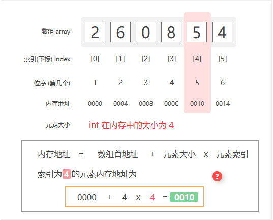

# <strong>2.1 顺序表</strong>

!!! note

    <p>&nbsp;&nbsp;&nbsp;&nbsp;&nbsp;&nbsp;&nbsp;&nbsp;在计算机世界中，数据结构代表了计算机在内存中存储和组织数据的独特方法。通过不同的排列和组合方式，可以使用户高效且适当的方式访问和使用他们所需的数据。</br>&nbsp;&nbsp;&nbsp;&nbsp;&nbsp;&nbsp;&nbsp;&nbsp;数据结构的存在使用户能够方便地按需访问和操作他们的数据，有助于以高效而紧凑的方式组织和检索各种类型的数据。</p>

<p>&nbsp;&nbsp;&nbsp;&nbsp;&nbsp;&nbsp;&nbsp;&nbsp;<strong style="text-decoration:underline"> 数组(array) </strong>是一种<span style="color:red">线性数据结构</span>，使用数组存放的数据不仅在逻辑上会排成一条线，在物理上也是连续存储。存储的这些数据元素具有相同的数据类型。图 2-1 展示了数组的主要概念和存储方式。</p></br>

<figure markdown="span">
  
  <figcaption>图2-1-1 数组定义与存储方式</figcaption>
</figure>

## <strong>2.1.1 数组</strong> 
<hr>

<p>    我们知道在使用变量之前要先进行声明，同样的我们在使用数组的时候也要提前进行声明。数组的声明是这样的：</p>

```C linenums="1" title="array.cpp" hl_lines="1"
    ElemType name[size];
```

* <strong>ElemType：</strong>是我们要存放的数组元素的<code style="color:red">类型</code>，类型可以是<code style="color:green">int</code>, <code style="color:green">float</code>, <code style="color:green">double</code>, <code style="color:green">char</code>,或者其他可以使用的数据类型；
* <strong>name：</strong>是用来表示数组的，称为<code style="color:red">数组名</code>；
* <strong>size：</strong>当前数组可以存放的<code style="color:red">最大数量</code>。

<strong>例如</strong>，int 类型是我们最常用的数据类型。<br>
我们可以使用以下来定义一个大小为10，数组名为array的数组。

```C linenums="1" title="array.cpp" hl_lines="3"
    ElemType name[size];
    //例如
    int array[6] = {2, 6, 0, 8, 5, 4};
```

!!! info "请注意"

    <p>后续中提到的所有</p>
    <strong>索引或下标</strong> 都是从 0 开始计数。<br>
    <strong>位序或第几个</strong> 都是从 1 开始计数。

<figure markdown="span">
  
  <figcaption>图2-1-2 数组及内存结构</figcaption>
</figure>


### 1 数组初始化

<p>我们可以根据需求选用数组的两种初始化方式：无初始值、给定初始值。在未指定初始值的情况下，大多数编程语言会将数组元素初始化为 
 ：</p>

=== "C"

    ```c title="array.c" linenums="1"
    /* 初始化数组 */
    int arr[5] = { 0 }; // { 0, 0, 0, 0, 0 }
    int nums[5] = { 1, 3, 2, 5, 4 };
    ```


=== "C++"

    ```cpp title="array.cpp" linenums="1"
    /* 初始化数组 */
    // 存储在栈上
    int arr[5];
    int nums[5] = { 1, 3, 2, 5, 4 };
    // 存储在堆上（需要手动释放空间）
    int* arr1 = new int[5];
    int* nums1 = new int[5] { 1, 3, 2, 5, 4 };
    ```

=== "Python"

    ```python title="array.py" linenums="1"
    # 初始化数组
    arr: list[int] = [0] * 5  # [ 0, 0, 0, 0, 0 ]
    nums: list[int] = [1, 3, 2, 5, 4]
    ```

=== "Java"

    ```java title="array.java"  linenums="1"
    /* 初始化数组 */
    int[] arr = new int[5]; // { 0, 0, 0, 0, 0 }
    int[] nums = { 1, 3, 2, 5, 4 };
    ```

### 2 数组访问元素

<p>数组元素被存储在连续的内存空间中，这意味着计算数组元素的内存地址非常容易。给定数组内存地址（首元素内存地址）和某个元素的索引，我们可以使用图 4-2 所示的公式计算得到该元素的内存地址，从而直接访问该元素。</p>

{ align=right }

<br><br>
&nbsp;&nbsp;&nbsp;&nbsp;&nbsp;&nbsp;&nbsp;&nbsp;观察右图,我们发现数组首个元素的索引为 <strong>0</strong>,这似乎有些反直觉，因为从<strong>1</strong>开始计数会更自然。但从地址计算公式的角度看,<strong style="color:red">索引本质上是内存地址的偏移量</strong>。首个元素的地址偏移量是<strong>0</strong>,因此它的索引为<strong>0</strong>是合理的。
<br>
<p>&nbsp;&nbsp;&nbsp;&nbsp;&nbsp;&nbsp;&nbsp;&nbsp;在数组中访问元素非常高效，我们可以在<strong>O(1)</strong>时间内随机访问数组中的任意一个元素。</p>
<br><br><br>

=== "C"

    ```c title="array.c" hl_lines="6" linenums="1"
    /* 随机访问元素 */
    int randomAccess(int *nums, int size) {
        // 在区间 [0, size) 中随机抽取一个数字
        int randomIndex = rand() % size;
        // 获取并返回随机元素
        int randomNum = nums[randomIndex];
        return randomNum;
    }
    ```


=== "C++"

    ```cpp title="array.cpp" hl_lines="6" linenums="1"
    /* 随机访问元素 */
    int randomAccess(int *nums, int size) {
        // 在区间 [0, size) 中随机抽取一个数字
        int randomIndex = rand() % size;
        // 获取并返回随机元素
        int randomNum = nums[randomIndex];
        return randomNum;
    }
    ```

=== "Python"

    ```python title="array.py" hl_lines="5" linenums="1"
    def random_access(nums: list[int]) -> int:
    """随机访问元素"""
    # 在区间 [0, len(nums)-1] 中随机抽取一个数字
    random_index = random.randint(0, len(nums) - 1)
    # 获取并返回随机元素
    random_num = nums[random_index]
    return random_num
    ```

=== "Java"

    ```java title="array.java" hl_lines="5" linenums="1"
    /* 随机访问元素 */
    int randomAccess(int[] nums) {
        // 在区间 [0, nums.length) 中随机抽取一个数字
        int randomIndex = ThreadLocalRandom.current().nextInt(0, nums.length);
        // 获取并返回随机元素
        int randomNum = nums[randomIndex];
        return randomNum;
    }
    ```

### 3 数组插入元素
<p>&nbsp;&nbsp;&nbsp;&nbsp;&nbsp;&nbsp;&nbsp;&nbsp;数组元素在内存中是“紧挨着的”,它们之间没有空间再存放任何数据。如图 <strong>2-4</strong>> 所示，如果想在数组中间插入一个元素，则需要将该元素之后的所有元素都向后移动一位，之后再把元素赋值给该索引。</p>

<figure markdown="span">
  
  <figcaption>图2-4 数组插入元素示例</figcaption>
</figure>

=== "C"

    ```c title="array.c" hl_lines="4 5 6 8" linenums="1"
    /* 在数组的索引 index 处插入元素 num */
    void insert(int *nums, int size, int num, int index) {
        // 把索引 index 以及之后的所有元素向后移动一位
        for (int i = size - 1; i > index; i--) {
            nums[i] = nums[i - 1];
        }
        // 将 num 赋给 index 处的元素
        nums[index] = num;
    }
    ```


=== "C++"

    ```cpp title="array.cpp" hl_lines="4 5 6 8" linenums="1"
    /* 在数组的索引 index 处插入元素 num */
    void insert(int *nums, int size, int num, int index) {
        // 把索引 index 以及之后的所有元素向后移动一位
        for (int i = size - 1; i > index; i--) {
            nums[i] = nums[i - 1];
        }
        // 将 num 赋给 index 处的元素
        nums[index] = num;
    }
    ```

=== "Python"

    ```python title="array.py" hl_lines="4 5" linenums="1"
    def insert(nums: list[int], num: int, index: int):
    """在数组的索引 index 处插入元素 num"""
    # 把索引 index 以及之后的所有元素向后移动一位
    for i in range(len(nums) - 1, index, -1):
        nums[i] = nums[i - 1]
    # 将 num 赋给 index 处的元素
    nums[index] = num
    ```

=== "Java"

    ```java title="array.java" hl_lines="4 5 6 8" linenums="1"
    /* 在数组的索引 index 处插入元素 num */
    void insert(int[] nums, int num, int index) {
        // 把索引 index 以及之后的所有元素向后移动一位
        for (int i = nums.length - 1; i > index; i--) {
            nums[i] = nums[i - 1];
        }
        // 将 num 赋给 index 处的元素
        nums[index] = num;
    }
    ```

### 4 数组删除元素

{ align=right }

<br><br><br><br><br>

<div class="annotate" markdown>
> &nbsp;&nbsp;&nbsp;&nbsp;&nbsp;&nbsp;&nbsp;&nbsp;同理,如右图所示,若想删除索引<code>i</code>处的元素,则需要把索引<code>i</code>之后的元素都向前移动一位. (1) 
</div>
1.  <p style="color: red">请注意,删除元素完成后,原先末尾的元素变得“无意义”了,所以我们无须特意去修改它.</p>

<br><br><br><br><br>

=== "C"

    ```c title="array.c" linenums="1"
    /* 删除索引 index 处的元素 */
    // 注意：stdio.h 占用了 remove 关键词
    void removeItem(int *nums, int size, int index) {
        // 把索引 index 之后的所有元素向前移动一位
        for (int i = index; i < size - 1; i++) {
            nums[i] = nums[i + 1];
        }
    }
    ```


=== "C++"

    ```cpp title="array.cpp" linenums="1"
    /* 删除索引 index 处的元素 */
    void remove(int *nums, int size, int index) {
        // 把索引 index 之后的所有元素向前移动一位
        for (int i = index; i < size - 1; i++) {
            nums[i] = nums[i + 1];
        }
    }
    ```

=== "Python"

    ```python title="array.py" linenums="1"
    def remove(nums: list[int], index: int):
    """删除索引 index 处的元素"""
    # 把索引 index 之后的所有元素向前移动一位
    for i in range(index, len(nums) - 1):
        nums[i] = nums[i + 1]
    ```

=== "Java"

    ```java title="array.java" hl_lines="4 5 6 8" linenums="1"
    /* 删除索引 index 处的元素 */
    void remove(int[] nums, int index) {
        // 把索引 index 之后的所有元素向前移动一位
        for (int i = index; i < nums.length - 1; i++) {
            nums[i] = nums[i + 1];
        }
    }
    ```

!!! bug "请注意"

    <p>总的来看,数组的插入与删除操作有以下缺点。</p>
    1. <strong>时间复杂度高:</strong> 数组的插入和删除的平均时间复杂度均为O(n),其中n为数组长度。<br>
    2. <strong>丢失元素:</strong> 由于数组的长度不可变,因此在插入元素后,超出数组长度范围的元素会丢失.<br>
    3. <strong>内存浪费:</strong> 我们可以初始化一个比较长的数组,只用前面一部分,这样在插入数据时,丢失的末尾元素都是“无意义”的,但这样做会造成部分内存空间浪费.


### 5 数组遍历

<p>&nbsp;&nbsp;&nbsp;&nbsp;&nbsp;&nbsp;&nbsp;&nbsp;在大多数编程语言中,我们既可以通过索引遍历数组,也可以直接遍历获取数组中的每个元素:</p>


=== "C"

    ```c title="array.c" linenums="1"
    /* 遍历数组 */
    void traverse(int *nums, int size) {
        int count = 0;
        // 通过索引遍历数组
        for (int i = 0; i < size; i++) {
            count += nums[i];
        }
    }
    ```


=== "C++"

    ```cpp title="array.cpp" linenums="1"
    /* 遍历数组 */
    void traverse(int *nums, int size) {
        int count = 0;
        // 通过索引遍历数组
        for (int i = 0; i < size; i++) {
            count += nums[i];
        }
    }
    ```

=== "Python"

    ```python title="array.py" linenums="1"
    def traverse(nums: list[int]):
    """遍历数组"""
    count = 0
    # 通过索引遍历数组
    for i in range(len(nums)):
        count += nums[i]
    # 直接遍历数组元素
    for num in nums:
        count += num
    # 同时遍历数据索引和元素
    for i, num in enumerate(nums):
        count += nums[i]
        count += num
    ```

=== "Java"

    ```java title="array.java" hl_lines="4 5 6 8" linenums="1"
    /* 遍历数组 */
    void traverse(int[] nums) {
        int count = 0;
        // 通过索引遍历数组
        for (int i = 0; i < nums.length; i++) {
            count += nums[i];
        }
        // 直接遍历数组元素
        for (int num : nums) {
            count += num;
        }
    }
    ```

## <strong>2.1.2 顺序表的介绍</strong> 

!!! tip "提示:"

    <p>我们前面已经介绍了数组的知识点:</p>
    &nbsp;&nbsp;&nbsp;&nbsp;1. 数组是一种数据结构,用于存储相同类型的元素的集合.<br>
    &nbsp;&nbsp;&nbsp;&nbsp;2. 由于数组的长度不可变,因此在插入元素后,超出数组长度范围的元素会丢失.<br>
    <p>那么数组和线性表的关系是什么呢？</p>
    &nbsp;&nbsp;&nbsp;&nbsp;1. 线性表是一种数据结构,其中元素排列成一条线一样的顺序.<br>
    &nbsp;&nbsp;&nbsp;&nbsp;2. 这种结构没有跳跃或分叉,每个元素都有且仅有一个前驱和一个后继.<br>
    &nbsp;&nbsp;&nbsp;&nbsp;3. 线性表包括顺序表（数组实现）和链表等.<br>
    <p>&nbsp;&nbsp;&nbsp;&nbsp;&nbsp;&nbsp;&nbsp;&nbsp;数组是一种实现线性表的方式之一.线性表可以通过数组来实现,也可以通过链表等其他结构来实现.因此,数组是线性表的一种实现方式,而线性表是一个更为抽象的概念,包括了多种实现方式,数组是其中之一.</p>
    <strong style="color:red">通过数组实现的线性表称为顺序表</strong>


### 1 顺序表的定义

<p>线性表的顺序存储类型结构如下:</p>

```C linenums="1"  
// 数据类型
#define ElemType int
    
#define MAX_SIZE 10 // 定义最大长度
typedef struct {
   ElemType data[MAX_SIZE]; // 用静态的
   int length; // 顺序表的当前长度
} SqList; // 顺序表的类型定义
```

<p>定义了一个结构体<code>SqList</code>,包含两个成员变量：<code>data</code>和<code>length</code>.</p>
<strong><code style="color: hotpink">data</code></strong> 是一个静态数组,用于存储顺序表的元素,数组最多可以存储<code style="color: hotpink">MAX_SIZE</code>个元素;<br>
<strong><code style="color: hotpink">length</code></strong> 用于记录顺序表的当前长度,即存储了多少个元素.

### 2 顺序表的初始化

```C linenums="1"  
// 初始化顺序表
void InitList (SqList &L) {
    L.length = 0; // 顺序表初始长度为 0
}
```

<p>这个函数的作用是将传入的<strong><code style="color: hotpink">顺序表L</code></strong>初始化为一个空表，长度为0。</p>
<p>在实际使用中，初始化是为了确保顺序表处于一个可控的状态，以便进行后续的插入、删除等操作。</p>

### 3 在顺序表中插入元素

<p>下面代码显示的是在顺序表L的第i个位置插入元素e</p>

```C linenums="1"  
// 在 L 的位序 i 处插入元素 e
// 注意区分【位序】和【下标】，位序从1开始，下标从0开始
bool ListInsert(SqList &L, int i, int e) {
  // 判断i的范围是否有效
  if (i < 1 || i > L.length + 1)
    return false;
  // 当前存储的元素已达到最大值，不能插入
  if (L.length >= MAX_SIZE)
    return false;
  // 将第i个元素及之后的元素后移
  for (int j = L.length; j >= i; j--) {
    L.data[j] = L.data[j - 1];
  }
  // 在位置 i 处放入 e
  L.data[i - 1] = e;
  // 长度加1
  L.length++;
  return true;
}
```


??? example "插入顺序表 | 可视化运行"

    <iframe width="800" height="600" frameborder="0" src="https://pythontutor.com/iframe-embed.html#code=%23include%20%3Cstdio.h%3E%0A%23include%20%3Cstdlib.h%3E%0A%0A%23define%20MAX_SIZE%2010%20//%20%E5%AE%9A%E4%B9%89%E6%9C%80%E5%A4%A7%E9%95%BF%E5%BA%A6%0Atypedef%20struct%20%7B%0Aint%20data%5BMAX_SIZE%5D%3B%20//%20%E7%94%A8%E9%9D%99%E6%80%81%E7%9A%84%0Aint%20length%3B%20//%20%E9%A1%BA%E5%BA%8F%E8%A1%A8%E7%9A%84%E5%BD%93%E5%89%8D%E9%95%BF%E5%BA%A6%0A%7D%20SqList%3B%20//%20%E9%A1%BA%E5%BA%8F%E8%A1%A8%E7%9A%84%E7%B1%BB%E5%9E%8B%E5%AE%9A%E4%B9%89%0A%0A//%20%E5%88%9D%E5%A7%8B%E5%8C%96%E9%A1%BA%E5%BA%8F%E8%A1%A8%0Avoid%20InitList%20%28SqList%20%26L%29%20%7B%0AL.length%20%3D%200%3B%20//%20%E9%A1%BA%E5%BA%8F%E8%A1%A8%E5%88%9D%E5%A7%8B%E9%95%BF%E5%BA%A6%E4%B8%BA%200%0A%7D%0A%0A//%20%E5%9C%A8%20L%20%E7%9A%84%E4%BD%8D%E5%BA%8F%20i%20%E5%A4%84%E6%8F%92%E5%85%A5%E5%85%83%E7%B4%A0%20e%0A//%20%E6%B3%A8%E6%84%8F%E5%8C%BA%E5%88%86%E3%80%90%E4%BD%8D%E5%BA%8F%E3%80%91%E5%92%8C%E3%80%90%E4%B8%8B%E6%A0%87%E3%80%91%EF%BC%8C%E4%BD%8D%E5%BA%8F%E4%BB%8E1%E5%BC%80%E5%A7%8B%EF%BC%8C%E4%B8%8B%E6%A0%87%E4%BB%8E0%E5%BC%80%E5%A7%8B%0Abool%20ListInsert%28SqList%20%26L,%20int%20i,%20int%20e%29%20%7B%0A//%20%E5%88%A4%E6%96%ADi%E7%9A%84%E8%8C%83%E5%9B%B4%E6%98%AF%E5%90%A6%E6%9C%89%E6%95%88%0Aif%20%28i%20%3C%201%20%7C%7C%20i%20%3E%20L.length%20%2B%201%29%0Areturn%20false%3B%0A//%20%E5%BD%93%E5%89%8D%E5%AD%98%E5%82%A8%E7%9A%84%E5%85%83%E7%B4%A0%E5%B7%B2%E8%BE%BE%E5%88%B0%E6%9C%80%E5%A4%A7%E5%80%BC%EF%BC%8C%E4%B8%8D%E8%83%BD%E6%8F%92%E5%85%A5%0Aif%20%28L.length%20%3E%3D%20MAX_SIZE%29%0Areturn%20false%3B%0A//%20%E5%B0%86%E7%AC%ACi%E4%B8%AA%E5%85%83%E7%B4%A0%E5%8F%8A%E4%B9%8B%E5%90%8E%E7%9A%84%E5%85%83%E7%B4%A0%E5%90%8E%E7%A7%BB%0Afor%20%28int%20j%20%3D%20L.length%3B%20j%20%3E%3D%20i%3B%20j--%29%20%7B%0AL.data%5Bj%5D%20%3D%20L.data%5Bj%20-%201%5D%3B%0A%7D%0A//%20%E5%9C%A8%E4%BD%8D%E7%BD%AE%20i%20%E5%A4%84%E6%94%BE%E5%85%A5%20e%0AL.data%5Bi%20-%201%5D%20%3D%20e%3B%0A//%20%E9%95%BF%E5%BA%A6%E5%8A%A01%0AL.length%2B%2B%3B%0Areturn%20true%3B%0A%7D%0A%0A%0A//%20%E6%8C%89%E4%BD%8D%E5%BA%8F%E6%9F%A5%E6%89%BE%EF%BC%8C%E8%BF%94%E5%9B%9E%E7%9A%84%E4%B8%BA%20%E5%80%BC%0Aint%20ListGetElem%20%28SqList%20L,%20int%20i%29%20%7B%0A//%20%E5%88%A4%E6%96%AD%20i%20%E7%9A%84%E8%8C%83%E5%9B%B4%E6%98%AF%E5%90%A6%E6%9C%89%E6%95%88%EF%BC%8C-999%20%E4%B8%BA%E7%BA%A6%E5%AE%9A%E7%9A%84%E5%A4%B1%E8%B4%A5%E4%BB%A3%E8%A1%A8%E5%80%BC%E5%8F%AF%E4%BB%A5%E4%B8%BA%E4%BB%BB%E6%84%8F%E8%83%BD%E4%BB%A3%E8%A1%A8%E5%A4%B1%E8%B4%A5%E7%9A%84%E6%95%B0%0Aif%20%28i%20%3C%201%20%7C%7C%20i%20%3E%20L.length%29%0Areturn%20-999%3B%0A%0Areturn%20L.data%5Bi%20-%201%5D%3B%0A%7D%0A%0A%0A//%20%E6%8C%89%E5%80%BC%E6%9F%A5%E6%89%BE%EF%BC%8C%E8%BF%94%E5%9B%9E%E7%9A%84%E4%B8%BA%E4%BD%8D%E5%BA%8F%0Aint%20ListLocateElem%20%28SqList%20L,%20int%20e%29%20%7B%0Afor%20%28int%20i%20%3D%200%3B%20i%20%3C%20L.length%3B%20i%2B%2B%29%20%7B%0Aif%20%28L.data%5Bi%5D%20%3D%3D%20e%29%20%7B%0A//%20%E8%BF%94%E5%9B%9E%E7%9A%84%E4%B8%BA%20%E4%BD%8D%E5%BA%8F%EF%BC%8C%E6%89%80%E4%BB%A5%E6%98%AF%20%E4%B8%8B%E6%A0%87%20%2B%201%0Areturn%20i%20%2B%201%3B%0A%7D%0A%7D%0Areturn%20-1%3B%0A%7D%0A%0Avoid%20ListPrint%20%28SqList%20L%29%20%7B%0Aprintf%28%22%E9%A1%BA%E5%BA%8F%E8%A1%A8%EF%BC%9A%22%29%3B%0Afor%20%28int%20i%20%3D%200%3B%20i%20%3C%20L.length%3B%20i%2B%2B%29%20%7B%0Aprintf%28%22%25d%20%22,%20L.data%5Bi%5D%29%3B%0A%7D%0Aprintf%28%22%5Cn%22%29%3B%0A%7D%0A%0A//%20%E5%9C%A8%E5%B0%BE%E9%83%A8%E6%8F%92%E5%85%A5%0Abool%20ListInsertTail%20%28SqList%20%26L,%20int%20e%29%20%7B%0A//%20%E5%BD%93%E5%89%8D%E5%AD%98%E5%82%A8%E7%9A%84%E5%85%83%E7%B4%A0%E5%B7%B2%E8%BE%BE%E5%88%B0%E6%9C%80%E5%A4%A7%E5%80%BC%EF%BC%8C%E4%B8%8D%E8%83%BD%E6%8F%92%E5%85%A5%0Aif%20%28L.length%20%3E%3D%20MAX_SIZE%29%0Areturn%20false%3B%0A%0AL.data%5BL.length%5D%20%3D%20e%3B%0AL.length%20%3D%20L.length%20%2B%201%3B%0A%7D%0A%0A%0Aint%20main%20%28%29%20%7B%0A//%20%E5%A3%B0%E6%98%8E%E4%B8%80%E4%B8%AA%E9%A1%BA%E5%BA%8F%E8%A1%A8%0ASqList%20L%3B%0A//%20%E5%88%9D%E5%A7%8B%E5%8C%96%E9%A1%BA%E5%BA%8F%E8%A1%A8%0AInitList%28L%29%3B%0A%0AListInsert%28L,%201,%201%29%3B%0AListInsert%28L,%201,%202%29%3B%0AListInsert%28L,%201,%203%29%3B%0AListInsert%28L,%201,%204%29%3B%0A//%20%E8%B6%85%E5%87%BA%20length%EF%BC%8C%E5%B9%B6%E6%B2%A1%E6%9C%89%E6%8F%92%E5%85%A5%E6%88%90%E5%8A%9F%0AListInsert%28L,%208,%207%29%3B%0AListPrint%28L%29%3B%0A%0AListPrint%28L%29%3B%0Areturn%200%3B%0A%7D&codeDivHeight=400&codeDivWidth=350&cumulative=false&curInstr=0&heapPrimitives=nevernest&origin=opt-frontend.js&py=cpp_g%2B%2B9.3.0&rawInputLstJSON=%5B%5D&textReferences=false"> </iframe>
    <a href="https://pythontutor.com/iframe-embed.html#code=%23include%20%3Cstdio.h%3E%0A%23include%20%3Cstdlib.h%3E%0A%0A%23define%20MAX_SIZE%2010%20//%20%E5%AE%9A%E4%B9%89%E6%9C%80%E5%A4%A7%E9%95%BF%E5%BA%A6%0Atypedef%20struct%20%7B%0Aint%20data%5BMAX_SIZE%5D%3B%20//%20%E7%94%A8%E9%9D%99%E6%80%81%E7%9A%84%0Aint%20length%3B%20//%20%E9%A1%BA%E5%BA%8F%E8%A1%A8%E7%9A%84%E5%BD%93%E5%89%8D%E9%95%BF%E5%BA%A6%0A%7D%20SqList%3B%20//%20%E9%A1%BA%E5%BA%8F%E8%A1%A8%E7%9A%84%E7%B1%BB%E5%9E%8B%E5%AE%9A%E4%B9%89%0A%0A//%20%E5%88%9D%E5%A7%8B%E5%8C%96%E9%A1%BA%E5%BA%8F%E8%A1%A8%0Avoid%20InitList%20%28SqList%20%26L%29%20%7B%0AL.length%20%3D%200%3B%20//%20%E9%A1%BA%E5%BA%8F%E8%A1%A8%E5%88%9D%E5%A7%8B%E9%95%BF%E5%BA%A6%E4%B8%BA%200%0A%7D%0A%0A//%20%E5%9C%A8%20L%20%E7%9A%84%E4%BD%8D%E5%BA%8F%20i%20%E5%A4%84%E6%8F%92%E5%85%A5%E5%85%83%E7%B4%A0%20e%0A//%20%E6%B3%A8%E6%84%8F%E5%8C%BA%E5%88%86%E3%80%90%E4%BD%8D%E5%BA%8F%E3%80%91%E5%92%8C%E3%80%90%E4%B8%8B%E6%A0%87%E3%80%91%EF%BC%8C%E4%BD%8D%E5%BA%8F%E4%BB%8E1%E5%BC%80%E5%A7%8B%EF%BC%8C%E4%B8%8B%E6%A0%87%E4%BB%8E0%E5%BC%80%E5%A7%8B%0Abool%20ListInsert%28SqList%20%26L,%20int%20i,%20int%20e%29%20%7B%0A//%20%E5%88%A4%E6%96%ADi%E7%9A%84%E8%8C%83%E5%9B%B4%E6%98%AF%E5%90%A6%E6%9C%89%E6%95%88%0Aif%20%28i%20%3C%201%20%7C%7C%20i%20%3E%20L.length%20%2B%201%29%0Areturn%20false%3B%0A//%20%E5%BD%93%E5%89%8D%E5%AD%98%E5%82%A8%E7%9A%84%E5%85%83%E7%B4%A0%E5%B7%B2%E8%BE%BE%E5%88%B0%E6%9C%80%E5%A4%A7%E5%80%BC%EF%BC%8C%E4%B8%8D%E8%83%BD%E6%8F%92%E5%85%A5%0Aif%20%28L.length%20%3E%3D%20MAX_SIZE%29%0Areturn%20false%3B%0A//%20%E5%B0%86%E7%AC%ACi%E4%B8%AA%E5%85%83%E7%B4%A0%E5%8F%8A%E4%B9%8B%E5%90%8E%E7%9A%84%E5%85%83%E7%B4%A0%E5%90%8E%E7%A7%BB%0Afor%20%28int%20j%20%3D%20L.length%3B%20j%20%3E%3D%20i%3B%20j--%29%20%7B%0AL.data%5Bj%5D%20%3D%20L.data%5Bj%20-%201%5D%3B%0A%7D%0A//%20%E5%9C%A8%E4%BD%8D%E7%BD%AE%20i%20%E5%A4%84%E6%94%BE%E5%85%A5%20e%0AL.data%5Bi%20-%201%5D%20%3D%20e%3B%0A//%20%E9%95%BF%E5%BA%A6%E5%8A%A01%0AL.length%2B%2B%3B%0Areturn%20true%3B%0A%7D%0A%0A%0A//%20%E6%8C%89%E4%BD%8D%E5%BA%8F%E6%9F%A5%E6%89%BE%EF%BC%8C%E8%BF%94%E5%9B%9E%E7%9A%84%E4%B8%BA%20%E5%80%BC%0Aint%20ListGetElem%20%28SqList%20L,%20int%20i%29%20%7B%0A//%20%E5%88%A4%E6%96%AD%20i%20%E7%9A%84%E8%8C%83%E5%9B%B4%E6%98%AF%E5%90%A6%E6%9C%89%E6%95%88%EF%BC%8C-999%20%E4%B8%BA%E7%BA%A6%E5%AE%9A%E7%9A%84%E5%A4%B1%E8%B4%A5%E4%BB%A3%E8%A1%A8%E5%80%BC%E5%8F%AF%E4%BB%A5%E4%B8%BA%E4%BB%BB%E6%84%8F%E8%83%BD%E4%BB%A3%E8%A1%A8%E5%A4%B1%E8%B4%A5%E7%9A%84%E6%95%B0%0Aif%20%28i%20%3C%201%20%7C%7C%20i%20%3E%20L.length%29%0Areturn%20-999%3B%0A%0Areturn%20L.data%5Bi%20-%201%5D%3B%0A%7D%0A%0A%0A//%20%E6%8C%89%E5%80%BC%E6%9F%A5%E6%89%BE%EF%BC%8C%E8%BF%94%E5%9B%9E%E7%9A%84%E4%B8%BA%E4%BD%8D%E5%BA%8F%0Aint%20ListLocateElem%20%28SqList%20L,%20int%20e%29%20%7B%0Afor%20%28int%20i%20%3D%200%3B%20i%20%3C%20L.length%3B%20i%2B%2B%29%20%7B%0Aif%20%28L.data%5Bi%5D%20%3D%3D%20e%29%20%7B%0A//%20%E8%BF%94%E5%9B%9E%E7%9A%84%E4%B8%BA%20%E4%BD%8D%E5%BA%8F%EF%BC%8C%E6%89%80%E4%BB%A5%E6%98%AF%20%E4%B8%8B%E6%A0%87%20%2B%201%0Areturn%20i%20%2B%201%3B%0A%7D%0A%7D%0Areturn%20-1%3B%0A%7D%0A%0Avoid%20ListPrint%20%28SqList%20L%29%20%7B%0Aprintf%28%22%E9%A1%BA%E5%BA%8F%E8%A1%A8%EF%BC%9A%22%29%3B%0Afor%20%28int%20i%20%3D%200%3B%20i%20%3C%20L.length%3B%20i%2B%2B%29%20%7B%0Aprintf%28%22%25d%20%22,%20L.data%5Bi%5D%29%3B%0A%7D%0Aprintf%28%22%5Cn%22%29%3B%0A%7D%0A%0A//%20%E5%9C%A8%E5%B0%BE%E9%83%A8%E6%8F%92%E5%85%A5%0Abool%20ListInsertTail%20%28SqList%20%26L,%20int%20e%29%20%7B%0A//%20%E5%BD%93%E5%89%8D%E5%AD%98%E5%82%A8%E7%9A%84%E5%85%83%E7%B4%A0%E5%B7%B2%E8%BE%BE%E5%88%B0%E6%9C%80%E5%A4%A7%E5%80%BC%EF%BC%8C%E4%B8%8D%E8%83%BD%E6%8F%92%E5%85%A5%0Aif%20%28L.length%20%3E%3D%20MAX_SIZE%29%0Areturn%20false%3B%0A%0AL.data%5BL.length%5D%20%3D%20e%3B%0AL.length%20%3D%20L.length%20%2B%201%3B%0A%7D%0A%0A%0Aint%20main%20%28%29%20%7B%0A//%20%E5%A3%B0%E6%98%8E%E4%B8%80%E4%B8%AA%E9%A1%BA%E5%BA%8F%E8%A1%A8%0ASqList%20L%3B%0A//%20%E5%88%9D%E5%A7%8B%E5%8C%96%E9%A1%BA%E5%BA%8F%E8%A1%A8%0AInitList%28L%29%3B%0A%0AListInsert%28L,%201,%201%29%3B%0AListInsert%28L,%201,%202%29%3B%0AListInsert%28L,%201,%203%29%3B%0AListInsert%28L,%201,%204%29%3B%0A//%20%E8%B6%85%E5%87%BA%20length%EF%BC%8C%E5%B9%B6%E6%B2%A1%E6%9C%89%E6%8F%92%E5%85%A5%E6%88%90%E5%8A%9F%0AListInsert%28L,%208,%207%29%3B%0AListPrint%28L%29%3B%0A%0AListPrint%28L%29%3B%0Areturn%200%3B%0A%7D&codeDivHeight=400&codeDivWidth=350&cumulative=false&curInstr=0&heapPrimitives=nevernest&origin=opt-frontend.js&py=cpp_g%2B%2B9.3.0&rawInputLstJSON=%5B%5D&textReferences=false" target="_blank" rel="noopener noreferrer"><span style="color:#349890">【全屏观看】</span></a>

### 4 在顺序表中删除元素

<p>在一个顺序表中,如果我们要删除的元素位置在末尾,那么就非常简单. 我们只需要在当前存放元素的<strong>长度 - 1</strong>> (L.length)。</p>
<p>但是如果在其他位置进行删除我们要如何操作呢?</p><br>

<p>如果想要从顺序表中间位置删除一个元素,则需要将该元素之后的所有元素都向前移动一位,覆盖掉待删除的位置,同时保证顺序表的顺序结构。</p>


??? danger "注意:"

    <p>删除元素完成后,原先末尾的元素变得<strong style="color:red">无意义</strong>了,所以我们无须特意去修改它.</p>
    

```C linenums="1"  
// 删除顺序表 L 的位序 i，并使用 e 返回删除的值
bool ListDelete (SqList &L, int i, int &e) {
  // 判断 i 的范围是否有效
  if (i < 1 || i > L.length)
    return false;
  // 将被删除的元素赋值给 e
  e = L.data[i - 1];
  // 将第 i 个位置后的元素前移
  for (int j = i; j < L.length; j++) {
    L.data[j - 1] = L.data[j];
  }
  L.length--;
  return true;
}
```

??? example "删除顺序表 | 可视化运行"

    <iframe width="800" height="600" frameborder="0" src="https://pythontutor.com/iframe-embed.html#code=%0A%23include%20%3Cstdio.h%3E%0A%23include%20%3Cstdlib.h%3E%0A%0A%23define%20MAX_SIZE%2010%20//%20%E5%AE%9A%E4%B9%89%E6%9C%80%E5%A4%A7%E9%95%BF%E5%BA%A6%0Atypedef%20struct%20%7B%0A%20%20int%20data%5BMAX_SIZE%5D%3B%20//%20%E7%94%A8%E9%9D%99%E6%80%81%E7%9A%84%0A%20%20int%20length%3B%20//%20%E9%A1%BA%E5%BA%8F%E8%A1%A8%E7%9A%84%E5%BD%93%E5%89%8D%E9%95%BF%E5%BA%A6%0A%7D%20SqList%3B%20//%20%E9%A1%BA%E5%BA%8F%E8%A1%A8%E7%9A%84%E7%B1%BB%E5%9E%8B%E5%AE%9A%E4%B9%89%0A%0A//%20%E5%88%9D%E5%A7%8B%E5%8C%96%E9%A1%BA%E5%BA%8F%E8%A1%A8%0Avoid%20InitList%20%28SqList%20%26L%29%20%7B%0A%20%20L.length%20%3D%200%3B%20//%20%E9%A1%BA%E5%BA%8F%E8%A1%A8%E5%88%9D%E5%A7%8B%E9%95%BF%E5%BA%A6%E4%B8%BA%200%0A%7D%0A%0A%0A//%20%E5%9C%A8%20L%20%E7%9A%84%E4%BD%8D%E5%BA%8F%20i%20%E5%A4%84%E6%8F%92%E5%85%A5%E5%85%83%E7%B4%A0%20e%0A//%20%E6%B3%A8%E6%84%8F%E5%8C%BA%E5%88%86%E3%80%90%E4%BD%8D%E5%BA%8F%E3%80%91%E5%92%8C%E3%80%90%E4%B8%8B%E6%A0%87%E3%80%91%EF%BC%8C%E4%BD%8D%E5%BA%8F%E4%BB%8E1%E5%BC%80%E5%A7%8B%EF%BC%8C%E4%B8%8B%E6%A0%87%E4%BB%8E0%E5%BC%80%E5%A7%8B%0Abool%20ListInsert%28SqList%20%26L,%20int%20i,%20int%20e%29%20%7B%0A%20%20//%20%E5%88%A4%E6%96%ADi%E7%9A%84%E8%8C%83%E5%9B%B4%E6%98%AF%E5%90%A6%E6%9C%89%E6%95%88%0A%20%20if%20%28i%20%3C%201%20%7C%7C%20i%20%3E%20L.length%20%2B%201%29%0A%20%20%20%20return%20false%3B%0A%20%20//%20%E5%BD%93%E5%89%8D%E5%AD%98%E5%82%A8%E7%9A%84%E5%85%83%E7%B4%A0%E5%B7%B2%E8%BE%BE%E5%88%B0%E6%9C%80%E5%A4%A7%E5%80%BC%EF%BC%8C%E4%B8%8D%E8%83%BD%E6%8F%92%E5%85%A5%0A%20%20if%20%28L.length%20%3E%3D%20MAX_SIZE%29%0A%20%20%20%20return%20false%3B%0A%20%20//%20%E5%B0%86%E7%AC%ACi%E4%B8%AA%E5%85%83%E7%B4%A0%E5%8F%8A%E4%B9%8B%E5%90%8E%E7%9A%84%E5%85%83%E7%B4%A0%E5%90%8E%E7%A7%BB%0A%20%20for%20%28int%20j%20%3D%20L.length%3B%20j%20%3E%3D%20i%3B%20j--%29%20%7B%0A%20%20%20%20L.data%5Bj%5D%20%3D%20L.data%5Bj%20-%201%5D%3B%0A%20%20%7D%0A%20%20//%20%E5%9C%A8%E4%BD%8D%E7%BD%AE%20i%20%E5%A4%84%E6%94%BE%E5%85%A5%20e%0A%20%20L.data%5Bi%20-%201%5D%20%3D%20e%3B%0A%20%20//%20%E9%95%BF%E5%BA%A6%E5%8A%A01%0A%20%20L.length%2B%2B%3B%0A%20%20return%20true%3B%0A%7D%0A%0A//%20%E5%88%A0%E9%99%A4%E9%A1%BA%E5%BA%8F%E8%A1%A8%20L%20%E7%9A%84%E4%BD%8D%E5%BA%8F%20i%EF%BC%8C%E5%B9%B6%E4%BD%BF%E7%94%A8%20e%20%E8%BF%94%E5%9B%9E%E5%88%A0%E9%99%A4%E7%9A%84%E5%80%BC%0Abool%20ListDelete%20%28SqList%20%26L,%20int%20i,%20int%20%26e%29%20%7B%0A%20%20//%20%E5%88%A4%E6%96%AD%20i%20%E7%9A%84%E8%8C%83%E5%9B%B4%E6%98%AF%E5%90%A6%E6%9C%89%E6%95%88%0A%20%20if%20%28i%20%3C%201%20%7C%7C%20i%20%3E%20L.length%29%0A%20%20%20%20return%20false%3B%0A%0A%20%20//%20%E5%B0%86%E8%A2%AB%E5%88%A0%E9%99%A4%E7%9A%84%E5%85%83%E7%B4%A0%E8%B5%8B%E5%80%BC%E7%BB%99%20e%0A%20%20e%20%3D%20L.data%5Bi%20-%201%5D%3B%0A%20%20//%20%E5%B0%86%E7%AC%AC%20i%20%E4%B8%AA%E4%BD%8D%E7%BD%AE%E5%90%8E%E7%9A%84%E5%85%83%E7%B4%A0%E5%89%8D%E7%A7%BB%0A%20%20for%20%28int%20j%20%3D%20i%3B%20j%20%3C%20L.length%3B%20j%2B%2B%29%20%7B%0A%20%20%20%20L.data%5Bj%20-%201%5D%20%3D%20L.data%5Bj%5D%3B%0A%20%20%7D%0A%20%20L.length--%3B%0A%20%20return%20true%3B%0A%7D%0A%0A%0Avoid%20ListPrint%20%28SqList%20L%29%20%7B%0A%20%20printf%28%22%E9%A1%BA%E5%BA%8F%E8%A1%A8%EF%BC%9A%22%29%3B%0A%20%20for%20%28int%20i%20%3D%200%3B%20i%20%3C%20L.length%3B%20i%2B%2B%29%20%7B%0A%20%20%20%20printf%28%22%25d%20%22,%20L.data%5Bi%5D%29%3B%0A%20%20%7D%0A%20%20printf%28%22%5Cn%22%29%3B%0A%7D%0A%0A%0Aint%20main%20%28%29%20%7B%0A%20%20//%20%E5%A3%B0%E6%98%8E%E4%B8%80%E4%B8%AA%E9%A1%BA%E5%BA%8F%E8%A1%A8%0A%20%20SqList%20L%3B%0A%20%20//%20%E5%88%9D%E5%A7%8B%E5%8C%96%E9%A1%BA%E5%BA%8F%E8%A1%A8%0A%20%20InitList%28L%29%3B%0A%0A%20%20ListInsert%28L,%201,%201%29%3B%0A%20%20ListInsert%28L,%201,%202%29%3B%0A%20%20ListInsert%28L,%201,%203%29%3B%0A%20%20ListInsert%28L,%201,%204%29%3B%0A%20%20ListPrint%28L%29%3B%0A%0A%20%20int%20delValue%3B%0A%20%20ListDelete%28L,%201,%20delValue%29%3B%0A%20%20ListPrint%28L%29%3B%0A%20%20return%200%3B%0A%7D&codeDivHeight=400&codeDivWidth=350&cumulative=false&curInstr=0&heapPrimitives=nevernest&origin=opt-frontend.js&py=cpp_g%2B%2B9.3.0&rawInputLstJSON=%5B%5D&textReferences=false"> </iframe>
    <a href="https://pythontutor.com/iframe-embed.html#code=%0A%23include%20%3Cstdio.h%3E%0A%23include%20%3Cstdlib.h%3E%0A%0A%23define%20MAX_SIZE%2010%20//%20%E5%AE%9A%E4%B9%89%E6%9C%80%E5%A4%A7%E9%95%BF%E5%BA%A6%0Atypedef%20struct%20%7B%0A%20%20int%20data%5BMAX_SIZE%5D%3B%20//%20%E7%94%A8%E9%9D%99%E6%80%81%E7%9A%84%0A%20%20int%20length%3B%20//%20%E9%A1%BA%E5%BA%8F%E8%A1%A8%E7%9A%84%E5%BD%93%E5%89%8D%E9%95%BF%E5%BA%A6%0A%7D%20SqList%3B%20//%20%E9%A1%BA%E5%BA%8F%E8%A1%A8%E7%9A%84%E7%B1%BB%E5%9E%8B%E5%AE%9A%E4%B9%89%0A%0A//%20%E5%88%9D%E5%A7%8B%E5%8C%96%E9%A1%BA%E5%BA%8F%E8%A1%A8%0Avoid%20InitList%20%28SqList%20%26L%29%20%7B%0A%20%20L.length%20%3D%200%3B%20//%20%E9%A1%BA%E5%BA%8F%E8%A1%A8%E5%88%9D%E5%A7%8B%E9%95%BF%E5%BA%A6%E4%B8%BA%200%0A%7D%0A%0A%0A//%20%E5%9C%A8%20L%20%E7%9A%84%E4%BD%8D%E5%BA%8F%20i%20%E5%A4%84%E6%8F%92%E5%85%A5%E5%85%83%E7%B4%A0%20e%0A//%20%E6%B3%A8%E6%84%8F%E5%8C%BA%E5%88%86%E3%80%90%E4%BD%8D%E5%BA%8F%E3%80%91%E5%92%8C%E3%80%90%E4%B8%8B%E6%A0%87%E3%80%91%EF%BC%8C%E4%BD%8D%E5%BA%8F%E4%BB%8E1%E5%BC%80%E5%A7%8B%EF%BC%8C%E4%B8%8B%E6%A0%87%E4%BB%8E0%E5%BC%80%E5%A7%8B%0Abool%20ListInsert%28SqList%20%26L,%20int%20i,%20int%20e%29%20%7B%0A%20%20//%20%E5%88%A4%E6%96%ADi%E7%9A%84%E8%8C%83%E5%9B%B4%E6%98%AF%E5%90%A6%E6%9C%89%E6%95%88%0A%20%20if%20%28i%20%3C%201%20%7C%7C%20i%20%3E%20L.length%20%2B%201%29%0A%20%20%20%20return%20false%3B%0A%20%20//%20%E5%BD%93%E5%89%8D%E5%AD%98%E5%82%A8%E7%9A%84%E5%85%83%E7%B4%A0%E5%B7%B2%E8%BE%BE%E5%88%B0%E6%9C%80%E5%A4%A7%E5%80%BC%EF%BC%8C%E4%B8%8D%E8%83%BD%E6%8F%92%E5%85%A5%0A%20%20if%20%28L.length%20%3E%3D%20MAX_SIZE%29%0A%20%20%20%20return%20false%3B%0A%20%20//%20%E5%B0%86%E7%AC%ACi%E4%B8%AA%E5%85%83%E7%B4%A0%E5%8F%8A%E4%B9%8B%E5%90%8E%E7%9A%84%E5%85%83%E7%B4%A0%E5%90%8E%E7%A7%BB%0A%20%20for%20%28int%20j%20%3D%20L.length%3B%20j%20%3E%3D%20i%3B%20j--%29%20%7B%0A%20%20%20%20L.data%5Bj%5D%20%3D%20L.data%5Bj%20-%201%5D%3B%0A%20%20%7D%0A%20%20//%20%E5%9C%A8%E4%BD%8D%E7%BD%AE%20i%20%E5%A4%84%E6%94%BE%E5%85%A5%20e%0A%20%20L.data%5Bi%20-%201%5D%20%3D%20e%3B%0A%20%20//%20%E9%95%BF%E5%BA%A6%E5%8A%A01%0A%20%20L.length%2B%2B%3B%0A%20%20return%20true%3B%0A%7D%0A%0A//%20%E5%88%A0%E9%99%A4%E9%A1%BA%E5%BA%8F%E8%A1%A8%20L%20%E7%9A%84%E4%BD%8D%E5%BA%8F%20i%EF%BC%8C%E5%B9%B6%E4%BD%BF%E7%94%A8%20e%20%E8%BF%94%E5%9B%9E%E5%88%A0%E9%99%A4%E7%9A%84%E5%80%BC%0Abool%20ListDelete%20%28SqList%20%26L,%20int%20i,%20int%20%26e%29%20%7B%0A%20%20//%20%E5%88%A4%E6%96%AD%20i%20%E7%9A%84%E8%8C%83%E5%9B%B4%E6%98%AF%E5%90%A6%E6%9C%89%E6%95%88%0A%20%20if%20%28i%20%3C%201%20%7C%7C%20i%20%3E%20L.length%29%0A%20%20%20%20return%20false%3B%0A%0A%20%20//%20%E5%B0%86%E8%A2%AB%E5%88%A0%E9%99%A4%E7%9A%84%E5%85%83%E7%B4%A0%E8%B5%8B%E5%80%BC%E7%BB%99%20e%0A%20%20e%20%3D%20L.data%5Bi%20-%201%5D%3B%0A%20%20//%20%E5%B0%86%E7%AC%AC%20i%20%E4%B8%AA%E4%BD%8D%E7%BD%AE%E5%90%8E%E7%9A%84%E5%85%83%E7%B4%A0%E5%89%8D%E7%A7%BB%0A%20%20for%20%28int%20j%20%3D%20i%3B%20j%20%3C%20L.length%3B%20j%2B%2B%29%20%7B%0A%20%20%20%20L.data%5Bj%20-%201%5D%20%3D%20L.data%5Bj%5D%3B%0A%20%20%7D%0A%20%20L.length--%3B%0A%20%20return%20true%3B%0A%7D%0A%0A%0Avoid%20ListPrint%20%28SqList%20L%29%20%7B%0A%20%20printf%28%22%E9%A1%BA%E5%BA%8F%E8%A1%A8%EF%BC%9A%22%29%3B%0A%20%20for%20%28int%20i%20%3D%200%3B%20i%20%3C%20L.length%3B%20i%2B%2B%29%20%7B%0A%20%20%20%20printf%28%22%25d%20%22,%20L.data%5Bi%5D%29%3B%0A%20%20%7D%0A%20%20printf%28%22%5Cn%22%29%3B%0A%7D%0A%0A%0Aint%20main%20%28%29%20%7B%0A%20%20//%20%E5%A3%B0%E6%98%8E%E4%B8%80%E4%B8%AA%E9%A1%BA%E5%BA%8F%E8%A1%A8%0A%20%20SqList%20L%3B%0A%20%20//%20%E5%88%9D%E5%A7%8B%E5%8C%96%E9%A1%BA%E5%BA%8F%E8%A1%A8%0A%20%20InitList%28L%29%3B%0A%0A%20%20ListInsert%28L,%201,%201%29%3B%0A%20%20ListInsert%28L,%201,%202%29%3B%0A%20%20ListInsert%28L,%201,%203%29%3B%0A%20%20ListInsert%28L,%201,%204%29%3B%0A%20%20ListPrint%28L%29%3B%0A%0A%20%20int%20delValue%3B%0A%20%20ListDelete%28L,%201,%20delValue%29%3B%0A%20%20ListPrint%28L%29%3B%0A%20%20return%200%3B%0A%7D&codeDivHeight=400&codeDivWidth=350&cumulative=false&curInstr=0&heapPrimitives=nevernest&origin=opt-frontend.js&py=cpp_g%2B%2B9.3.0&rawInputLstJSON=%5B%5D&textReferences=false" target="_blank" rel="noopener noreferrer"><span style="color:#349890">【全屏观看】</span></a>

<strong style="color:red">时间复杂度：</strong>

* <strong>最好情况：</strong> 如果要删除的元素在顺序表的末尾,那么删除操作的时间复杂度为O(1),即常数时间复杂度.这是因为直接删除末尾元素只需要将顺序表的长度减一即可,不需要移动其他元素.
* <strong>最差情况：</strong> 如果要删除的元素在顺序表的开头,或者在中间,需要将被删除元素后面的所有元素向前移动一个位置.在最坏情况下,这个移动过程需要线性地遍历和移动n个元素,其中n是顺序表中的元素个数.因此,最坏情况下的时间复杂度为O(n).
* <strong>平均情况：</strong> 平均情况下,需要移动被删除元素后面一半的元素,因此平均时间复杂度为O(n).

### 5 查找顺序表的值-遍历

<p>在顺序表中查找指定元素需要遍历顺序表,每轮判断顺序表值是否匹配,若匹配则通过<code>e变量</code>进行返回其<strong>位序</strong>.</p>


```C linenums="1"  
// 按位序查找，返回的为 值
int ListGetElem (SqList L, int i) {
  // 判断 i 的范围是否有效，-999 为约定的失败代表值可以为任意能代表失败的数
  if (i < 1 || i > L.length)
    return -999;
  return L.data[i - 1];
}

// 按值查找，返回的为位序
int ListLocateElem (SqList L, int e) {
  for (int i = 0; i < L.length; i++) {
    if (L.data[i] == e) {
      // 返回的为 位序，所以是 下标 + 1
      return i + 1;
    }
  }
  return -1;
}
```

<strong style="color:red">时间复杂度：</strong>

* <strong>最好情况：</strong> 要查找的元素恰好在顺序表的第一个位置,此时时间复杂度为<strong>O(1)</strong> ,即常数时间复杂度.
* <strong>最差情况：</strong> 要查找的元素可能在顺序表的最后一个位置,或者不在顺序表中.在这种情况下,时间复杂度为O(n),其中n是顺序表中元素的个数.
* <strong>平均情况：</strong> 平均情况的时间复杂度通常是O(n),因为平均而言,我们可以认为要查找的元素在顺序表的中间位置.但是在大O表示法中,我们通常忽略常数因子,因此平均情况的时间复杂度仍然是O(n).

<hr>

## <strong style="color:red">2.1.3 顺序表数组实现的优点与缺点</strong>
<strong style="color:red">优点</strong>

* <strong>随机访问速度快：</strong> 由于数组是一段连续的内存空间,通过索引可以直接访问数组中的任何元素,因此随机访问的时间复杂度为 O(1).这使得数组在需要频繁随机访问元素的情况下非常高效.
* <strong>节约空间：</strong> 相对于后续学习的链表等动态数据结构,数组不需要额外的指针存储空间,因此在存储上相对紧凑,更节省空间.
* <strong>缓存友好：</strong> 由于数组的元素在内存中是连续存储的,这有利于CPU缓存的预取,因此对于大规模数据的遍历和访问,数组通常比链表更具性能优势.

<strong style="color:red">优点</strong>

* <strong>固定大小：</strong> 数组的大小是固定的,一旦创建后就不能动态改变.如果需要存储的元素个数超过数组的初始大小,就需要重新分配内存并复制数据,这可能导致性能开销.
* <strong>插入和删除操作效率低：</strong> 在数组中插入或删除元素时,需要移动其他元素,尤其是在插入或删除中间位置的情况下,时间复杂度为 O(n).这使得数组在频繁插入和删除操作的场景下效率较低.
* <strong>不适合存储变长数据：</strong> 由于数组的大小是固定的,如果存储的元素大小变化较大,可能会导致浪费内存或无法满足需求.

