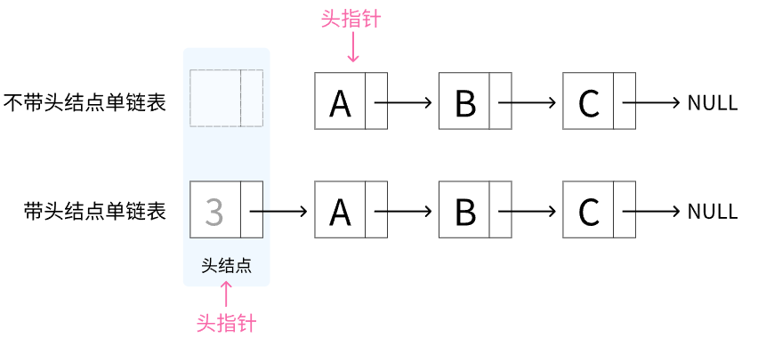

# <strong>2.2 链表</strong>
<hr>
<p>&nbsp;&nbsp;&nbsp;&nbsp;&nbsp;&nbsp;&nbsp;&nbsp;内存空间是所有程序的公共资源,在一个复杂的系统运行环境下,空闲的内存空间可能散落在内存各处.我们知道,存储数组的内存空间必须是连续的,而当数组非常大时,内存可能无法提供如此大的连续空间.此时链表的灵活性优势就体现出来了.</p>
<p>&nbsp;&nbsp;&nbsp;&nbsp;&nbsp;&nbsp;&nbsp;&nbsp;<strong style="text-decoration:underline"> 链表(linked list) </strong>是一种线性数据结构,其中的每个元素都是一个节点对象,各个节点通过“引用”相连接.引用记录了下一个节点的内存地址,通过它可以从当前节点访问到下一个节点.</p>
<p>&nbsp;&nbsp;&nbsp;&nbsp;&nbsp;&nbsp;&nbsp;&nbsp;链表的设计使得各个节点可以分散存储在内存各处，它们的内存地址无须连续。</p>

<figure markdown="span">
  
  <figcaption>图2-2-1 链表定义与存储方式</figcaption>
</figure>

<p>&nbsp;&nbsp;&nbsp;&nbsp;&nbsp;&nbsp;&nbsp;&nbsp;观察图2-2-1,链表的组成单位是<strong style="text-decoration:underline">节点（node）</strong>对象.每个节点都包含两项数据:</p>

* data: 数据域,也是节点的值
* next: 指针域,指向下一个节点的指针


&nbsp;&nbsp;&nbsp;&nbsp;&nbsp;&nbsp;&nbsp;&nbsp;如以下代码所示，链表节点 <code>ListNodec</code> 除了包含值,还需额外保存一个引用（指针）.因此在相同数据量下,<strong style="color:hotpink">链表比数组占用更多的内存空间</strong> .

=== "C"

    ```c linenums="1"
    /* 链表节点结构体 */
    typedef struct ListNode {
        int val;               // 节点值
        struct ListNode *next; // 指向下一节点的指针
    } ListNode;

    /* 构造函数 */
    ListNode *newListNode(int val) {
        ListNode *node;
        node = (ListNode *) malloc(sizeof(ListNode));
        node->val = val;
        node->next = NULL;
        return node;
    }
    ```


=== "C++"

    ```cpp linenums="1"
    /* 链表节点结构体 */
    struct ListNode {
        int val;         // 节点值
        ListNode *next;  // 指向下一节点的指针
        ListNode(int x) : val(x), next(nullptr) {}  // 构造函数
    };
    ```

=== "Python"

    ```python linenums="1"
    class ListNode:
    """链表节点类"""
    def __init__(self, val: int):
        self.val: int = val               # 节点值
        self.next: ListNode | None = None # 指向下一节点的引用
    ```

=== "Java"

    ```java linenums="1"
    /* 链表节点类 */
    class ListNode {
        int val;        // 节点值
        ListNode next;  // 指向下一节点的引用
        ListNode(int x) { val = x; }  // 构造函数
    }
    ```

## <strong>链表中的一些概念</strong>
### <strong style="color:red">头节点</strong>

<p>&nbsp;&nbsp;&nbsp;&nbsp;&nbsp;&nbsp;&nbsp;&nbsp;在单链表的开始结点之前设立一个节点称之为<code style="color: #00c853">头结点</code>(也称为哨兵节点或哑节点),头结点的数据域可以不存储任何信息,也可以存储<strong>链表的长度</strong>等附加信息,头结点的指针域存储指向第一个结点(首元结点)的指针。</p>

<figure markdown="span">
  
  <figcaption>图2-2-2 带头节点和不带头结点区别</figcaption>
</figure>

### <strong style="color:red">头指针</strong>
<p>头指针是指链表中,<strong>指向</strong>第一个结点的指针.</p>
<p>头指针具有标识作用,所以常常会用头指针冠以链表的名字.所以你定义一个链表,那么链表的名字一般就是这个链表的头指针.</p>
<p><code style="color: #c3185d">ListNode L = new ListNode(0); </code>左边的是指针和结点</p>
<p>无论链表是否为空,头指针均不为空,头指针是链表的必要元素.</p>

<figure markdown="span">
  
  <figcaption>图2-2-3 带头节点和不带头结点区别</figcaption>
</figure>

### <strong style="color:red">首元节点</strong>

<p>链表中第一个元素所在的结点,它是头结点后边的第一个结点.如果是带头结点的链表,则头结点后面的为首元结点.</p>
<p>元素是指链表中实际存储数据的结点,像头结点就不属于元素,因为它存储的不是数据,而是一些链表的属性信息(链表长度)或者为空.</p>

<figure markdown="span">
  
  <figcaption>图2-2-4 首元节点</figcaption>
</figure>

!!! info "整理成一句话就是"

    * <strong style="color:red">头指针:</strong> 指向第一个节点
    * <strong style="color:red">头节点:</strong> 在首元结点前面设立的一个结点
    * <strong style="color:red">首元结点:</strong> 链表中第一个元素所在的结点
    * <strong style="color:red">元素结点:</strong> 存储链表实际信息的结点


<hr style="border:none;border-top-color:#ff0033;border-top-style: double;border-top-left-radius: 10px" >

## <strong>单链表(带头结点)</strong>

!!! tip "下面以带头节点的单链表为例展示以下6种函数的实现"

    * <p style="color:red">按值查找节点</p>
    * <p style="color:red">按位序插入节点</p>
    * <p style="color:red">按位序删除节点</p>
    * <p style="color:red">头插法创建链表</p>
    * <p style="color:red">尾插法创建链表</p>

### 1 链表初始化
<p>建立链表分为两步,第一步是初始化各个节点对象,第二步是构建节点之间的引用关系.初始化完成后,我们就可以从链表的头节点出发,通过引用指向<code>next</code>依次访问所有节点.</p>


=== "C"

    ```c linenums="1" title="linked_list.c"
    /* 先定义一个带头节点的单链表 */
    typedef struct LNode{           //定义单链表节点类型
        ElemType data;              //每个节点存放一个数据元素
        struct LNode *next;         //指针指向下一个节点
    }LNode, *LinkList;              //LNode 是节点类型，LinkList是指向LNode这种节点的指针类型


    // 初始化一个单链表(带头结点)
    bool InitList(LinkList &L){
        L = (LNode * ) malloc(sizeof(LNode));   //分配一个头节点
        if(L == NULL)                           //  内存不足，分配失败
            return false;
        L->next = NULL;                         //头节点之后暂时还没有节点
        return true;
    }
    ```


=== "C++"

    ```cpp linenums="1" title="linked_list.cpp"
    /* 先定义一个带头节点的单链表 */
    typedef struct LNode{           //定义单链表节点类型
        ElemType data;              //每个节点存放一个数据元素
        struct LNode *next;         //指针指向下一个节点
    }LNode, *LinkList;              //LNode 是节点类型，LinkList是指向LNode这种节点的指针类型


    // 初始化一个单链表(带头结点)
    bool InitList(LinkList &L){
        L = (LNode * ) malloc(sizeof(LNode));   //分配一个头节点
        if(L == NULL)                           //  内存不足，分配失败
            return false;
        L->next = NULL;                         //头节点之后暂时还没有节点
        return true;
    }
    ```

=== "Python"

    ```python linenums="1" title="linked_list.py"
    # TODO
    ```

=== "Java"

    ```java linenums="1" title="linked_list.java"
    /* TODO */
    
    ```

??? example "可视化运行"

    <iframe width="800" height="600" frameborder="0" src="https://pythontutor.com/iframe-embed.html#code=%23include%20%3Cstdio.h%3E%0A%23include%3Cstdlib.h%3E%0Atypedef%20struct%20LNode%20%7B%0A%20%20int%20data%3B%0A%20%20struct%20LNode%20*%20next%3B%0A%7D%20LNode,%20*LinkList%3B%0A%0A//%20%E5%88%9D%E5%A7%8B%E5%8C%96%E9%93%BE%E8%A1%A8%0Abool%20List_Init%20%28LinkList%20%26pHead%29%20%7B%0A%20%20pHead%20%3D%20%28LNode%20*%29%20malloc%28sizeof%28LNode%29%29%3B%20//%20%E4%B8%BA%E5%A4%B4%E7%BB%93%E7%82%B9%E5%88%86%E9%85%8D%E5%86%85%E5%AD%98%E5%B9%B6%E5%B0%86%E5%9C%B0%E5%9D%80%E5%AD%98%E5%82%A8%E5%9C%A8pHead%E4%B8%AD%E3%80%82%0A%20%20if%20%28pHead%20%3D%3D%20NULL%29%20return%20false%3B%20//%20%E6%A3%80%E6%9F%A5%E5%86%85%E5%AD%98%E5%88%86%E9%85%8D%E6%98%AF%E5%90%A6%E6%88%90%E5%8A%9F%EF%BC%88pHead%E4%B8%8D%E4%B8%BANULL%EF%BC%89%E3%80%82%0A%20%20pHead-%3Enext%20%3D%20NULL%3B%20//%20%E5%88%9D%E5%A7%8B%E5%8C%96%E5%A4%B4%E7%BB%93%E7%82%B9%E7%9A%84'next'%E6%8C%87%E9%92%88%E4%B8%BANULL%EF%BC%8C%E5%9B%A0%E4%B8%BA%E5%AE%83%E6%98%AF%E9%93%BE%E8%A1%A8%E4%B8%AD%E5%94%AF%E4%B8%80%E7%9A%84%E8%8A%82%E7%82%B9%E3%80%82%0A%20%20return%20true%3B%0A%7D%0A%0Aint%20main%20%28%29%20%7B%0A%20%20LinkList%20pHead%3B%0A%20%20List_Init%28pHead%29%3B%0A%20%20return%200%3B%0A%7D&codeDivHeight=400&codeDivWidth=350&cumulative=false&curInstr=0&heapPrimitives=nevernest&origin=opt-frontend.js&py=cpp_g%2B%2B9.3.0&rawInputLstJSON=%5B%5D&textReferences=false"> </iframe>
    <a href="https://pythontutor.com/iframe-embed.html#code=%23include%20%3Cstdio.h%3E%0A%23include%3Cstdlib.h%3E%0Atypedef%20struct%20LNode%20%7B%0A%20%20int%20data%3B%0A%20%20struct%20LNode%20*%20next%3B%0A%7D%20LNode,%20*LinkList%3B%0A%0A//%20%E5%88%9D%E5%A7%8B%E5%8C%96%E9%93%BE%E8%A1%A8%0Abool%20List_Init%20%28LinkList%20%26pHead%29%20%7B%0A%20%20pHead%20%3D%20%28LNode%20*%29%20malloc%28sizeof%28LNode%29%29%3B%20//%20%E4%B8%BA%E5%A4%B4%E7%BB%93%E7%82%B9%E5%88%86%E9%85%8D%E5%86%85%E5%AD%98%E5%B9%B6%E5%B0%86%E5%9C%B0%E5%9D%80%E5%AD%98%E5%82%A8%E5%9C%A8pHead%E4%B8%AD%E3%80%82%0A%20%20if%20%28pHead%20%3D%3D%20NULL%29%20return%20false%3B%20//%20%E6%A3%80%E6%9F%A5%E5%86%85%E5%AD%98%E5%88%86%E9%85%8D%E6%98%AF%E5%90%A6%E6%88%90%E5%8A%9F%EF%BC%88pHead%E4%B8%8D%E4%B8%BANULL%EF%BC%89%E3%80%82%0A%20%20pHead-%3Enext%20%3D%20NULL%3B%20//%20%E5%88%9D%E5%A7%8B%E5%8C%96%E5%A4%B4%E7%BB%93%E7%82%B9%E7%9A%84'next'%E6%8C%87%E9%92%88%E4%B8%BANULL%EF%BC%8C%E5%9B%A0%E4%B8%BA%E5%AE%83%E6%98%AF%E9%93%BE%E8%A1%A8%E4%B8%AD%E5%94%AF%E4%B8%80%E7%9A%84%E8%8A%82%E7%82%B9%E3%80%82%0A%20%20return%20true%3B%0A%7D%0A%0Aint%20main%20%28%29%20%7B%0A%20%20LinkList%20pHead%3B%0A%20%20List_Init%28pHead%29%3B%0A%20%20return%200%3B%0A%7D&codeDivHeight=400&codeDivWidth=350&cumulative=false&curInstr=0&heapPrimitives=nevernest&origin=opt-frontend.js&py=cpp_g%2B%2B9.3.0&rawInputLstJSON=%5B%5D&textReferences=false"  target="_blank" rel="noopener noreferrer"><span style="color:#349890">【全屏观看】</span></a>


### 2 链表插入节点(按位序插入)
<p>在链表中插入节点非常容易.如图2-2-2所示,假设我们想在相邻的两个节点<code style="color: hotpink">n0</code> 和 <code style="color: hotpink">n1</code> 之间插入一个新节点  <code style="color: hotpink">P</code> ,则只需改变两个节点引用（指针）即可，时间复杂度为 O(1) .</p>
<p>相比之下，在数组中插入元素的时间复杂度为O(n),在大数据量下的效率较低.</p>

<figure markdown="span">
  
  <figcaption>图2-2-2 链表插入节点</figcaption>
</figure>


=== "C"

    ```c linenums="1" title="linked_list.c" hl_lines="10 11 12 13 19 20"
    //在第 i 个位置插入元素e(带头结点)
    bool ListInsert(LinkList &L, int i, ElemType e){
        if(i < 1)
            return false;
        LNode *p;                       //指针p指向当前扫描到的节点
        int j = 0;                      //当前p指向的是第几个节点
        p = L;                          //L指向头节点，头节点是第0个节点(不存数据)

        //寻找第 i-1 个节点
        while(p != NULL && j < i-1){    //循环找到第 i-1 个节点
            p = p->next;
            j++;
        }

        if(p == NULL)                   //i值不合法
            return false;
        
        //新建一个节点并赋值要插入的数据e
        LNode *s = (LNode *)malloc(sizeof(LNode));
        s->data = e;

        //开始插入
        s->next = p->next;              //先将新节点的next指向第 i 个节点
        p->next = s;                    //将节点s连接到p之后
        
        return true;                    //插入成功
    }
    ```


=== "C++"

    ```cpp linenums="1" title="linked_list.cpp" hl_lines="10 11 12 13 19 20"
    //在第 i 个位置插入元素e(带头结点)
    bool ListInsert(LinkList &L, int i, ElemType e){
        if(i < 1)
            return false;
        LNode *p;                       //指针p指向当前扫描到的节点
        int j = 0;                      //当前p指向的是第几个节点
        p = L;                          //L指向头节点，头节点是第0个节点(不存数据)

        //寻找第 i-1 个节点
        while(p != NULL && j < i-1){    //循环找到第 i-1 个节点
            p = p->next;
            j++;
        }

        if(p == NULL)                   //i值不合法
            return false;
        LNode *s = (LNode *)malloc(sizeof(LNode));
        s->data = e;
        s->next = p->next;              //先将新节点的next指向第 i 个节点
        p->next = s;                    //将节点s连接到p之后
        
        return true;                    //插入成功
    }
    ```

=== "Python"

    ```python linenums="1" title="linked_list.py"
    # TODO
    ```

=== "Java"

    ```java linenums="1" title="linked_list.java"
    /* TODO */
    ```

??? example "可视化运行"

    <iframe width="800" height="600" frameborder="0" src="https://pythontutor.com/iframe-embed.html#code=%23include%20%3Cstdio.h%3E%0A%23include%3Cstdlib.h%3E%0A%0Atypedef%20struct%20LNode%20%7B%0A%20%20int%20data%3B%0A%20%20struct%20LNode%20*%20next%3B%0A%7D%20LNode,%20*LinkList%3B%0A%0A//%20%E5%88%9D%E5%A7%8B%E5%8C%96%E9%93%BE%E8%A1%A8%0Abool%20List_Init%20%28LinkList%20%26pHead%29%20%7B%0A%20%20pHead%20%3D%20%28LNode%20*%29%20malloc%28sizeof%28LNode%29%29%3B%20//%20%E4%B8%BA%E5%A4%B4%E7%BB%93%E7%82%B9%E5%88%86%E9%85%8D%E5%86%85%E5%AD%98%E5%B9%B6%E5%B0%86%E5%9C%B0%E5%9D%80%E5%AD%98%E5%82%A8%E5%9C%A8pHead%E4%B8%AD%E3%80%82%0A%20%20if%20%28pHead%20%3D%3D%20NULL%29%20return%20false%3B%20//%20%E6%A3%80%E6%9F%A5%E5%86%85%E5%AD%98%E5%88%86%E9%85%8D%E6%98%AF%E5%90%A6%E6%88%90%E5%8A%9F%EF%BC%88pHead%E4%B8%8D%E4%B8%BANULL%EF%BC%89%E3%80%82%0A%20%20pHead-%3Enext%20%3D%20NULL%3B%20//%20%E5%88%9D%E5%A7%8B%E5%8C%96%E5%A4%B4%E7%BB%93%E7%82%B9%E7%9A%84'next'%E6%8C%87%E9%92%88%E4%B8%BANULL%EF%BC%8C%E5%9B%A0%E4%B8%BA%E5%AE%83%E6%98%AF%E9%93%BE%E8%A1%A8%E4%B8%AD%E5%94%AF%E4%B8%80%E7%9A%84%E8%8A%82%E7%82%B9%E3%80%82%0A%20%20return%20true%3B%0A%7D%0A%0A//%20%E8%8E%B7%E5%8F%96%E5%8D%95%E9%93%BE%E8%A1%A8%E6%9C%89%E6%95%88%E6%95%B0%E6%8D%AE%E8%8A%82%E7%82%B9%E4%B8%AA%E6%95%B0%0Aint%20List_Length%20%28LinkList%20pHead%29%20%7B%0A%20%20int%20count%20%3D%200%3B%20//%20%E7%94%A8%E4%BA%8E%E8%AE%A1%E6%95%B0%E6%9C%89%E6%95%88%E8%8A%82%E7%82%B9%E7%9A%84%E5%8F%98%E9%87%8F%0A%20%20for%20%28LNode%20*p%20%3D%20pHead-%3Enext%3B%20p%20!%3D%20NULL%3B%20p%20%3D%20p-%3Enext%29%20//%20%E4%BB%8E%E5%A4%B4%E7%BB%93%E7%82%B9%E7%9A%84%E4%B8%8B%E4%B8%80%E4%B8%AA%E8%8A%82%E7%82%B9%E5%BC%80%E5%A7%8B%EF%BC%8C%E9%81%8D%E5%8E%86%E9%93%BE%E8%A1%A8%E7%9B%B4%E5%88%B0%E9%93%BE%E8%A1%A8%E7%BB%93%E6%9D%9F%EF%BC%88%E8%8A%82%E7%82%B9%E4%B8%BANULL%EF%BC%89%E3%80%82%0A%20%20%20%20count%2B%2B%3B%20//%20%E6%AF%8F%E7%BB%8F%E8%BF%87%E4%B8%80%E4%B8%AA%E8%8A%82%E7%82%B9%EF%BC%8C%E6%9C%89%E6%95%88%E8%8A%82%E7%82%B9%E6%95%B0%E9%87%8F%E5%8A%A01%E3%80%82%0A%20%20return%20count%3B%0A%7D%0A%0A//%20%E6%8C%89%E4%BD%8D%E5%BA%8F%E6%8F%92%E5%85%A5%EF%BC%8Ci%3D1%E6%8F%92%E5%9C%A8%E8%A1%A8%E5%A4%B4%EF%BC%8Ci%3Dlength%2B1%E6%8F%92%E5%9C%A8%E8%A1%A8%E5%B0%BE%0Abool%20List_Insert%28LinkList%20%26pHead,%20int%20i,%20int%20e%29%20%7B%0A%20%20if%20%28i%20%3C%201%20%7C%7C%20i%20%3E%20List_Length%28pHead%29%20%2B%201%29%20return%20false%3B%20%20//%20%E6%A3%80%E6%9F%A5%E6%8F%92%E5%85%A5%E4%BD%8D%E7%BD%AE%E6%98%AF%E5%90%A6%E6%9C%89%E6%95%88%0A%20%20int%20j%20%3D%200%3B%20//%20%E5%BD%93%E5%89%8Dp%E6%8C%87%E5%90%91%E7%9A%84%E6%98%AF%E7%AC%AC%E5%87%A0%E4%B8%AA%E7%BB%93%E7%82%B9%0A%20%20LNode%20*p%20%3D%20pHead%3B%20//%20p%20%E6%8C%87%E5%90%91%E5%A4%B4%E7%BB%93%E7%82%B9%0A%20%20while%20%28p%20!%3D%20NULL%20%26%26%20j%20%3C%20i%20-%201%29%20%7B%20//%20%E5%BE%AA%E7%8E%AF%E6%89%BE%E5%88%B0%E8%A6%81%E6%8F%92%E5%85%A5%E4%BD%8D%E7%BD%AE%E7%9A%84%E5%89%8D%E9%A9%B1%E7%BB%93%E7%82%B9%EF%BC%8C%E7%9B%B4%E5%88%B0%E6%89%BE%E5%88%B0%E5%89%8D%E9%A9%B1%E7%BB%93%E7%82%B9%E6%88%96%E8%80%85%E9%93%BE%E8%A1%A8%E7%BB%93%E6%9D%9F%0A%20%20%20%20p%20%3D%20p-%3Enext%3B%0A%20%20%20%20j%2B%2B%3B%0A%20%20%7D%0A%0A%20%20LNode%20*pTemp%20%3D%20%28LNode%20*%29malloc%28sizeof%28LNode%29%29%3B%0A%20%20pTemp-%3Edata%20%3D%20e%3B%0A%20%20pTemp-%3Enext%20%3D%20p-%3Enext%3B%20//%20%E5%B0%86%E6%96%B0%E8%8A%82%E7%82%B9%E7%9A%84'next'%E6%8C%87%E5%90%91p%E7%9A%84%E4%B8%8B%E4%B8%80%E4%B8%AA%E8%8A%82%E7%82%B9%0A%20%20p-%3Enext%20%3D%20pTemp%3B%20//%20%E6%9B%B4%E6%96%B0p%E7%9A%84'next'%E6%8C%87%E5%90%91%E6%96%B0%E8%8A%82%E7%82%B9%EF%BC%8C%E5%AE%8C%E6%88%90%E6%8F%92%E5%85%A5%E6%93%8D%E4%BD%9C%E3%80%82%0A%20%20return%20true%3B%0A%7D%0A%0A//%20%E6%89%93%E5%8D%B0%E9%93%BE%E8%A1%A8%E6%89%80%E6%9C%89%E5%80%BC%0Avoid%20List_Show%20%28LinkList%20pHead%29%20%7B%0A%20%20LNode%20*node%20%3D%20pHead-%3Enext%3B%0A%20%20printf%28%22%E9%93%BE%E8%A1%A8%E5%80%BC%EF%BC%9A%22%29%3B%0A%20%20while%20%28node%20!%3D%20NULL%29%20%7B%0A%20%20%20%20printf%28%22%25d%E3%80%81%22,%20node-%3Edata%29%3B%0A%20%20%20%20node%20%3D%20node-%3Enext%3B%0A%20%20%7D%0A%20%20printf%28%22%5Cn%22%29%3B%0A%7D%0A%0Aint%20main%20%28%29%20%7B%0A%20%20LinkList%20pHead%3B%0A%20%20List_Init%28pHead%29%3B%0A%0A%20%20printf%28%22%E9%93%BE%E8%A1%A8%E9%95%BF%E5%BA%A6%EF%BC%9A%25d%5Cn%5Cn%22,%20List_Length%28pHead%29%29%3B%0A%20%20printf%28%22%E4%BD%8D%E5%BA%8F%E4%B8%BA1%28%E5%A4%B4%E6%8F%92%29%EF%BC%8C%E6%8F%92%E5%85%A5%EF%BC%9A0%5Cn%22%29%3B%0A%20%20List_Insert%28pHead,%201,%200%29%3B%0A%20%20List_Show%28pHead%29%3B%0A%20%20printf%28%22%E9%93%BE%E8%A1%A8%E9%95%BF%E5%BA%A6%EF%BC%9A%25d%5Cn%5Cn%22,%20List_Length%28pHead%29%29%3B%0A%20%20%0A%0A%20%20printf%28%22%E4%BD%8D%E5%BA%8F%E4%B8%BA%25d%28%E5%B0%BE%E6%8F%92%29%EF%BC%8C%E6%8F%92%E5%85%A5%EF%BC%9A99%5Cn%22,%20List_Length%28pHead%29%20%2B%201%29%3B%0A%20%20List_Insert%28pHead,%20List_Length%28pHead%29%20%2B%201,%2099%29%3B%0A%20%20List_Show%28pHead%29%3B%0A%20%20printf%28%22%E9%93%BE%E8%A1%A8%E9%95%BF%E5%BA%A6%EF%BC%9A%25d%5Cn%5Cn%22,%20List_Length%28pHead%29%29%3B%0A%20%20%0A%20%20return%200%3B%0A%7D&codeDivHeight=400&codeDivWidth=350&cumulative=false&curInstr=0&heapPrimitives=nevernest&origin=opt-frontend.js&py=cpp_g%2B%2B9.3.0&rawInputLstJSON=%5B%5D&textReferences=false"> </iframe>
    <a href="https://pythontutor.com/iframe-embed.html#code=%23include%20%3Cstdio.h%3E%0A%23include%3Cstdlib.h%3E%0A%0Atypedef%20struct%20LNode%20%7B%0A%20%20int%20data%3B%0A%20%20struct%20LNode%20*%20next%3B%0A%7D%20LNode,%20*LinkList%3B%0A%0A//%20%E5%88%9D%E5%A7%8B%E5%8C%96%E9%93%BE%E8%A1%A8%0Abool%20List_Init%20%28LinkList%20%26pHead%29%20%7B%0A%20%20pHead%20%3D%20%28LNode%20*%29%20malloc%28sizeof%28LNode%29%29%3B%20//%20%E4%B8%BA%E5%A4%B4%E7%BB%93%E7%82%B9%E5%88%86%E9%85%8D%E5%86%85%E5%AD%98%E5%B9%B6%E5%B0%86%E5%9C%B0%E5%9D%80%E5%AD%98%E5%82%A8%E5%9C%A8pHead%E4%B8%AD%E3%80%82%0A%20%20if%20%28pHead%20%3D%3D%20NULL%29%20return%20false%3B%20//%20%E6%A3%80%E6%9F%A5%E5%86%85%E5%AD%98%E5%88%86%E9%85%8D%E6%98%AF%E5%90%A6%E6%88%90%E5%8A%9F%EF%BC%88pHead%E4%B8%8D%E4%B8%BANULL%EF%BC%89%E3%80%82%0A%20%20pHead-%3Enext%20%3D%20NULL%3B%20//%20%E5%88%9D%E5%A7%8B%E5%8C%96%E5%A4%B4%E7%BB%93%E7%82%B9%E7%9A%84'next'%E6%8C%87%E9%92%88%E4%B8%BANULL%EF%BC%8C%E5%9B%A0%E4%B8%BA%E5%AE%83%E6%98%AF%E9%93%BE%E8%A1%A8%E4%B8%AD%E5%94%AF%E4%B8%80%E7%9A%84%E8%8A%82%E7%82%B9%E3%80%82%0A%20%20return%20true%3B%0A%7D%0A%0A//%20%E8%8E%B7%E5%8F%96%E5%8D%95%E9%93%BE%E8%A1%A8%E6%9C%89%E6%95%88%E6%95%B0%E6%8D%AE%E8%8A%82%E7%82%B9%E4%B8%AA%E6%95%B0%0Aint%20List_Length%20%28LinkList%20pHead%29%20%7B%0A%20%20int%20count%20%3D%200%3B%20//%20%E7%94%A8%E4%BA%8E%E8%AE%A1%E6%95%B0%E6%9C%89%E6%95%88%E8%8A%82%E7%82%B9%E7%9A%84%E5%8F%98%E9%87%8F%0A%20%20for%20%28LNode%20*p%20%3D%20pHead-%3Enext%3B%20p%20!%3D%20NULL%3B%20p%20%3D%20p-%3Enext%29%20//%20%E4%BB%8E%E5%A4%B4%E7%BB%93%E7%82%B9%E7%9A%84%E4%B8%8B%E4%B8%80%E4%B8%AA%E8%8A%82%E7%82%B9%E5%BC%80%E5%A7%8B%EF%BC%8C%E9%81%8D%E5%8E%86%E9%93%BE%E8%A1%A8%E7%9B%B4%E5%88%B0%E9%93%BE%E8%A1%A8%E7%BB%93%E6%9D%9F%EF%BC%88%E8%8A%82%E7%82%B9%E4%B8%BANULL%EF%BC%89%E3%80%82%0A%20%20%20%20count%2B%2B%3B%20//%20%E6%AF%8F%E7%BB%8F%E8%BF%87%E4%B8%80%E4%B8%AA%E8%8A%82%E7%82%B9%EF%BC%8C%E6%9C%89%E6%95%88%E8%8A%82%E7%82%B9%E6%95%B0%E9%87%8F%E5%8A%A01%E3%80%82%0A%20%20return%20count%3B%0A%7D%0A%0A//%20%E6%8C%89%E4%BD%8D%E5%BA%8F%E6%8F%92%E5%85%A5%EF%BC%8Ci%3D1%E6%8F%92%E5%9C%A8%E8%A1%A8%E5%A4%B4%EF%BC%8Ci%3Dlength%2B1%E6%8F%92%E5%9C%A8%E8%A1%A8%E5%B0%BE%0Abool%20List_Insert%28LinkList%20%26pHead,%20int%20i,%20int%20e%29%20%7B%0A%20%20if%20%28i%20%3C%201%20%7C%7C%20i%20%3E%20List_Length%28pHead%29%20%2B%201%29%20return%20false%3B%20%20//%20%E6%A3%80%E6%9F%A5%E6%8F%92%E5%85%A5%E4%BD%8D%E7%BD%AE%E6%98%AF%E5%90%A6%E6%9C%89%E6%95%88%0A%20%20int%20j%20%3D%200%3B%20//%20%E5%BD%93%E5%89%8Dp%E6%8C%87%E5%90%91%E7%9A%84%E6%98%AF%E7%AC%AC%E5%87%A0%E4%B8%AA%E7%BB%93%E7%82%B9%0A%20%20LNode%20*p%20%3D%20pHead%3B%20//%20p%20%E6%8C%87%E5%90%91%E5%A4%B4%E7%BB%93%E7%82%B9%0A%20%20while%20%28p%20!%3D%20NULL%20%26%26%20j%20%3C%20i%20-%201%29%20%7B%20//%20%E5%BE%AA%E7%8E%AF%E6%89%BE%E5%88%B0%E8%A6%81%E6%8F%92%E5%85%A5%E4%BD%8D%E7%BD%AE%E7%9A%84%E5%89%8D%E9%A9%B1%E7%BB%93%E7%82%B9%EF%BC%8C%E7%9B%B4%E5%88%B0%E6%89%BE%E5%88%B0%E5%89%8D%E9%A9%B1%E7%BB%93%E7%82%B9%E6%88%96%E8%80%85%E9%93%BE%E8%A1%A8%E7%BB%93%E6%9D%9F%0A%20%20%20%20p%20%3D%20p-%3Enext%3B%0A%20%20%20%20j%2B%2B%3B%0A%20%20%7D%0A%0A%20%20LNode%20*pTemp%20%3D%20%28LNode%20*%29malloc%28sizeof%28LNode%29%29%3B%0A%20%20pTemp-%3Edata%20%3D%20e%3B%0A%20%20pTemp-%3Enext%20%3D%20p-%3Enext%3B%20//%20%E5%B0%86%E6%96%B0%E8%8A%82%E7%82%B9%E7%9A%84'next'%E6%8C%87%E5%90%91p%E7%9A%84%E4%B8%8B%E4%B8%80%E4%B8%AA%E8%8A%82%E7%82%B9%0A%20%20p-%3Enext%20%3D%20pTemp%3B%20//%20%E6%9B%B4%E6%96%B0p%E7%9A%84'next'%E6%8C%87%E5%90%91%E6%96%B0%E8%8A%82%E7%82%B9%EF%BC%8C%E5%AE%8C%E6%88%90%E6%8F%92%E5%85%A5%E6%93%8D%E4%BD%9C%E3%80%82%0A%20%20return%20true%3B%0A%7D%0A%0A//%20%E6%89%93%E5%8D%B0%E9%93%BE%E8%A1%A8%E6%89%80%E6%9C%89%E5%80%BC%0Avoid%20List_Show%20%28LinkList%20pHead%29%20%7B%0A%20%20LNode%20*node%20%3D%20pHead-%3Enext%3B%0A%20%20printf%28%22%E9%93%BE%E8%A1%A8%E5%80%BC%EF%BC%9A%22%29%3B%0A%20%20while%20%28node%20!%3D%20NULL%29%20%7B%0A%20%20%20%20printf%28%22%25d%E3%80%81%22,%20node-%3Edata%29%3B%0A%20%20%20%20node%20%3D%20node-%3Enext%3B%0A%20%20%7D%0A%20%20printf%28%22%5Cn%22%29%3B%0A%7D%0A%0Aint%20main%20%28%29%20%7B%0A%20%20LinkList%20pHead%3B%0A%20%20List_Init%28pHead%29%3B%0A%0A%20%20printf%28%22%E9%93%BE%E8%A1%A8%E9%95%BF%E5%BA%A6%EF%BC%9A%25d%5Cn%5Cn%22,%20List_Length%28pHead%29%29%3B%0A%20%20printf%28%22%E4%BD%8D%E5%BA%8F%E4%B8%BA1%28%E5%A4%B4%E6%8F%92%29%EF%BC%8C%E6%8F%92%E5%85%A5%EF%BC%9A0%5Cn%22%29%3B%0A%20%20List_Insert%28pHead,%201,%200%29%3B%0A%20%20List_Show%28pHead%29%3B%0A%20%20printf%28%22%E9%93%BE%E8%A1%A8%E9%95%BF%E5%BA%A6%EF%BC%9A%25d%5Cn%5Cn%22,%20List_Length%28pHead%29%29%3B%0A%20%20%0A%0A%20%20printf%28%22%E4%BD%8D%E5%BA%8F%E4%B8%BA%25d%28%E5%B0%BE%E6%8F%92%29%EF%BC%8C%E6%8F%92%E5%85%A5%EF%BC%9A99%5Cn%22,%20List_Length%28pHead%29%20%2B%201%29%3B%0A%20%20List_Insert%28pHead,%20List_Length%28pHead%29%20%2B%201,%2099%29%3B%0A%20%20List_Show%28pHead%29%3B%0A%20%20printf%28%22%E9%93%BE%E8%A1%A8%E9%95%BF%E5%BA%A6%EF%BC%9A%25d%5Cn%5Cn%22,%20List_Length%28pHead%29%29%3B%0A%20%20%0A%20%20return%200%3B%0A%7D&codeDivHeight=400&codeDivWidth=350&cumulative=false&curInstr=0&heapPrimitives=nevernest&origin=opt-frontend.js&py=cpp_g%2B%2B9.3.0&rawInputLstJSON=%5B%5D&textReferences=false"  target="_blank" rel="noopener noreferrer"><span style="color:#349890">【全屏观看】</span></a>

### 3 链表删除节点
<p>如图 2-2-3 所示,在链表中删除节点也非常方便,<strong><code style="color: hotpink">只需改变一个节点的引用（指针）即可</code></strong>。</p>
!!! info 

    <p>请注意,尽管在删除操作完成后节点 <code>P</code> 仍然指向 <code>n1</code>,但实际上遍历此链表已经无法访问到 <code>P</code> ,这意味着 <code>P</code> 已经不再属于该链表了。</p>

<figure markdown="span">
  
  <figcaption>图2-2-2 链表删除节点</figcaption>
</figure>


=== "C"

    ```c linenums="1" title="linked_list.c" hl_lines="9 10 11 12 16"
    // 按位序删除，i=1删表头，i=length删头尾
    bool List_Del (LinkList &L, int i, ElemType &e) {           //删除时返回删除的元素
        if (i < 1 || i > List_Length(pHead)) return false;      //删除位置不合法
        LNode *p;                                               //指针p指向当前扫描到的节点
        int j = 0;                                              //当前p指向的第几个节点
        p = L;                                                  //L和p相同，都指向头节点

        //寻找第 i-1 个节点
        while(p != NULL && j < i-1){                            //循环找到第 i-1 个节点
            p = p->next;
            j++;
        }

        LNode *q = p->next;                                     // q指向待删除结点
        e = q->data;                                            //返回即将删除的数据
        p->next = q->next;                                      // 将q节点从链中“断开”
        free(q);                                                //释放节点的存储空间
        return true;                                            //删除成功
    }
    ```


=== "C++"

    ```cpp linenums="1" title="linked_list.cpp" hl_lines="9 10 11 12 16"
    // 按位序删除，i=1删表头，i=length删头尾
    bool List_Del (LinkList &L, int i, ElemType &e) {           //删除时返回删除的元素
        if (i < 1 || i > List_Length(pHead)) return false;      //删除位置不合法
        LNode *p;                                               //指针p指向当前扫描到的节点
        int j = 0;                                              //当前p指向的第几个节点
        p = L;                                                  //L和p相同，都指向头节点

        //寻找第 i-1 个节点
        while(p != NULL && j < i-1){                            //循环找到第 i-1 个节点
            p = p->next;
            j++;
        }

        LNode *q = p->next;                                     // q指向待删除结点
        e = q->data;                                            //返回即将删除的数据
        p->next = q->next;                                      // 将q节点从链中“断开”
        free(q);                                                //释放节点的存储空间
        return true;                                            //删除成功
    }
    ```

=== "Python"

    ```python linenums="1" title="linked_list.py"
    # TODO
    ```

=== "Java"

    ```java linenums="1" title="linked_list.java"
    /* TODO */
    
    ```

### 4 访问节点

<p><code>在链表中访问节点的效率较低</code>.如上一节所述,我们可以在O(1)时间下访问数组中的任意元素.链表则不然,程序需要从头节点出发,逐个向后遍历,直至找到目标节点.也就是说,访问链表的第<code>i</code>个节点需要循环<code>i - 1</code>>轮,时间复杂度为O(n).</p>

=== "C"

    ```c linenums="1" title="linked_list.c" hl_lines="4 5 6"
    /* 访问链表中索引为 index 的节点 */
    ListNode *access(ListNode *head, int index) {
        for (int i = 0; i < index; i++) {
            if (head == NULL)
            return NULL;
            head = head->next;
        }
        return head;
    }
    ```


=== "C++"

    ```cpp linenums="1" title="linked_list.cpp" hl_lines="4 5 6"
    /* 删除链表的节点 n0 之后的首个节点 */
    void remove(ListNode *n0) {
        if (n0->next == nullptr)
            return;
        // n0 -> P -> n1
        ListNode *P = n0->next;
        ListNode *n1 = P->next;
        n0->next = n1;
        // 释放内存
        delete P;
    }
    ```

=== "Python"

    ```python linenums="1" title="linked_list.py"
    def access(head: ListNode, index: int) -> ListNode | None:
    """访问链表中索引为 index 的节点"""
    for _ in range(index):
        if not head:
            return None
        head = head.next
    return head
    ```

=== "Java"

    ```java linenums="1" title="linked_list.java"
    /* 访问链表中索引为 index 的节点 */
    ListNode access(ListNode head, int index) {
        for (int i = 0; i < index; i++) {
            if (head == null)
                return null;
            head = head.next;
        }
        return head;
    }
    
    ```

### 5 查找节点

<p>遍历链表,查找其中值为<code> target </code>的节点,输出该节点在链表中的索引.此过程也属于线性查找.代码如下所示: </p>

=== "C"

    ```c linenums="1" title="linked_list.c" hl_lines="5 6 7 8"
    /* 在链表中查找值为 target 的首个节点 */
    int find(ListNode *head, int target) {
        int index = 0;
        while (head) {
            if (head->val == target)
                return index;
            head = head->next;
            index++;
        }
        return -1;
    }
    ```


=== "C++"

    ```cpp linenums="1" title="linked_list.cpp" hl_lines="4 5 6"
    /* 在链表中查找值为 target 的首个节点 */
    int find(ListNode *head, int target) {
        int index = 0;
        while (head != nullptr) {
            if (head->val == target)
                return index;
            head = head->next;
            index++;
        }
        return -1;
    }
    ```

=== "Python"

    ```python linenums="1" title="linked_list.py"
    def find(head: ListNode, target: int) -> int:
    """在链表中查找值为 target 的首个节点"""
    index = 0
    while head:
        if head.val == target:
            return index
        head = head.next
        index += 1
    return -1
    ```

=== "Java"

    ```java linenums="1" title="linked_list.java"
    /* 在链表中查找值为 target 的首个节点 */
    int find(ListNode head, int target) {
        int index = 0;
        while (head != null) {
            if (head.val == target)
                return index;
            head = head.next;
            index++;
        }
        return -1;
    }
    
    ```

### 6 尾插法 - 建立单链表
<p>下面展示通过尾插法创建一个链表。</p>
<p>尾插法的特点是每插入一个新节点,链表的<code>尾节点指针(pTail)</code>会更新为新插入的节点,使其始终指向当前链表的尾结点。从而使得输入的数据在链表中按<code>顺序存储</code>>。 当输入数据为 999 时，循环结束，将尾节点的 next 指针置为 NULL 表示链表结束，函数返回最终的链表头节点。</p>

=== "C"

    ```c linenums="1" title="linked_list.c" hl_lines="7 8 9 10 11 12 13"
    // 创建链表-通过尾插法
    LinkList List_Create_Tail_Insert(LinkList &pHead) {
    LNode *pTemp; // 临时节点指针
    LNode *pTail = pHead; // 尾节点指针，初始指向头结点
    int x; // 用于存储输入的数据
    scanf("%d", &x);
    while (x != 999) {
        pTemp = (LNode *)malloc(sizeof(LNode)); // 分配内存并创建新节点
        pTemp->data = x; // 尾节点的下一个指针指向新节点
        pTail->next = pTemp; // 更新尾节点指针，使其指向新节点
        pTail = pTemp; // 读取下一个数据
        scanf("%d", &x);
    }
    pTail->next = NULL; // 尾节点的下一个指针置为 NULL，表示链表结束
    return pHead; // 返回带头结点的链表头指针
    }
    ```

=== "C++"

    ```cpp linenums="1" title="linked_list.cpp" hl_lines="9 10 11 12 16"
    // 创建链表-通过尾插法
    LinkList List_Create_Tail_Insert(LinkList &pHead) {
    LNode *pTemp; // 临时节点指针
    LNode *pTail = pHead; // 尾节点指针，初始指向头结点
    int x; // 用于存储输入的数据
    scanf("%d", &x);
    while (x != 999) {
        pTemp = (LNode *)malloc(sizeof(LNode)); // 分配内存并创建新节点
        pTemp->data = x; // 尾节点的下一个指针指向新节点
        pTail->next = pTemp; // 更新尾节点指针，使其指向新节点
        pTail = pTemp; // 读取下一个数据
        scanf("%d", &x);
    }
    pTail->next = NULL; // 尾节点的下一个指针置为 NULL，表示链表结束
    return pHead; // 返回带头结点的链表头指针
    }
    ```

### 7 头插法 - 建立单链表

<p>下面展示通过尾插法创建一个链表。</p>
!!! info "请注意"

    <p style="color:red">头插法结果为倒叙</p>

<p>该代码通过头插法创建一个链表. 头插法的特点是每插入一个新节点,链表的头节点就会变成新插入的节点,从而使得输入的数据在链表中是<code>倒序存储</code>>的. 当输入数据为 999 时，创建链表的循环结束,函数返回最终的链表头节点.</p>

=== "C"

    ```c linenums="1" title="linked_list.c" hl_lines="5 6 7 8 9 10 11"
    // 创建链表，头插法结果为倒叙
    LinkList List_Create(LinkList &pHead) {
    LNode *pTemp; int x; // 临时节点指针
    scanf("%d", &x);
    while (x != 999) {
        pTemp = (LNode *)malloc(sizeof(LNode)); // 分配内存并创建新节点
        pTemp->data = x;
        pTemp->next = pHead->next; // 新节点的指针指向当前头节点的下一个节点
        pHead->next = pTemp; // 头指针指向新节点，使其成为新的头节点
        scanf("%d", &x);
    }
    return pHead; // 返回带头结点的链表头指针
    }
    ```

=== "C++"

    ```cpp linenums="1" title="linked_list.cpp" hl_lines="9 10 11 12 16"
    // 创建链表，头插法结果为倒叙
    LinkList List_Create(LinkList &pHead) {
    LNode *pTemp; int x; // 临时节点指针
    scanf("%d", &x);
    while (x != 999) {
        pTemp = (LNode *)malloc(sizeof(LNode)); // 分配内存并创建新节点
        pTemp->data = x;
        pTemp->next = pHead->next; // 新节点的指针指向当前头节点的下一个节点
        pHead->next = pTemp; // 头指针指向新节点，使其成为新的头节点
        scanf("%d", &x);
    }
    return pHead; // 返回带头结点的链表头指针
    }
    ```