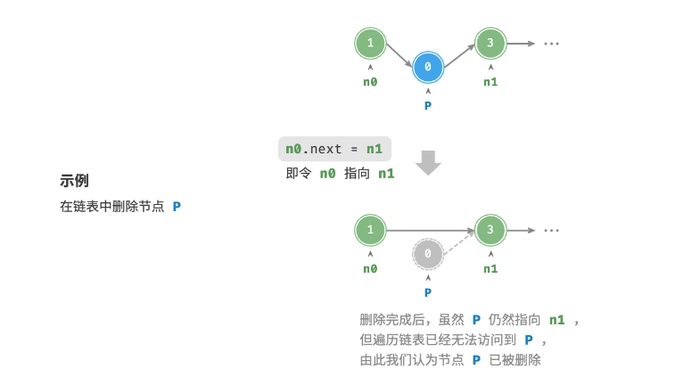

# <strong>2.2 链表</strong>
<hr>

<p>&nbsp;&nbsp;&nbsp;&nbsp;&nbsp;&nbsp;&nbsp;&nbsp;内存空间是所有程序的公共资源,在一个复杂的系统运行环境下,空闲的内存空间可能散落在内存各处.我们知道,存储数组的内存空间必须是连续的,而当数组非常大时,内存可能无法提供如此大的连续空间.此时链表的灵活性优势就体现出来了.</p></br>
<p>&nbsp;&nbsp;&nbsp;&nbsp;&nbsp;&nbsp;&nbsp;&nbsp;<strong style="text-decoration:underline"> 链表(linked list) </strong>是一种线性数据结构,其中的每个元素都是一个节点对象,各个节点通过“引用”相连接.引用记录了下一个节点的内存地址,通过它可以从当前节点访问到下一个节点.</p></br>
<p>&nbsp;&nbsp;&nbsp;&nbsp;&nbsp;&nbsp;&nbsp;&nbsp;链表的设计使得各个节点可以分散存储在内存各处，它们的内存地址无须连续。</p>

<figure markdown="span">
  
  <figcaption>图2-2-1 链表定义与存储方式</figcaption>
</figure>

<p>观察图2-2-1,链表的组成单位是<strong style="text-decoration:underline">节点（node）</strong>对象.每个节点都包含两项数据:节点的“值”和指向下一节点的“引用”.</p>

* 链表的首个节点被称为“头节点”，最后一个节点被称为“尾节点”。
* 尾节点指向的是“空”，它在 Java、C++ 和 Python 中分别被记为 null、nullptr 和 None 。
* 在 C、C++、Go 和 Rust 等支持指针的语言中，上述“引用”应被替换为“指针”。

如以下代码所示，链表节点 <code>ListNodec</code> 除了包含值,还需额外保存一个引用（指针）.因此在相同数据量下,<strong style="color:hotpink">链表比数组占用更多的内存空间</strong> .

=== "C"

    ```c linenums="1"
    /* 链表节点结构体 */
    typedef struct ListNode {
        int val;               // 节点值
        struct ListNode *next; // 指向下一节点的指针
    } ListNode;

    /* 构造函数 */
    ListNode *newListNode(int val) {
        ListNode *node;
        node = (ListNode *) malloc(sizeof(ListNode));
        node->val = val;
        node->next = NULL;
        return node;
    }
    ```


=== "C++"

    ```cpp linenums="1"
    /* 链表节点结构体 */
    struct ListNode {
        int val;         // 节点值
        ListNode *next;  // 指向下一节点的指针
        ListNode(int x) : val(x), next(nullptr) {}  // 构造函数
    };
    ```

=== "Python"

    ```python linenums="1"
    class ListNode:
    """链表节点类"""
    def __init__(self, val: int):
        self.val: int = val               # 节点值
        self.next: ListNode | None = None # 指向下一节点的引用
    ```

=== "Java"

    ```java linenums="1"
    /* 链表节点类 */
    class ListNode {
        int val;        // 节点值
        ListNode next;  // 指向下一节点的引用
        ListNode(int x) { val = x; }  // 构造函数
    }
    ```

## <strong>2.2.1 链表常用操作</strong> 

### 1 链表初始化
<p>建立链表分为两步,第一步是初始化各个节点对象,第二步是构建节点之间的引用关系.初始化完成后,我们就可以从链表的头节点出发,通过引用指向<code>next</code>依次访问所有节点.</p>

=== "C"

    ```c linenums="1" title="linked_list.c"
    /* 初始化链表 1 -> 3 -> 2 -> 5 -> 4 */
    // 初始化各个节点
    ListNode* n0 = newListNode(1);
    ListNode* n1 = newListNode(3);
    ListNode* n2 = newListNode(2);
    ListNode* n3 = newListNode(5);
    ListNode* n4 = newListNode(4);
    // 构建节点之间的引用
    n0->next = n1;
    n1->next = n2;
    n2->next = n3;
    n3->next = n4;
    ```


=== "C++"

    ```cpp linenums="1" title="linked_list.cpp"
    /* 初始化链表 1 -> 3 -> 2 -> 5 -> 4 */
    // 初始化各个节点
    ListNode* n0 = new ListNode(1);
    ListNode* n1 = new ListNode(3);
    ListNode* n2 = new ListNode(2);
    ListNode* n3 = new ListNode(5);
    ListNode* n4 = new ListNode(4);
    // 构建节点之间的引用
    n0->next = n1;
    n1->next = n2;
    n2->next = n3;
    n3->next = n4;
    ```

=== "Python"

    ```python linenums="1" title="linked_list.py"
    # 初始化链表 1 -> 3 -> 2 -> 5 -> 4
    # 初始化各个节点
    n0 = ListNode(1)
    n1 = ListNode(3)
    n2 = ListNode(2)
    n3 = ListNode(5)
    n4 = ListNode(4)
    # 构建节点之间的引用
    n0.next = n1
    n1.next = n2
    n2.next = n3
    n3.next = n4
    ```

=== "Java"

    ```java linenums="1" title="linked_list.java"
    /* 初始化链表 1 -> 3 -> 2 -> 5 -> 4 */
    // 初始化各个节点
    ListNode n0 = new ListNode(1);
    ListNode n1 = new ListNode(3);
    ListNode n2 = new ListNode(2);
    ListNode n3 = new ListNode(5);
    ListNode n4 = new ListNode(4);
    // 构建节点之间的引用
    n0.next = n1;
    n1.next = n2;
    n2.next = n3;
    n3.next = n4;
    ```

??? example "可视化运行"

    <iframe width="800" height="600" frameborder="0" src="https://pythontutor.com/iframe-embed.html#code=%23include%20%3Cstdio.h%3E%0A%23include%3Cstdlib.h%3E%0Atypedef%20struct%20LNode%20%7B%0A%20%20int%20data%3B%0A%20%20struct%20LNode%20*%20next%3B%0A%7D%20LNode,%20*LinkList%3B%0A%0A//%20%E5%88%9D%E5%A7%8B%E5%8C%96%E9%93%BE%E8%A1%A8%0Abool%20List_Init%20%28LinkList%20%26pHead%29%20%7B%0A%20%20pHead%20%3D%20%28LNode%20*%29%20malloc%28sizeof%28LNode%29%29%3B%20//%20%E4%B8%BA%E5%A4%B4%E7%BB%93%E7%82%B9%E5%88%86%E9%85%8D%E5%86%85%E5%AD%98%E5%B9%B6%E5%B0%86%E5%9C%B0%E5%9D%80%E5%AD%98%E5%82%A8%E5%9C%A8pHead%E4%B8%AD%E3%80%82%0A%20%20if%20%28pHead%20%3D%3D%20NULL%29%20return%20false%3B%20//%20%E6%A3%80%E6%9F%A5%E5%86%85%E5%AD%98%E5%88%86%E9%85%8D%E6%98%AF%E5%90%A6%E6%88%90%E5%8A%9F%EF%BC%88pHead%E4%B8%8D%E4%B8%BANULL%EF%BC%89%E3%80%82%0A%20%20pHead-%3Enext%20%3D%20NULL%3B%20//%20%E5%88%9D%E5%A7%8B%E5%8C%96%E5%A4%B4%E7%BB%93%E7%82%B9%E7%9A%84'next'%E6%8C%87%E9%92%88%E4%B8%BANULL%EF%BC%8C%E5%9B%A0%E4%B8%BA%E5%AE%83%E6%98%AF%E9%93%BE%E8%A1%A8%E4%B8%AD%E5%94%AF%E4%B8%80%E7%9A%84%E8%8A%82%E7%82%B9%E3%80%82%0A%20%20return%20true%3B%0A%7D%0A%0Aint%20main%20%28%29%20%7B%0A%20%20LinkList%20pHead%3B%0A%20%20List_Init%28pHead%29%3B%0A%20%20return%200%3B%0A%7D&codeDivHeight=400&codeDivWidth=350&cumulative=false&curInstr=0&heapPrimitives=nevernest&origin=opt-frontend.js&py=cpp_g%2B%2B9.3.0&rawInputLstJSON=%5B%5D&textReferences=false"> </iframe>
    <a href="https://pythontutor.com/iframe-embed.html#code=%23include%20%3Cstdio.h%3E%0A%23include%3Cstdlib.h%3E%0Atypedef%20struct%20LNode%20%7B%0A%20%20int%20data%3B%0A%20%20struct%20LNode%20*%20next%3B%0A%7D%20LNode,%20*LinkList%3B%0A%0A//%20%E5%88%9D%E5%A7%8B%E5%8C%96%E9%93%BE%E8%A1%A8%0Abool%20List_Init%20%28LinkList%20%26pHead%29%20%7B%0A%20%20pHead%20%3D%20%28LNode%20*%29%20malloc%28sizeof%28LNode%29%29%3B%20//%20%E4%B8%BA%E5%A4%B4%E7%BB%93%E7%82%B9%E5%88%86%E9%85%8D%E5%86%85%E5%AD%98%E5%B9%B6%E5%B0%86%E5%9C%B0%E5%9D%80%E5%AD%98%E5%82%A8%E5%9C%A8pHead%E4%B8%AD%E3%80%82%0A%20%20if%20%28pHead%20%3D%3D%20NULL%29%20return%20false%3B%20//%20%E6%A3%80%E6%9F%A5%E5%86%85%E5%AD%98%E5%88%86%E9%85%8D%E6%98%AF%E5%90%A6%E6%88%90%E5%8A%9F%EF%BC%88pHead%E4%B8%8D%E4%B8%BANULL%EF%BC%89%E3%80%82%0A%20%20pHead-%3Enext%20%3D%20NULL%3B%20//%20%E5%88%9D%E5%A7%8B%E5%8C%96%E5%A4%B4%E7%BB%93%E7%82%B9%E7%9A%84'next'%E6%8C%87%E9%92%88%E4%B8%BANULL%EF%BC%8C%E5%9B%A0%E4%B8%BA%E5%AE%83%E6%98%AF%E9%93%BE%E8%A1%A8%E4%B8%AD%E5%94%AF%E4%B8%80%E7%9A%84%E8%8A%82%E7%82%B9%E3%80%82%0A%20%20return%20true%3B%0A%7D%0A%0Aint%20main%20%28%29%20%7B%0A%20%20LinkList%20pHead%3B%0A%20%20List_Init%28pHead%29%3B%0A%20%20return%200%3B%0A%7D&codeDivHeight=400&codeDivWidth=350&cumulative=false&curInstr=0&heapPrimitives=nevernest&origin=opt-frontend.js&py=cpp_g%2B%2B9.3.0&rawInputLstJSON=%5B%5D&textReferences=false"  target="_blank" rel="noopener noreferrer"><span style="color:#349890">【全屏观看】</span></a>


### 2 链表插入节点
<p>在链表中插入节点非常容易.如图2-2-2所示,假设我们想在相邻的两个节点<code style="color: hotpink">n0</code> 和 <code style="color: hotpink">n1</code> 之间插入一个新节点  <code style="color: hotpink">P</code> ,则只需改变两个节点引用（指针）即可，时间复杂度为 O(1) .</p>
<br>
<p>相比之下，在数组中插入元素的时间复杂度为,在大数据量下的效率较低.</p>

<figure markdown="span">
  
  <figcaption>图2-2-2 链表插入节点</figcaption>
</figure>


=== "C"

    ```c linenums="1" title="linked_list.c"
    /* 在链表的节点 n0 之后插入节点 P */
    void insert(ListNode *n0, ListNode *P) {
        ListNode *n1 = n0->next;
        P->next = n1;
        n0->next = P;
    }
    ```


=== "C++"

    ```cpp linenums="1" title="linked_list.cpp"
    /* 在链表的节点 n0 之后插入节点 P */
    void insert(ListNode *n0, ListNode *P) {
        ListNode *n1 = n0->next;
        P->next = n1;
        n0->next = P;
    }
    ```

=== "Python"

    ```python linenums="1" title="linked_list.py"
    def insert(n0: ListNode, P: ListNode):
    """在链表的节点 n0 之后插入节点 P"""
    n1 = n0.next
    P.next = n1
    n0.next = P
    ```

=== "Java"

    ```java linenums="1" title="linked_list.java"
    /* 在链表的节点 n0 之后插入节点 P */
    void insert(ListNode n0, ListNode P) {
        ListNode n1 = n0.next;
        P.next = n1;
        n0.next = P;
    }
    ```

??? example "可视化运行"

    <iframe width="800" height="600" frameborder="0" src="https://pythontutor.com/iframe-embed.html#code=%23include%20%3Cstdio.h%3E%0A%23include%3Cstdlib.h%3E%0A%0Atypedef%20struct%20LNode%20%7B%0A%20%20int%20data%3B%0A%20%20struct%20LNode%20*%20next%3B%0A%7D%20LNode,%20*LinkList%3B%0A%0A//%20%E5%88%9D%E5%A7%8B%E5%8C%96%E9%93%BE%E8%A1%A8%0Abool%20List_Init%20%28LinkList%20%26pHead%29%20%7B%0A%20%20pHead%20%3D%20%28LNode%20*%29%20malloc%28sizeof%28LNode%29%29%3B%20//%20%E4%B8%BA%E5%A4%B4%E7%BB%93%E7%82%B9%E5%88%86%E9%85%8D%E5%86%85%E5%AD%98%E5%B9%B6%E5%B0%86%E5%9C%B0%E5%9D%80%E5%AD%98%E5%82%A8%E5%9C%A8pHead%E4%B8%AD%E3%80%82%0A%20%20if%20%28pHead%20%3D%3D%20NULL%29%20return%20false%3B%20//%20%E6%A3%80%E6%9F%A5%E5%86%85%E5%AD%98%E5%88%86%E9%85%8D%E6%98%AF%E5%90%A6%E6%88%90%E5%8A%9F%EF%BC%88pHead%E4%B8%8D%E4%B8%BANULL%EF%BC%89%E3%80%82%0A%20%20pHead-%3Enext%20%3D%20NULL%3B%20//%20%E5%88%9D%E5%A7%8B%E5%8C%96%E5%A4%B4%E7%BB%93%E7%82%B9%E7%9A%84'next'%E6%8C%87%E9%92%88%E4%B8%BANULL%EF%BC%8C%E5%9B%A0%E4%B8%BA%E5%AE%83%E6%98%AF%E9%93%BE%E8%A1%A8%E4%B8%AD%E5%94%AF%E4%B8%80%E7%9A%84%E8%8A%82%E7%82%B9%E3%80%82%0A%20%20return%20true%3B%0A%7D%0A%0A//%20%E8%8E%B7%E5%8F%96%E5%8D%95%E9%93%BE%E8%A1%A8%E6%9C%89%E6%95%88%E6%95%B0%E6%8D%AE%E8%8A%82%E7%82%B9%E4%B8%AA%E6%95%B0%0Aint%20List_Length%20%28LinkList%20pHead%29%20%7B%0A%20%20int%20count%20%3D%200%3B%20//%20%E7%94%A8%E4%BA%8E%E8%AE%A1%E6%95%B0%E6%9C%89%E6%95%88%E8%8A%82%E7%82%B9%E7%9A%84%E5%8F%98%E9%87%8F%0A%20%20for%20%28LNode%20*p%20%3D%20pHead-%3Enext%3B%20p%20!%3D%20NULL%3B%20p%20%3D%20p-%3Enext%29%20//%20%E4%BB%8E%E5%A4%B4%E7%BB%93%E7%82%B9%E7%9A%84%E4%B8%8B%E4%B8%80%E4%B8%AA%E8%8A%82%E7%82%B9%E5%BC%80%E5%A7%8B%EF%BC%8C%E9%81%8D%E5%8E%86%E9%93%BE%E8%A1%A8%E7%9B%B4%E5%88%B0%E9%93%BE%E8%A1%A8%E7%BB%93%E6%9D%9F%EF%BC%88%E8%8A%82%E7%82%B9%E4%B8%BANULL%EF%BC%89%E3%80%82%0A%20%20%20%20count%2B%2B%3B%20//%20%E6%AF%8F%E7%BB%8F%E8%BF%87%E4%B8%80%E4%B8%AA%E8%8A%82%E7%82%B9%EF%BC%8C%E6%9C%89%E6%95%88%E8%8A%82%E7%82%B9%E6%95%B0%E9%87%8F%E5%8A%A01%E3%80%82%0A%20%20return%20count%3B%0A%7D%0A%0A//%20%E6%8C%89%E4%BD%8D%E5%BA%8F%E6%8F%92%E5%85%A5%EF%BC%8Ci%3D1%E6%8F%92%E5%9C%A8%E8%A1%A8%E5%A4%B4%EF%BC%8Ci%3Dlength%2B1%E6%8F%92%E5%9C%A8%E8%A1%A8%E5%B0%BE%0Abool%20List_Insert%28LinkList%20%26pHead,%20int%20i,%20int%20e%29%20%7B%0A%20%20if%20%28i%20%3C%201%20%7C%7C%20i%20%3E%20List_Length%28pHead%29%20%2B%201%29%20return%20false%3B%20%20//%20%E6%A3%80%E6%9F%A5%E6%8F%92%E5%85%A5%E4%BD%8D%E7%BD%AE%E6%98%AF%E5%90%A6%E6%9C%89%E6%95%88%0A%20%20int%20j%20%3D%200%3B%20//%20%E5%BD%93%E5%89%8Dp%E6%8C%87%E5%90%91%E7%9A%84%E6%98%AF%E7%AC%AC%E5%87%A0%E4%B8%AA%E7%BB%93%E7%82%B9%0A%20%20LNode%20*p%20%3D%20pHead%3B%20//%20p%20%E6%8C%87%E5%90%91%E5%A4%B4%E7%BB%93%E7%82%B9%0A%20%20while%20%28p%20!%3D%20NULL%20%26%26%20j%20%3C%20i%20-%201%29%20%7B%20//%20%E5%BE%AA%E7%8E%AF%E6%89%BE%E5%88%B0%E8%A6%81%E6%8F%92%E5%85%A5%E4%BD%8D%E7%BD%AE%E7%9A%84%E5%89%8D%E9%A9%B1%E7%BB%93%E7%82%B9%EF%BC%8C%E7%9B%B4%E5%88%B0%E6%89%BE%E5%88%B0%E5%89%8D%E9%A9%B1%E7%BB%93%E7%82%B9%E6%88%96%E8%80%85%E9%93%BE%E8%A1%A8%E7%BB%93%E6%9D%9F%0A%20%20%20%20p%20%3D%20p-%3Enext%3B%0A%20%20%20%20j%2B%2B%3B%0A%20%20%7D%0A%0A%20%20LNode%20*pTemp%20%3D%20%28LNode%20*%29malloc%28sizeof%28LNode%29%29%3B%0A%20%20pTemp-%3Edata%20%3D%20e%3B%0A%20%20pTemp-%3Enext%20%3D%20p-%3Enext%3B%20//%20%E5%B0%86%E6%96%B0%E8%8A%82%E7%82%B9%E7%9A%84'next'%E6%8C%87%E5%90%91p%E7%9A%84%E4%B8%8B%E4%B8%80%E4%B8%AA%E8%8A%82%E7%82%B9%0A%20%20p-%3Enext%20%3D%20pTemp%3B%20//%20%E6%9B%B4%E6%96%B0p%E7%9A%84'next'%E6%8C%87%E5%90%91%E6%96%B0%E8%8A%82%E7%82%B9%EF%BC%8C%E5%AE%8C%E6%88%90%E6%8F%92%E5%85%A5%E6%93%8D%E4%BD%9C%E3%80%82%0A%20%20return%20true%3B%0A%7D%0A%0A//%20%E6%89%93%E5%8D%B0%E9%93%BE%E8%A1%A8%E6%89%80%E6%9C%89%E5%80%BC%0Avoid%20List_Show%20%28LinkList%20pHead%29%20%7B%0A%20%20LNode%20*node%20%3D%20pHead-%3Enext%3B%0A%20%20printf%28%22%E9%93%BE%E8%A1%A8%E5%80%BC%EF%BC%9A%22%29%3B%0A%20%20while%20%28node%20!%3D%20NULL%29%20%7B%0A%20%20%20%20printf%28%22%25d%E3%80%81%22,%20node-%3Edata%29%3B%0A%20%20%20%20node%20%3D%20node-%3Enext%3B%0A%20%20%7D%0A%20%20printf%28%22%5Cn%22%29%3B%0A%7D%0A%0Aint%20main%20%28%29%20%7B%0A%20%20LinkList%20pHead%3B%0A%20%20List_Init%28pHead%29%3B%0A%0A%20%20printf%28%22%E9%93%BE%E8%A1%A8%E9%95%BF%E5%BA%A6%EF%BC%9A%25d%5Cn%5Cn%22,%20List_Length%28pHead%29%29%3B%0A%20%20printf%28%22%E4%BD%8D%E5%BA%8F%E4%B8%BA1%28%E5%A4%B4%E6%8F%92%29%EF%BC%8C%E6%8F%92%E5%85%A5%EF%BC%9A0%5Cn%22%29%3B%0A%20%20List_Insert%28pHead,%201,%200%29%3B%0A%20%20List_Show%28pHead%29%3B%0A%20%20printf%28%22%E9%93%BE%E8%A1%A8%E9%95%BF%E5%BA%A6%EF%BC%9A%25d%5Cn%5Cn%22,%20List_Length%28pHead%29%29%3B%0A%20%20%0A%0A%20%20printf%28%22%E4%BD%8D%E5%BA%8F%E4%B8%BA%25d%28%E5%B0%BE%E6%8F%92%29%EF%BC%8C%E6%8F%92%E5%85%A5%EF%BC%9A99%5Cn%22,%20List_Length%28pHead%29%20%2B%201%29%3B%0A%20%20List_Insert%28pHead,%20List_Length%28pHead%29%20%2B%201,%2099%29%3B%0A%20%20List_Show%28pHead%29%3B%0A%20%20printf%28%22%E9%93%BE%E8%A1%A8%E9%95%BF%E5%BA%A6%EF%BC%9A%25d%5Cn%5Cn%22,%20List_Length%28pHead%29%29%3B%0A%20%20%0A%20%20return%200%3B%0A%7D&codeDivHeight=400&codeDivWidth=350&cumulative=false&curInstr=0&heapPrimitives=nevernest&origin=opt-frontend.js&py=cpp_g%2B%2B9.3.0&rawInputLstJSON=%5B%5D&textReferences=false"> </iframe>
    <a href="https://pythontutor.com/iframe-embed.html#code=%23include%20%3Cstdio.h%3E%0A%23include%3Cstdlib.h%3E%0A%0Atypedef%20struct%20LNode%20%7B%0A%20%20int%20data%3B%0A%20%20struct%20LNode%20*%20next%3B%0A%7D%20LNode,%20*LinkList%3B%0A%0A//%20%E5%88%9D%E5%A7%8B%E5%8C%96%E9%93%BE%E8%A1%A8%0Abool%20List_Init%20%28LinkList%20%26pHead%29%20%7B%0A%20%20pHead%20%3D%20%28LNode%20*%29%20malloc%28sizeof%28LNode%29%29%3B%20//%20%E4%B8%BA%E5%A4%B4%E7%BB%93%E7%82%B9%E5%88%86%E9%85%8D%E5%86%85%E5%AD%98%E5%B9%B6%E5%B0%86%E5%9C%B0%E5%9D%80%E5%AD%98%E5%82%A8%E5%9C%A8pHead%E4%B8%AD%E3%80%82%0A%20%20if%20%28pHead%20%3D%3D%20NULL%29%20return%20false%3B%20//%20%E6%A3%80%E6%9F%A5%E5%86%85%E5%AD%98%E5%88%86%E9%85%8D%E6%98%AF%E5%90%A6%E6%88%90%E5%8A%9F%EF%BC%88pHead%E4%B8%8D%E4%B8%BANULL%EF%BC%89%E3%80%82%0A%20%20pHead-%3Enext%20%3D%20NULL%3B%20//%20%E5%88%9D%E5%A7%8B%E5%8C%96%E5%A4%B4%E7%BB%93%E7%82%B9%E7%9A%84'next'%E6%8C%87%E9%92%88%E4%B8%BANULL%EF%BC%8C%E5%9B%A0%E4%B8%BA%E5%AE%83%E6%98%AF%E9%93%BE%E8%A1%A8%E4%B8%AD%E5%94%AF%E4%B8%80%E7%9A%84%E8%8A%82%E7%82%B9%E3%80%82%0A%20%20return%20true%3B%0A%7D%0A%0A//%20%E8%8E%B7%E5%8F%96%E5%8D%95%E9%93%BE%E8%A1%A8%E6%9C%89%E6%95%88%E6%95%B0%E6%8D%AE%E8%8A%82%E7%82%B9%E4%B8%AA%E6%95%B0%0Aint%20List_Length%20%28LinkList%20pHead%29%20%7B%0A%20%20int%20count%20%3D%200%3B%20//%20%E7%94%A8%E4%BA%8E%E8%AE%A1%E6%95%B0%E6%9C%89%E6%95%88%E8%8A%82%E7%82%B9%E7%9A%84%E5%8F%98%E9%87%8F%0A%20%20for%20%28LNode%20*p%20%3D%20pHead-%3Enext%3B%20p%20!%3D%20NULL%3B%20p%20%3D%20p-%3Enext%29%20//%20%E4%BB%8E%E5%A4%B4%E7%BB%93%E7%82%B9%E7%9A%84%E4%B8%8B%E4%B8%80%E4%B8%AA%E8%8A%82%E7%82%B9%E5%BC%80%E5%A7%8B%EF%BC%8C%E9%81%8D%E5%8E%86%E9%93%BE%E8%A1%A8%E7%9B%B4%E5%88%B0%E9%93%BE%E8%A1%A8%E7%BB%93%E6%9D%9F%EF%BC%88%E8%8A%82%E7%82%B9%E4%B8%BANULL%EF%BC%89%E3%80%82%0A%20%20%20%20count%2B%2B%3B%20//%20%E6%AF%8F%E7%BB%8F%E8%BF%87%E4%B8%80%E4%B8%AA%E8%8A%82%E7%82%B9%EF%BC%8C%E6%9C%89%E6%95%88%E8%8A%82%E7%82%B9%E6%95%B0%E9%87%8F%E5%8A%A01%E3%80%82%0A%20%20return%20count%3B%0A%7D%0A%0A//%20%E6%8C%89%E4%BD%8D%E5%BA%8F%E6%8F%92%E5%85%A5%EF%BC%8Ci%3D1%E6%8F%92%E5%9C%A8%E8%A1%A8%E5%A4%B4%EF%BC%8Ci%3Dlength%2B1%E6%8F%92%E5%9C%A8%E8%A1%A8%E5%B0%BE%0Abool%20List_Insert%28LinkList%20%26pHead,%20int%20i,%20int%20e%29%20%7B%0A%20%20if%20%28i%20%3C%201%20%7C%7C%20i%20%3E%20List_Length%28pHead%29%20%2B%201%29%20return%20false%3B%20%20//%20%E6%A3%80%E6%9F%A5%E6%8F%92%E5%85%A5%E4%BD%8D%E7%BD%AE%E6%98%AF%E5%90%A6%E6%9C%89%E6%95%88%0A%20%20int%20j%20%3D%200%3B%20//%20%E5%BD%93%E5%89%8Dp%E6%8C%87%E5%90%91%E7%9A%84%E6%98%AF%E7%AC%AC%E5%87%A0%E4%B8%AA%E7%BB%93%E7%82%B9%0A%20%20LNode%20*p%20%3D%20pHead%3B%20//%20p%20%E6%8C%87%E5%90%91%E5%A4%B4%E7%BB%93%E7%82%B9%0A%20%20while%20%28p%20!%3D%20NULL%20%26%26%20j%20%3C%20i%20-%201%29%20%7B%20//%20%E5%BE%AA%E7%8E%AF%E6%89%BE%E5%88%B0%E8%A6%81%E6%8F%92%E5%85%A5%E4%BD%8D%E7%BD%AE%E7%9A%84%E5%89%8D%E9%A9%B1%E7%BB%93%E7%82%B9%EF%BC%8C%E7%9B%B4%E5%88%B0%E6%89%BE%E5%88%B0%E5%89%8D%E9%A9%B1%E7%BB%93%E7%82%B9%E6%88%96%E8%80%85%E9%93%BE%E8%A1%A8%E7%BB%93%E6%9D%9F%0A%20%20%20%20p%20%3D%20p-%3Enext%3B%0A%20%20%20%20j%2B%2B%3B%0A%20%20%7D%0A%0A%20%20LNode%20*pTemp%20%3D%20%28LNode%20*%29malloc%28sizeof%28LNode%29%29%3B%0A%20%20pTemp-%3Edata%20%3D%20e%3B%0A%20%20pTemp-%3Enext%20%3D%20p-%3Enext%3B%20//%20%E5%B0%86%E6%96%B0%E8%8A%82%E7%82%B9%E7%9A%84'next'%E6%8C%87%E5%90%91p%E7%9A%84%E4%B8%8B%E4%B8%80%E4%B8%AA%E8%8A%82%E7%82%B9%0A%20%20p-%3Enext%20%3D%20pTemp%3B%20//%20%E6%9B%B4%E6%96%B0p%E7%9A%84'next'%E6%8C%87%E5%90%91%E6%96%B0%E8%8A%82%E7%82%B9%EF%BC%8C%E5%AE%8C%E6%88%90%E6%8F%92%E5%85%A5%E6%93%8D%E4%BD%9C%E3%80%82%0A%20%20return%20true%3B%0A%7D%0A%0A//%20%E6%89%93%E5%8D%B0%E9%93%BE%E8%A1%A8%E6%89%80%E6%9C%89%E5%80%BC%0Avoid%20List_Show%20%28LinkList%20pHead%29%20%7B%0A%20%20LNode%20*node%20%3D%20pHead-%3Enext%3B%0A%20%20printf%28%22%E9%93%BE%E8%A1%A8%E5%80%BC%EF%BC%9A%22%29%3B%0A%20%20while%20%28node%20!%3D%20NULL%29%20%7B%0A%20%20%20%20printf%28%22%25d%E3%80%81%22,%20node-%3Edata%29%3B%0A%20%20%20%20node%20%3D%20node-%3Enext%3B%0A%20%20%7D%0A%20%20printf%28%22%5Cn%22%29%3B%0A%7D%0A%0Aint%20main%20%28%29%20%7B%0A%20%20LinkList%20pHead%3B%0A%20%20List_Init%28pHead%29%3B%0A%0A%20%20printf%28%22%E9%93%BE%E8%A1%A8%E9%95%BF%E5%BA%A6%EF%BC%9A%25d%5Cn%5Cn%22,%20List_Length%28pHead%29%29%3B%0A%20%20printf%28%22%E4%BD%8D%E5%BA%8F%E4%B8%BA1%28%E5%A4%B4%E6%8F%92%29%EF%BC%8C%E6%8F%92%E5%85%A5%EF%BC%9A0%5Cn%22%29%3B%0A%20%20List_Insert%28pHead,%201,%200%29%3B%0A%20%20List_Show%28pHead%29%3B%0A%20%20printf%28%22%E9%93%BE%E8%A1%A8%E9%95%BF%E5%BA%A6%EF%BC%9A%25d%5Cn%5Cn%22,%20List_Length%28pHead%29%29%3B%0A%20%20%0A%0A%20%20printf%28%22%E4%BD%8D%E5%BA%8F%E4%B8%BA%25d%28%E5%B0%BE%E6%8F%92%29%EF%BC%8C%E6%8F%92%E5%85%A5%EF%BC%9A99%5Cn%22,%20List_Length%28pHead%29%20%2B%201%29%3B%0A%20%20List_Insert%28pHead,%20List_Length%28pHead%29%20%2B%201,%2099%29%3B%0A%20%20List_Show%28pHead%29%3B%0A%20%20printf%28%22%E9%93%BE%E8%A1%A8%E9%95%BF%E5%BA%A6%EF%BC%9A%25d%5Cn%5Cn%22,%20List_Length%28pHead%29%29%3B%0A%20%20%0A%20%20return%200%3B%0A%7D&codeDivHeight=400&codeDivWidth=350&cumulative=false&curInstr=0&heapPrimitives=nevernest&origin=opt-frontend.js&py=cpp_g%2B%2B9.3.0&rawInputLstJSON=%5B%5D&textReferences=false"  target="_blank" rel="noopener noreferrer"><span style="color:#349890">【全屏观看】</span></a>

### 3 链表删除节点
<p>如图 2-2-3 所示,在链表中删除节点也非常方便,<strong><code style="color: hotpink">只需改变一个节点的引用（指针）即可</code></strong>。</p>
!!! info 

    <p>请注意,尽管在删除操作完成后节点 <code>P</code> 仍然指向 <code>n1</code>,但实际上遍历此链表已经无法访问到 <code>P</code> ,这意味着 <code>P</code> 已经不再属于该链表了。</p>

<figure markdown="span">
  
  <figcaption>图2-2-2 链表删除节点</figcaption>
</figure>


=== "C"

    ```c linenums="1" title="linked_list.c"
    /* 删除链表的节点 n0 之后的首个节点 */
    // 注意：stdio.h 占用了 remove 关键词
    void removeItem(ListNode *n0) {
        if (!n0->next)
        return;
        // n0 -> P -> n1
        ListNode *P = n0->next;
        ListNode *n1 = P->next;
        n0->next = n1;
        // 释放内存
        free(P);
    }
    ```


=== "C++"

    ```cpp linenums="1" title="linked_list.cpp"
    /* 删除链表的节点 n0 之后的首个节点 */
    void remove(ListNode *n0) {
        if (n0->next == nullptr)
        return;
        // n0 -> P -> n1
        ListNode *P = n0->next;
        ListNode *n1 = P->next;
        n0->next = n1;
        // 释放内存
        delete P;
    }
    ```

=== "Python"

    ```python linenums="1" title="linked_list.py"
    def remove(n0: ListNode):
    """删除链表的节点 n0 之后的首个节点"""
    if not n0.next:
        return
    # n0 -> P -> n1
    P = n0.next
    n1 = P.next
    n0.next = n1
    ```

=== "Java"

    ```java linenums="1" title="linked_list.java"
    /* 删除链表的节点 n0 之后的首个节点 */
    void remove(ListNode n0) {
        if (n0.next == null)
        return;
        // n0 -> P -> n1
        ListNode P = n0.next;
        ListNode n1 = P.next;
        n0.next = n1;
    }
    ```

