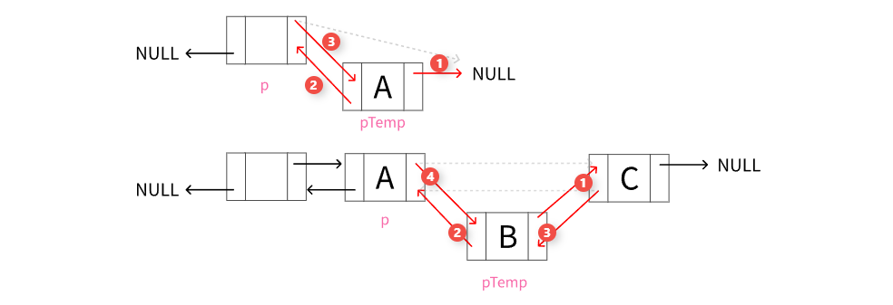
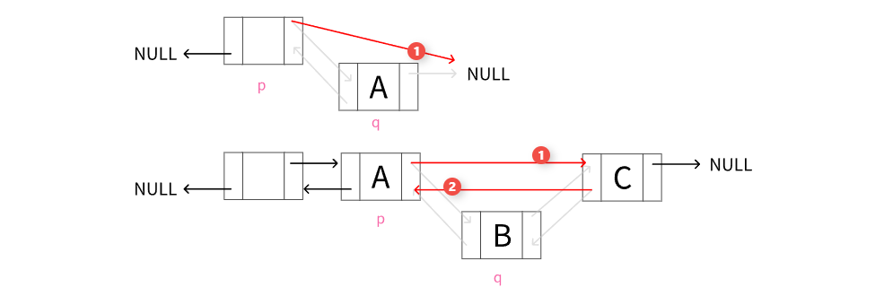

# <strong>2.3 双链表</strong>
<hr>
!!! info

    <p>单链表结点中只有一个指向其后继的指针,使得单链表只能从前往后依次遍历.要访问某个结点的前驱(插入、删除操作时),<br>只能从头开始遍历，访问前驱的时间复杂度为 O(n).<br>为了克服单链表的这个缺点,引入了<strong>双链表</strong>,双链表结点中有两个指针<strong>prior</strong>和<strong>next</strong>,分别指向其直接前驱和直接后继.</p>
   
## 双链表的主要特性

* 双向遍历由于每个节点都有前后两个指针，因此可以在列表中双向遍历，无需像单链表那样只能从头节点开始向前遍历。
* 插入与删除的便捷性：在双链表中插入或删除一个节点时，只需改变相应节点的前后节点的指针指向即可，操作相对简单高效。

### 数据结构
* <strong style="color:red">data:</strong>数据域,也是节点的值
* <strong style="color:red">prior:</strong>指针域,指向前一个结点的指针
* <strong style="color:red">next:</strong>指针域,指向下一个结点的指针

    ```c linenums="1" title="Dlinked_list.c" 
    /* 双链表中查找值为 target 的首个节点 */
    typedef struct DNode {
        int data; // 数据
        struct DNode *prior, *next; // 前驱和后继指针
    } DNode, *DLinkList;
    ```

<figure markdown="span">
  
  <figcaption>图2-4 链表结构</figcaption>
</figure>

!!! tip 

    <p>双链表在单链表结点中增加了一个指向其前驱的指针<code> prior </code>,因此双链表的按值查找和按位查找的操作与单链表的相同.但双链表在插入和删除操作的实现上,与单链表有着较大的不同. 这是因为“链”变化时也需要对指针<code> prior </code>做出修改,其关键是保证在修改的过程中不断链. 此外,双链表可以很方便地找到当前结点的前驱,因此,插入、除操作的时间复杂度仅为 O(1).</p>

## 双链表的基本操作实现

<p>单链表的节点在需要时<stong>动态分配内存</stong>,这意味着不需要像数组那样在创建时预先分配一大片连续内存.因此,<strong>单链表在内存使用上更加灵活</strong>>,可以有效应对内存碎片和动态增长的问题。</p>
<p>由于链表节点是在需要时分配的,可以避免数组因初始化大小不确定而造成的<strong>内存浪费</strong>。例如,如果数组大小初始化过大,未使用的部分将浪费内存;若初始化过小,则可能需要频繁重新分配和复制。</p>
<p>每个节点需要一个指针域来存储对下一个节点的引用,这意味着相比于数组,单链表在每个节点上都会有额外的内存开销。对于存储小数据的场景,这个开销相对较大,可能导致内存利用率下降。</p>

### 按位序插入结点
<p>该函数用于在双向链表中按<strong>指定位置插入</strong>一个新元素。(注意区分位置和下标：位置从1开始,下标从0开始)</p>
<p>在位置<strong> i </strong>插入元素<strong> e</strong>,其中<strong> i=1 </strong>表示插入到表头,<strong> i=length+1 </strong>表示插入到表尾。</p>
<p>重点注意下链表为空和不为空时的处理逻辑</p>

<figure markdown="span">
  
  <figcaption>图2-4 插入时链表空和不空时的区别</figcaption>
</figure>

=== "C"

    ```c linenums="1" title="linked_list.c"
    // 按位序插入，i=1插在表头，i=length+1插在表尾
    bool DList_Insert(DLinkList &pHead, int i, int e) {
      if (i < 1 || i > DList_Length(pHead) + 1) 
        return false;
      int j = 0; // 当前p指向的是第几个结点
      DNode *p = pHead; // p 指向头结点
      while (p != NULL && j < i - 1) { // 循环找到要插入位置的前驱结点
      p = p->next;
      j++;
    }

      DNode *pTemp = (DNode *)malloc(sizeof(DNode));
      pTemp->data = e;
      pTemp->next = p->next;
      pTemp->prior = p;
      // 又后续结点，不是空链表
      if (p->next != NULL) {
        p->next->prior = pTemp;
      }
      p->next = pTemp;
      return true;
    }
    ```


=== "C++"

    ```cpp linenums="1" title="linked_list.cpp"
    // 按位序插入，i=1插在表头，i=length+1插在表尾
    bool DList_Insert(DLinkList &pHead, int i, int e) {
      if (i < 1 || i > DList_Length(pHead) + 1) 
        return false;
      int j = 0; // 当前p指向的是第几个结点
      DNode *p = pHead; // p 指向头结点
      while (p != NULL && j < i - 1) { // 循环找到要插入位置的前驱结点
      p = p->next;
      j++;
    }

      DNode *pTemp = (DNode *)malloc(sizeof(DNode));
      pTemp->data = e;
      pTemp->next = p->next;
      pTemp->prior = p;
      // 又后续结点，不是空链表
      if (p->next != NULL) {
        p->next->prior = pTemp;
      }
      p->next = pTemp;
      return true;
    }
    ```

=== "Python"

    ```python linenums="1" title="linked_list.py"
    # TODO
    ```

=== "Java"

    ```java linenums="1" title="linked_list.java"
    /* TODO */
    
    ```

### 按位序删除结点

<p>该函数用于按位序删除节点的功能。具体来说,当参数<code> i </code>  为 <code> 1 </code> 时,删除链表的<code> 头节点 </code> ;当 <code> i </code> 等于链表长度时,删除链表的<code> 尾节点 </code> 。</p>
<p>重点注意下链表为空和不为空时的处理逻辑</p>

<figure markdown="span">
  
  <figcaption>图2-4 删除时链表空和不空时的区别</figcaption>
</figure>

=== "C"

    ```c linenums="1" title="linked_list.c"
    // 按位序删除，i=1删表头，i=length删头尾
    bool DList_Del (DLinkList &pHead, int i) {
      if (i < 1 || i > DList_Length(pHead)) 
        return false;
      DNode *p = pHead;

      // 找到待删除位序的前一位结点
      for (int j = 0; j < i - 1; j++)
        p = p->next;
      DNode *q = p->next; // 待删除结点
      p->next = q->next;
      if (q->next != NULL)
        q->next->prior = p;
      free(q);
      return true;
    }
    ```


=== "C++"

    ```cpp linenums="1" title="linked_list.cpp"
    // 按位序删除，i=1删表头，i=length删头尾
    bool DList_Del (DLinkList &pHead, int i) {
      if (i < 1 || i > DList_Length(pHead)) 
        return false;
      DNode *p = pHead;

      // 找到待删除位序的前一位结点
      for (int j = 0; j < i - 1; j++)
        p = p->next;
      DNode *q = p->next; // 待删除结点
      p->next = q->next;
      if (q->next != NULL)
        q->next->prior = p;
      free(q);
      return true;
    }
    ```

=== "Python"

    ```python linenums="1" title="linked_list.py"
    # TODO
    ```

=== "Java"

    ```java linenums="1" title="linked_list.java"
    /* TODO */
    
    ```

