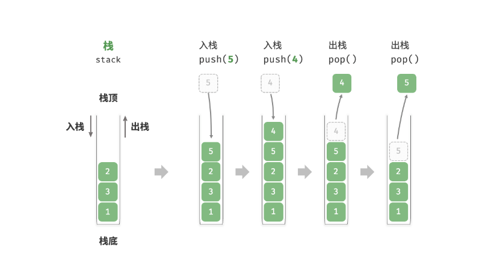

# <strong>3.1 栈</strong>

&nbsp;&nbsp;&nbsp;&nbsp;&nbsp;&nbsp;&nbsp;&nbsp;<strong style="text-decoration:underline"> 栈（stack）</strong>是一种遵循先入后出逻辑的线性数据结构。

&nbsp;&nbsp;&nbsp;&nbsp;&nbsp;&nbsp;&nbsp;&nbsp;我们可以将栈类比为桌面上的一摞盘子，如果想取出底部的盘子，则需要先将上面的盘子依次移走。我们将盘子替换为各种类型的元素（如整数、字符、对象等），就得到了栈这种数据结构。

&nbsp;&nbsp;&nbsp;&nbsp;&nbsp;&nbsp;&nbsp;&nbsp;如图 3-1-1 所示，我们把堆叠元素的顶部称为“栈顶”，底部称为“栈底”。将把元素添加到栈顶的操作叫作“入栈”，删除栈顶元素的操作叫作“出栈”。

<figure markdown="span">
  
  <figcaption>图3-1-1  栈的先入后出规则</figcaption>
</figure>

## 3.11 栈的常用操作

&nbsp;&nbsp;&nbsp;&nbsp;&nbsp;&nbsp;&nbsp;&nbsp;栈的常用操作如表 3-1 所示，具体的方法名需要根据所使用的编程语言来确定。在此，我们以常见的 push()、pop()、peek() 命名为例。

 表 3-1 &nbsp; 栈的操作效率 

<table >
<tr>
<th >方法</th>
<th > 描述</th>
<th >时间复杂度</th>
</tr>

<tr>
<td > <code>push()</code> </td>
<td >元素入栈（添加至栈顶） </td>
<td >$O(1) </td>
</tr>

<tr>
<td><code>pop()</code> </td>
<td>栈顶元素出栈  </td>
<td>$O(1)  </td>
</tr>

<tr>
<td><code>peek()</code> </td>
<td>访问栈顶元素  </td>
<td> $O(1)  </td>
</tr>
</table>

通常情况下，我们可以直接使用编程语言内置的栈类。然而，某些语言可能没有专门提供栈类，这时我们可以将该语言的“数组”或“链表”当作栈来使用，并在程序逻辑上忽略与栈无关的操作。

