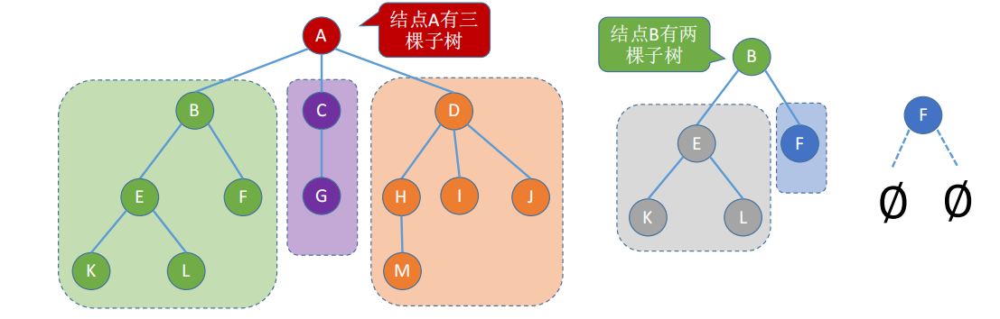
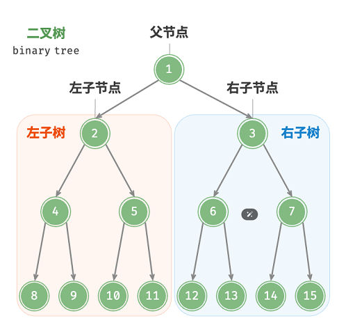

# <strong>5.1 树与二叉树</strong>

### 5.1.1 树的概念

树是n（n≥0）个结点的有限集合，n = 0时，称为<strong style="color:red">空树</strong>，这是一种特殊情况。在任意一棵非空树中应满足：

    
1. <strong style="color:red">有且仅有一个</strong>特定的称为根的结点。
2. 当n > 1时，其余结点可分为m（m > 0）个互不相交的有限集合T1, T2,…, Tm，其中每个集合本身又是一棵树，并且称为根结点的<strong style="color:red">子树</strong>。

<figure markdown="span">
  
  <figcaption>图5-1-1 树</figcaption>
</figure>

### 5.1.2 树的属性

{: align=left }
    
<strong style="color:red">属性:</strong>

* <strong>节点的层次(深度)</strong>: 从上往下数
* <strong>节点的高度</strong>: 从下往上数
* <strong>树的高度(深度)</strong>: 总共多少层
* <strong>节点的度</strong>: 有几个孩子(分支)
* <strong>树的度</strong>: 各节点的度的最大值

   

### 5.1.3 树的常考性质

<strong style="color: #c3185d">常见考点1: 节点数 = 总度数 + 1</strong>

<strong style="color: #c3185d">常见考点2: 度为m的树一定为非空树，且最少有m+1个节点</strong>

<strong style="color: #c3185d">常见考点3: 度为m的树第 <code> i </code> 层至多有<code> m^(i-1) </code></strong>

$$
\operatorname{ker} f=\{g\in G:f(g)=e_{H}\}{\mbox{.}}
$$
