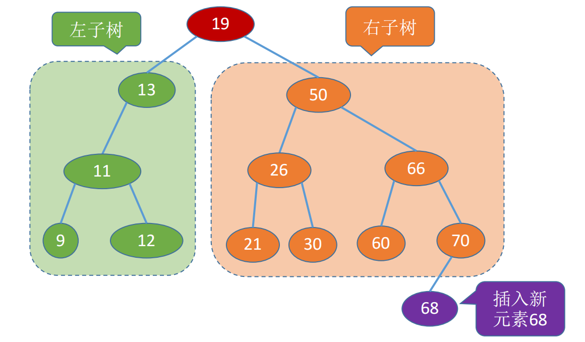

# <strong>5.1 树与二叉树</strong>

### 5.1.1 树的概念

树是n（n≥0）个结点的有限集合，n = 0时，称为<strong style="color:red">空树</strong>，这是一种特殊情况。在任意一棵非空树中应满足：

    
1. <strong style="color:red">有且仅有一个</strong>特定的称为根的结点。
2. 当n > 1时，其余结点可分为m（m > 0）个互不相交的有限集合T1, T2,…, Tm，其中每个集合本身又是一棵树，并且称为根结点的<strong style="color:red">子树</strong>。

<figure markdown="span">
  
  <figcaption>图5-1-1 树</figcaption>
</figure>

### 5.1.2 二叉树

!!! info inline end "特点"
    * 每一个节点至多只有两棵子树
    * 左右子树不能颠倒(有序树)

<strong style="text-decoration:underline"> 二叉树(binary tree)</strong>是n(n&ge;0)个节点的有限集合:

1. 或者是空二叉树,即n = 0;
2. 或者由一个根节点 和两个互不相交的被成为根的左子树和右子树组成。左子树和右子树又分别是一颗二叉树。

 

<figure markdown="span">
  
  <figcaption>图5-1-2 二叉树的常用术语</figcaption>
</figure>

<strong style="color:red">二叉树的常用术语:</strong>

* <strong style="text-decoration:underline">根节点（root node）:</strong>位于二叉树顶层的节点，没有父节点。
* <strong style="text-decoration:underline">叶节点（leaf node）:</strong>没有子节点的节点，其两个指针均指向 <code>None</code> 。

- <u>根节点（root node）</u>：位于二叉树顶层的节点，没有父节点。
- <u>叶节点（leaf node）</u>：没有子节点的节点，其两个指针均指向 `None` 。
- <u>边（edge）</u>：连接两个节点的线段，即节点引用（指针）。
- 节点所在的<u>层（level）</u>：从顶至底递增，根节点所在层为 1 。
- 节点的<u>度（degree）</u>：节点的子节点的数量。在二叉树中，度的取值范围是 0、1、2 。
- 二叉树的<u>高度（height）</u>：从根节点到最远叶节点所经过的边的数量。
- 节点的<u>深度（depth）</u>：从根节点到该节点所经过的边的数量。
- 节点的<u>高度（height）</u>：从距离该节点最远的叶节点到该节点所经过的边的数量。

!!! tip

    请注意，我们通常将“高度”和“深度”定义为“经过的边的数量”，但有些题目或教材可能会将其定义为“经过的节点的数量”。在这种情况下，高度和深度都需要加 1 。

### 5.1.3 几种特殊的二叉树

#### 1. 满二叉树

<u>满二叉树(perfect binary tree)</u>所有层的节点都被完全填满。在满二叉树中，叶节点的度为 $0$ ，其余所有节点的度都为 $2$ ；若树的高度为 $h$ ，则节点总数为 $2^{h+1} - 1$ ，呈现标准的指数级关系，反映了自然界中常见的细胞分裂现象。
 

特点:

- 只有最后一层有叶子节点
- 不存在度为1的节点
- 按层序从$1$开始编号，节点$i$的左孩子为$2i$,右孩子为$2i+1$; 节点$i$的父节点为$\lfloor{n\over2}\rfloor$(如果有的话)

!!! tip

    请注意，有些地方也将满二叉树成称为<u>完美二叉树</u>。

#### 2. 完全二叉树

如下图所示，<u>完全二叉树（complete binary tree）</u>只有最底层的节点未被填满，且最底层节点尽量靠左填充。请注意，满二叉树也是一棵完全二叉树。

当且仅当其每一个节点都与高度为h的满二叉树中编号为$1$ ~ $n$ 的节点一一对应时，成为<u>完全二叉树（complete binary tree）</u>

特点:

- 只有最后两层可能有叶子节点
- 最多只有一个度为1的节点
- 按层序从$1$开始编号，节点$i$的左孩子为$2i$,右孩子为$2i+1$; 节点$i$的父节点为$\lfloor{n\over2}\rfloor$(如果有的话)
- $i$ $\le$ $\lfloor{n\over2}\rfloor$为分支节点， $i$ $\ge$ $\lfloor{n\over2}\rfloor$ 为叶子节点

#### 3. 平衡二叉树

如下图所示，<u>平衡二叉树（balanced binary tree）</u>中任意节点的左子树和右子树的高度之差的绝对值不超过 1 。

#### 4. 二叉树排序树

如下图所示，<u>二叉树排序树（sort binary tree）</u> 一棵二叉树或者是空二叉树，或者是具有如下性质的二叉树：

- 左子树上所有节点的关键字均小于根节点的关键字;
- 右子树上所有节点的关键字均小于根节点的关键字;
- 左子树和右子树又各是一棵二叉排序树。

### 5.1.4 二叉树的常考性质

<strong style="background: #ffee57;font-size: 20px;color: #c3185d">常见考点1: </strong>

设非空二叉树中度为0、1和2的节点个数分别为 $n_0$ 、 $n_1$ 和 $n_2$ ,则 $n_0$ = $n_2$ + 1 . (叶子节点数比二分支节点多1个)

<figure markdown="span">
  
  <figcaption>图5-1-3 叶子节与比二分支节点的关系</figcaption>
</figure>

<strong style="background: #ffee57;font-size: 20px;color: #c3185d">常见考点2: </strong>

高度为h的二叉树至多有 $2^h - 1$ 个节点(满二叉树)

<figure markdown="span">
  
  <figcaption>图5-1-3 二叉树的层(高)</figcaption>
</figure>

<strong style="background: #ffee57;font-size: 20px;color: #c3185d">常见考点3: </strong>

具有$n$个($n$ $\gt$ $0$)节点的完全二叉树的高度h为$\lceil log_2(n+1) \rceil$ 或者 $\lfloor log_2(n) \rfloor$ + 1

!!! info inline "推导过程"
    $$ 2^{h-1} \le n \lt 2^h $$

    $$ h - 1 \le log_2n \lt h $$

    $$ h = \lfloor log_2n \rfloor + 1 $$

 

* 高为$h-1$的满二叉树共有$2^{h-1} - 1$个节点
* 高为$h$的完全二叉树:
    - 至少$2^{h-1}$个节点
    - 至多$2^h-1$个节点

  

<strong style="background: #ffee57;font-size: 20px;color: #c3185d">常见考点4: </strong>

对于完全二叉树，可以由节点数$n$ 推出来度为$0$、$1$和$2$的节点个数为$n_0$、$n_1$和$n_2$ .

!!! faq inline end "提示一下"
    - $n_1$ = $0$ 或 $1$(完全二叉树至多只有一个度为$1$的节点)
    - $n_0$ = $n_2$ + $1$ -> $n_0$ + $n_2$一定是奇数

- 若完全二叉树有$2k$(偶数)个节点，则必有：
    - $n_1$ = 1;
    - $n_0$ = k;
    - $n_2$ = k-1;
- 若完全二叉树有$2k-1$(奇数)个节点，则必有：
    - $n_1$ = 0;
    - $n_0$ = k;
    - $n_2$ = k-1;

