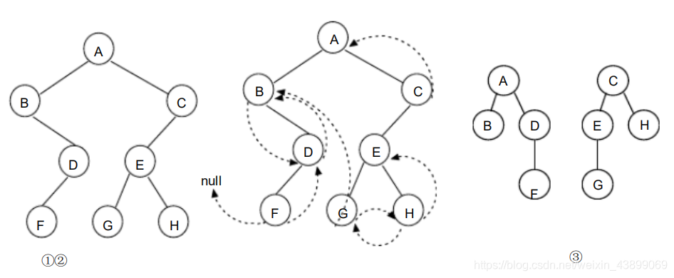

# 第 5 章 树和二叉树课后习题

### 一. 选择题

<table style="border: none">
<tr>
<th colspan="4" width="100%" align="left" style="border-style: none;">(1)把一棵树转换为二叉树后，这棵二叉树的形态是（） 。</th>
</tr>

<tr>
<td style="border-style: none;"> <mark style="color: #ff0000"><b>A. 唯一的</b></mark></td>
<td style="border-style: none;"> B. 有多种</td>
<td style="border-style: none;"> C. 有多种，但根结点都没有左孩子</td>
<td style="border-style: none;"> D. 有多种，但根结点都没有右孩子</td>
</tr>

<tr>
<td colspan="4" style="border-style: none;color: #ff0000">答案解析：因为二叉树有左孩子、右孩子之分，故一棵树转换为二叉树后，这棵二叉树的形态是唯一的。</td>
</tr>
</table>

<table style="border: none">
<tr>
<th colspan="4" width="100%" align="left" style="border-style: none;">(2)由 3 个结点可以构造出多少种不同的二叉树？（）。</th>
</tr>

<tr>
<td style="border-style: none;"> A. 2</td>
<td style="border-style: none;"> B. 3</td>
<td style="border-style: none;"> C. 4</td>
<td style="border-style: none;"> <mark style="color: #ff0000"><b>D. 5</b></mark></td>
</tr>
<tr>
<td colspan="4" style="border-style: none;color: #ff0000">答案解析：D。</td>
</tr>
</table>

<table style="border: none">
<tr>
<th colspan="4" width="100%" align="left" style="border-style: none;">(3)一棵完全二叉树上有 1001 个结点，其中叶子结点的个数是（） 。</th>
</tr>

<tr>
<td style="border-style: none;"> A. 250</td>
<td style="border-style: none;"> B. 500</td>
<td style="border-style: none;"> C. 254</td>
<td style="border-style: none;"> <mark style="color: #ff0000"><b>D. 501 </b></mark></td>
</tr>
<tr>
<td colspan="4" style="border-style: none;color: #ff0000">答案解析：设度为 0 结点（叶子结点）个数为 A，度为 1 的结点个数为 B，度为 2 的结点个数为 C，有A=C+1， A+B+C=1001 ，可得 2C+B=1000 ，由完全二叉树的性质可得 B=0 或 1，又因为 C 为整数，所以 B=0， C=500 ， A=501 ，即有 501 个叶子结点。</td>
</tr>
</table>

<table style="border: none">
<tr>
<th colspan="4" width="100%" align="left" style="border-style: none;">(4)一个具有 1025 个结点的二叉树的高 h 为（） 。</th>
</tr>

<tr>
<td style="border-style: none;"> A. 11</td>
<td style="border-style: none;"> B. 10</td>
<td style="border-style: none;"> <mark style="color: #ff0000"><b>C. 11至1025之间 </b></mark></td>
<td style="border-style: none;"> D. 10至1024之间 </td>
</tr>
<tr>
<td colspan="4" style="border-style: none;color: #ff0000">答案解析：若每层仅有一个结点，则树高 h 为 1025 ；且其最小树高为 log 2 1025 + 1=11 ， 即 h 在 11 至 1025 之间。</td>
</tr>
</table>

| (5)深度为 h 的满 m叉树的第 k 层有（）个结点。 (1 =< k = < h) 。                                                          | 
|--------------------------------------------------------------------------------------------------------| 
| <mark style="color: #ff0000"><b>A. $m^{k-1}$  </b></mark>                                       | 
| B. $m^k-1$                                                                                             | 
| C. $m^{h-1}$                                                                                           |
| D. $m^h-1$                                                                                             |
| 
答案解析：若每层仅有一个结点，则树高 h 为 1025 ；且其最小树高为 log 2 1025 + 1=11 ， 即 h 在 11 至 1025 之间。 
 |

<table style="border: none">
<tr>
<th colspan="4" width="100%" align="left" style="border-style: none;">(6)利用孩子兄弟表示法存储树，则根结点的右指针是（） 。</th>
</tr>

<tr>
<td style="border-style: none;" colspan="4"> A.指向最左孩子  </td>
</tr>

<tr>
<td style="border-style: none;" colspan="4"> B. 指向最右孩子 </td>
</tr>

<tr>
<td style="border-style: none;" colspan="4"> <mark style="color: #ff0000"><b>C. 空 </b></mark></td>
</tr>

<tr>
<td style="border-style: none;" colspan="4"> D. 非空 </td>
</tr>
<tr>
<td colspan="4" style="border-style: none;color: #ff0000">答案解析：利用孩子兄弟表示法存储树时，右指针指向兄弟结点，因为根节点没有兄弟结点，故根节点的右指针指向空。</td>
</tr>
</table>

<table style="border: none">
<tr>
<th colspan="4" width="100%" align="left" style="border-style: none;">(7)对二叉树的结点从 1 开始进行连续编号，要求每个结点的编号大于其左、右孩子的编号，同一结点的左右孩子中，其左孩子的编号小于其右孩子的编号，可采用（）遍历实现编号。</th>
</tr>

<tr>
<td style="border-style: none;"> A. 先序</td>
<td style="border-style: none;"> B. 中序</td>
<td style="border-style: none;"> <mark style="color: #ff0000"><b>C. 后序 </b></mark></td>
<td style="border-style: none;"> D. 从根开始按层次遍历 </td>
</tr>

<tr>
<td colspan="4" style="border-style: none;color: #ff0000">答案解析：根据题意可知按照先左孩子、再右孩子、最后双亲结点的顺序遍历二叉树，即后序遍历二叉树。</td>
</tr>
</table>

<table style="border: none">
<tr>
<th colspan="4" width="100%" align="left" style="border-style: none;">(8)若二叉树采用二叉链表存储结构，要交换其所有分支结点左、右子树的位置，利用（）遍历方法最合适。</th>
</tr>

<td style="border-style: none;"> A. 前序</td>
<td style="border-style: none;"> B. 中序</td>
<td style="border-style: none;"> <mark style="color: #ff0000"><b>C. 后序 </b></mark></td>
<td style="border-style: none;"> D. 按层次 </td>

<tr>
<td colspan="4" style="border-style: none;color: #ff0000">答案解析：后续遍历和层次遍历均可实现左右子树的交换 ，不过层次遍历的实现消耗比后续大，后序遍历方法最合适。</td>
</tr>
</table>

<table style="border: none">
<tr>
<th colspan="4" width="100%" align="left" style="border-style: none;">(9)在下列存储形式中， （）不是树的存储形式？</th>
</tr>

<tr>
<td style="border-style: none;" colspan="4"> A. 双亲表示法  </td>
</tr>

<tr>
<td style="border-style: none;" colspan="4"> B. 孩子链表表示法 </td>
</tr>

<tr>
<td style="border-style: none;" colspan="4"> C. 孩子兄弟表示法</td>
</tr>

<tr>
<td style="border-style: none;" colspan="4"> <mark style="color: #ff0000"><b>D. 顺序存储表示法 </b></mark></td>
</tr>
<tr>
<td colspan="4" style="border-style: none;color: #ff0000">答案解析：树的存储结构有三种：双亲表示法、孩子表示法、孩子兄弟表示法，其中孩子兄弟表示法是常用的表示法，任意一棵树都能通过孩子兄弟表示法转换为二叉树进行存储。</td>
</tr>
</table>

<table style="border: none">
<tr>
<th colspan="4" width="100%" align="left" style="border-style: none;">(10)一棵非空的二叉树的先序遍历序列与后序遍历序列正好相反，则该二叉树一定满足（）。</th>
</tr>

<tr>
<td style="border-style: none;" colspan="4"> A. 所有的结点均无左孩子  </td>
</tr>

<tr>
<td style="border-style: none;" colspan="4"> B. 所有的结点均无右孩子 </td>
</tr>

<tr>
<td style="border-style: none;" colspan="4"> <mark style="color: #ff0000"><b>C. 只有一个叶子结点 </b></mark></td>
</tr>

<tr>
<td style="border-style: none;" colspan="4"> D. 是任意一棵二叉树 </td>
</tr>
<tr>
<td colspan="4" style="border-style: none;color: #ff0000">答案解析：因为先序遍历结果是“中左右” ，后序遍历结果是“左右中” ，当没有左子树时，就是“中右”和“右中” ；当没有右子树时，就是“中左”和“左中” 。则所有的结点均无左孩子或所有的结点均无右孩子均可，所以 A、B 不能选，又所有的结点均无左孩子与所有的结点均无右孩子时，均只有一个叶子结点，故选 C。</td>
</tr>
</table>

<table style="border: none">
<tr>
<th colspan="4" width="100%" align="left" style="border-style: none;">(11)设哈夫曼树中有 199 个结点，则该哈夫曼树中有（）个叶子结点。</th>
</tr>

<td style="border-style: none;"> A. 99</td>
<td style="border-style: none;"> <mark style="color: #ff0000"><b>B. 100 </b></mark> </td>
<td style="border-style: none;"> C. 101 </td>
<td style="border-style: none;"> D. 102 </td>

<tr>
<td colspan="4" style="border-style: none;color: #ff0000">答案解析：在哈夫曼树中没有度为 1 的结点，只有度为 0（叶子结点）和度为 2 的结点。设叶子结点的个数为 n0，度为 2 的结点的个数为 n2，由二叉树的性质 n0=n2+1 ，则总结点数 n= n0+n2=2*n0-1 ，得到 n0=100.</td>
</tr>
</table>

<table style="border: none">
<tr>
<th colspan="4" width="100%" align="left" style="border-style: none;">(12)若 X 是二叉中序线索树中一个有左孩子的结点，且 X 不为根，则 X 的前驱为（） 。</th>
</tr>

<td style="border-style: none;"> A.  X 的双亲</td>
<td style="border-style: none;"> B.  X 的右子树中最左的结点  </td>
<td style="border-style: none;"> <mark style="color: #ff0000"><b>C. X 的左子树中最右结点 </b></mark></td>
<td style="border-style: none;"> D. X 的左子树中最右叶结点 </td>

<tr>
<td colspan="4" style="border-style: none;color: #ff0000">答案解析：C </td>
</tr>
</table>

<table style="border: none">
<tr>
<th colspan="4" width="100%" align="left" style="border-style: none;">(13)引入二叉线索树的目的是（） 。</th>
</tr>

<tr>
<td style="border-style: none;" colspan="4"> <mark style="color: #ff0000"><b>A. 加快查找结点的前驱或后继的速度 </b></mark> </td>
</tr>

<tr>
<td style="border-style: none;" colspan="4"> B. 为了能在二叉树中方便的进行插入与删除 </td>
</tr>

<tr>
<td style="border-style: none;" colspan="4"> C. 为了能方便的找到双亲 </td>
</tr>

<tr>
<td style="border-style: none;" colspan="4"> D. 使二叉树的遍历结果唯一 </td>
</tr>

<tr>
<td colspan="4" style="border-style: none;color: #ff0000">答案解析：A </td>
</tr>
</table>

<table style="border: none">
<tr>
<th colspan="4" width="100%" align="left" style="border-style: none;">(14)设 F 是一个森林， B 是由 F 变换得的二叉树。若 F 中有 n 个非终端结点，则 B 中右指针域为空的结点有（ ）个。</th>
</tr>

<td style="border-style: none;"> A.   n- 1 </td>
<td style="border-style: none;"> B.  n  </td>
<td style="border-style: none;"> <mark style="color: #ff0000"><b> C.  n + 1 </b></mark></td>
<td style="border-style: none;"> D. n + 2 </td>

<tr>
<td colspan="4" style="border-style: none;color: #ff0000">答案解析：A </td>
</tr>
</table>

<table style="border: none">
<tr>
<th colspan="4" width="100%" align="left" style="border-style: none;">(15)n（ n≥2）个权值均不相同的字符构成哈夫曼树， 关于该树的叙述中， 错误的是 （ ）。</th>
</tr>

<tr>
<td style="border-style: none;" colspan="4"> <mark style="color: #ff0000"><b>A. 该树一定是一棵完全二叉树 </b></mark> </td>
</tr>

<tr>
<td style="border-style: none;" colspan="4"> B. 树中一定没有度为 1 的结点 </td>
</tr>

<tr>
<td style="border-style: none;" colspan="4"> C. 树中两个权值最小的结点一定是兄弟结点 </td>
</tr>

<tr>
<td style="border-style: none;" colspan="4"> D. 树中任一非叶结点的权值一定不小于下一层任一结点的权值 </td>
</tr>

<tr>
<td colspan="4" style="border-style: none;color: #ff0000">答案解析：哈夫曼树的构造过程是每次都选取权值最小的树作为左右子树构造一棵新的二叉树，所以树中一定没有度为 1 的结点、两个权值最小的结点一定是兄弟结点、任一非叶结点的权值一定不小于下一层任一结点的权值。</td>
</tr>
</table>

【题目描述】

(1)试找出满足下列条件的二叉树

   * 先序序列与后序序列相同
   * 中序序列与后序序列相同
   * 先序序列与中序序列相同
   * 中序序列与层次遍历序列相同

【题目分析】

先序遍历二叉树的顺序是“根—左子树—右子树” ，中序遍历“左子树—根—右子树”，后序遍历顺序是： “左子树—右子树―根＂，根据以上原则有:

  * 或为空树，或为只有根结点的二叉树
  * 或为空树，或为任一结点至多只有左子树的二叉树．
  * 或为空树，或为任一结点至多只有右子树的二叉树．
  * 或为空树，或为任一结点至多只有右子树的二叉树

 

【题目描述】

(2)设一棵二叉树的先序序列： A B D F C E G H ，中序序列： B F D A G E H C

* 画出这棵二叉树。
* 画出这棵二叉树的后序线索树。
* 将这棵二叉树转换成对应的树（或森林） 。

  【题目分析】
<figure markdown="span">
  
  <figcaption>图 5-x-1 参考答案</figcaption>
</figure>

【题目描述】

(3)假设用于通信的电文仅由 8 个字母组成， 字母在电文中出现的频率分别为 0.07 ，0.19 ， 0.02 ， 0.06 ， 0.32 ， 0.03 ， 0.21 ， 0.10 。

* 试为这 8 个字母设计赫夫曼编码。
* 试设计另一种由二进制表示的等长编码方案。
* 对于上述实例，比较两种方案的优缺点。

【题目分析】

先将概率放大 100 倍，以方便构造哈夫曼树w={7,19,2,6,32,3,21,10} 。

|字母编号 | 哈夫曼 | 频率  | --> | 二进制 |  频率  |
|-------|-------|-------|-----|-------|-------|
|   1   |  1100 |  0.07 |     |  000  |  0.07 |
|   2   |   00  |  0.19 |     |  001  |  0.19 |
|   3   | 11110 |  0.02 |     |  010  |  0.02 |
|   4   |  1110 |  0.06 |     |  011  |  0.06 |
|   5   |   10  |  0.32 |     |  100  |  0.32 |
|   6   | 11111 |  0.03 |     |  101  |  0.03 |
|   7   |   01  |  0.21 |     |  110  |  0.21 |
|   8   |  1101 |  0.10 |     |  111  |  0.10 |

